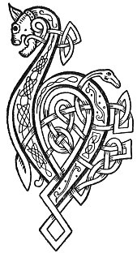

  
[Intangible Textual Heritage](../../../index) 
[Legends/Sagas](../../index)  [Celtic](../index)  [Carmina
Gadelica](../cg)  [Index](index)  [Previous](cg2042)  [Next](cg2044) 

------------------------------------------------------------------------

[Buy this Book at
Amazon.com](https://www.amazon.com/exec/obidos/ASIN/B0027P890O/internetsacredte)

------------------------------------------------------------------------

  
*Carmina Gadelica, Volume 2*, by Alexander Carmicheal, \[1900\], at
Intangible Textual Heritage

------------------------------------------------------------------------

 

<table data-border="0">
<colgroup>
<col style="width: 50%" />
<col style="width: 50%" />
</colgroup>
<tbody>
<tr class="odd">
<td data-valign="top" width="327">
p. 86
</td>
<td data-valign="top" width="327">
p. 87
</td>
</tr>
<tr class="even">
<td data-valign="top" width="327"><h3 id="an-torranan-160" data-align="center">AN TORRANAN [160]</h3></td>
<td data-valign="top" width="327"><h3 id="the-figwort" data-align="center">THE FIGWORT</h3></td>
</tr>
</tbody>
</table>

 

<table data-border="0">
<colgroup>
<col style="width: 25%" />
<col style="width: 25%" />
<col style="width: 25%" />
<col style="width: 25%" />
</colgroup>
<tbody>
<tr class="odd">
<td data-valign="top">
 
</td>
<td data-valign="top">
p. 86
</td>
<td data-valign="top">
 
</td>
<td data-valign="top">
p. 87
</td>
</tr>
<tr class="even">
<td data-valign="top">
 
</td>
<td data-valign="top">
BUAINIDH mi an torranan, 
Le toradh mara ’s tir, 
Ri lionadh gun traghadh, 
Le d’ laimh, a Mhoire mhin.

Calum caomh da m’ sheoladh, 
Odhran naomh da m’ dhion, 
’S Bride nam ban buadhach 
Cur bhuadh anns an ni.

Mar a dh’ orduich Righ nan righ, 
Bainne chur an cich ’s an carr, 
Mar a dh’ orduich Ri nan dul, 
Sugh a chur an uth ’s an ar.

Ann an uth bruc, 
Ann an uth brac, 
Ann an uth murc, 
Ann an uth marc.

Ann an uth urc, 
Ann an uth arc, 
An uth gobhar, othasg, agus caora, 
Maoiseach, agus mart.
</td>
<td data-valign="top">
 
</td>
<td data-valign="top">
I WILL pluck the figwort, 
With the fullness of sea and land, 
At the flow, not the ebb of the tide, 
By thine hand, gentle Mary.

The kindly Colum directing me, 
The holy Oran protecting me, 
Whilst Bride of women beneficent 
Shall put fruitage in the kine.

As the King of kings ordained, 
To put milk in breast and gland, 
As the Being of life ordained, 
To put sap in udder and teat.

In udder of badger, 
In udder of reindeer, 
In udder of sow (?), 
In udder of mare.

In udder of sow (?), 
In udder of heifer, 
In udder of goat, ewe, and sheep, 
Of roe, and of cow.
</td>
</tr>
<tr class="odd">
<td data-valign="top">
 
</td>
<td data-valign="top">
p. 88
</td>
<td data-valign="top">
 
</td>
<td data-valign="top">
p. 89
</td>
</tr>
<tr class="even">
<td data-valign="top">
 
</td>
<td data-valign="top">
Le bliochd, le blachd, le bladh, 
Le bair, le dair, le toradh, 
Le laoigh bhoirionn, bharr, 
Le al, le agh, le sonadh.

Gun fear mi-ruin, 
Gun bhean mi-shuil, 
Gun ghnu, gun tnu, 
Gun aon donadh.

An ainm nan ostal deug,          [da 
An ainm Mathar De, 
An ainm Chriosda fein, 
Agus Phadruig.
</td>
<td data-valign="top">
 
</td>
<td data-valign="top">
With milk, with cream, with substance, 
With rutting, with begetting, with fruitfulness, 
With female calves excelling, 
With progeny, with joyance, with blessing.

Without man of evil wish, 
Without woman of evil eye, 
Without malice, without envy, 
Without one evil.

In name of the apostles twelve, 
In name of the Mother of God, 
In name of Christ Himself, 
And of Patrick.
</td>
</tr>
</tbody>
</table>

 

------------------------------------------------------------------------

[Next: 161. The Charm of the Figwort. Eolas An Torranain](cg2044)
