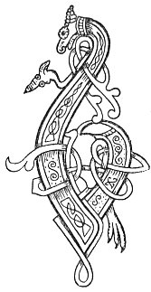

  
[Intangible Textual Heritage](../../../index.md) 
[Legends/Sagas](../../index)  [Celtic](../index.md)  [Carmina
Gadelica](../cg)  [Index](index)  [Previous](cg2043)  [Next](cg2045.md) 

------------------------------------------------------------------------

[Buy this Book at
Amazon.com](https://www.amazon.com/exec/obidos/ASIN/B0027P890O/internetsacredte.md)

------------------------------------------------------------------------

  
*Carmina Gadelica, Volume 2*, by Alexander Carmicheal, \[1900\], at
Intangible Textual Heritage

------------------------------------------------------------------------

 

<table data-border="0">
<colgroup>
<col style="width: 50%" />
<col style="width: 50%" />
</colgroup>
<tbody>
<tr class="odd">
<td data-valign="top" width="327">
p. 90
</td>
<td data-valign="top" width="327">
p. 91
</td>
</tr>
<tr class="even">
<td data-valign="top" width="327"><h3 id="eolas-an-torranain-161" data-align="center">EOLAS AN TORRANAIN [161]</h3></td>
<td data-valign="top" width="327"><h3 id="the-charm-of-the-figwort" data-align="center">THE CHARM OF THE FIGWORT</h3></td>
</tr>
</tbody>
</table>

 

<table data-border="0">
<colgroup>
<col style="width: 25%" />
<col style="width: 25%" />
<col style="width: 25%" />
<col style="width: 25%" />
</colgroup>
<tbody>
<tr class="odd">
<td data-valign="top">
 
</td>
<td data-valign="top">
p. 90
</td>
<td data-valign="top">
 
</td>
<td data-valign="top">
p. 91
</td>
</tr>
<tr class="even">
<td data-valign="top">
 
</td>
<td data-valign="top">
BUAINIDH mi an torranan, 
Le mile beannachd, le mile buaidh, 
Bride bhith dha chonall dhomh, 
Moire mhin dha thoradh dhomh, 
Moire mhor, Mathair chobhair an t-sluaigh.

Thainig na naoi sonais, 
Le na naoi marannan, 
A bhuain an torranain, 
Le mile beannachd, le mile buaidh-- 
Le mile beannachd, le mile buaidh.

Lamh Chriosda liom, 
Fath Chriosda rium, 
Sgath Chriosda tharam, 
Tha mo lus allail an allos a bhuain-- 
Tha mo lus allail an allos a bhuain.

An ainm Athar ais, 
An ainm Criosda Phais, 
An ainm Spiorad grais, 
An agallaich mo bhais, 
Nach fag mi gu Luan-- 
     An agallaich mo bhais, 
     Nach fag mi gu Luan.
</td>
<td data-valign="top">
 
</td>
<td data-valign="top">
I WILL cull the figwort, 
Of thousand blessings, of thousand virtues, 
The calm Bride endowing it to me, 
The fair Mary enriching it to me, 
The great Mary, aid-Mother of the people.

Came the nine joys, 
With the nine waves, 
To cull the figwort, 
Of thousand blessings, of thousand virtues-- 
Of thousand blessings, of thousand virtues.

The arm of Christ about me, 
The face of Christ before me, 
The shade of Christ over me, 
My noble plant is being culled-- 
My noble plant is being culled.

In name of the Father of wisdom, 
In name of the Christ of Pasch, 
In name of the Spirit of grace, 
Who in the struggles of my death, 
Will not leave me till Doom 
     Who in the struggles of my death, 
     Will not leave me till Doom.
</td>
</tr>
</tbody>
</table>

 

------------------------------------------------------------------------

[Next: 162. The Fairy Wort. An Earnaid Shith](cg2045.md)
