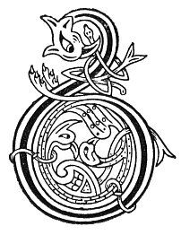

  
[Intangible Textual Heritage](../../../index) 
[Legends/Sagas](../../index)  [Celtic](../index)  [Carmina
Gadelica](../cg)  [Index](index)  [Previous](cg2048)  [Next](cg2050) 

------------------------------------------------------------------------

[Buy this Book at
Amazon.com](https://www.amazon.com/exec/obidos/ASIN/B0027P890O/internetsacredte)

------------------------------------------------------------------------

  
*Carmina Gadelica, Volume 2*, by Alexander Carmicheal, \[1900\], at
Intangible Textual Heritage

------------------------------------------------------------------------

 

<table data-border="0">
<colgroup>
<col style="width: 50%" />
<col style="width: 50%" />
</colgroup>
<tbody>
<tr class="odd">
<td data-valign="top" width="327">
p. 98
</td>
<td data-valign="top" width="327">
p. 99
</td>
</tr>
<tr class="even">
<td data-valign="top" width="327"><h3 id="achlasan-chaluim-chille-166" data-align="center">ACHLASAN CHALUIM-CHILLE [166]</h3></td>
<td data-valign="top" width="327"><h3 id="st-columbas-plant" data-align="center">ST COLUMBA'S PLANT</h3></td>
</tr>
</tbody>
</table>

 

<table data-border="0">
<colgroup>
<col style="width: 25%" />
<col style="width: 25%" />
<col style="width: 25%" />
<col style="width: 25%" />
</colgroup>
<tbody>
<tr class="odd">
<td data-valign="top">
 
</td>
<td data-valign="top">
p. 98
</td>
<td data-valign="top">
 
</td>
<td data-valign="top">
p. 99
</td>
</tr>
<tr class="even">
<td data-valign="top">
 
</td>
<td data-valign="top">
BUAINIDH mi mo choinneachan, 
Mar choinneamh ri mo naomh, 
Chasga fuath nam fear foille, 
     Agus boile nam ban baoth.

Buainidh mi m’ achlasan, 
Mar achainidh ri m’ Righ, 
Gur liom-sa buaidh an achlasain, 
     Thar gach neach a chi.

Buainim an duille gu h-ard, 
Mar a dh’ orduich an t-Ard Righ, 
An ainm Tri Naomh nan agh, 
     Agus Moire, Mathair Chriosd.
</td>
<td data-valign="top">
 
</td>
<td data-valign="top">
I WILL pluck what I meet, 
As in communion with my saint, 
To stop the wiles of wily men, 
     And the arts of foolish women.

I will pluck my Columba plant, 
As a prayer to my King, 
That mine be the power of Columba's plant, 
     Over every one I see.

I will pluck the leaf above, 
As ordained of the High King, 
In name of the Three of glory, 
     And of Mary, Mother of Christ.
</td>
</tr>
</tbody>
</table>

 

------------------------------------------------------------------------

[Next: 167. St Columba's Plant. Achlasan Chaluim-Chille](cg2050)
