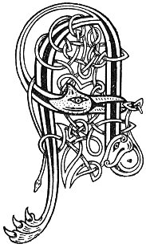

  
[Intangible Textual Heritage](../../../index.md) 
[Legends/Sagas](../../index)  [Celtic](../index.md)  [Carmina
Gadelica](../cg)  [Index](index)  [Previous](cg2052)  [Next](cg2054.md) 

------------------------------------------------------------------------

[Buy this Book at
Amazon.com](https://www.amazon.com/exec/obidos/ASIN/B0027P890O/internetsacredte.md)

------------------------------------------------------------------------

  
*Carmina Gadelica, Volume 2*, by Alexander Carmicheal, \[1900\], at
Intangible Textual Heritage

------------------------------------------------------------------------

 

<table data-border="0">
<colgroup>
<col style="width: 50%" />
<col style="width: 50%" />
</colgroup>
<tbody>
<tr class="odd">
<td data-valign="top" width="327">
p. 106
</td>
<td data-valign="top" width="327">
p. 107
</td>
</tr>
<tr class="even">
<td data-valign="top" width="327"><h3 id="seamarag-nam-buadh-170" data-align="center">SEAMARAG NAM BUADH [170]</h3></td>
<td data-valign="top" width="327"><h3 id="shamrock-of-luck" data-align="center">SHAMROCK OF LUCK</h3></td>
</tr>
</tbody>
</table>

 

SOME of the people say that the four-leaved shamrock is the shamrock of
luck. Others maintain that the shamrock of luck is the five-leaved
shamrock. This is a very rare plant and much prized when found.

The shamrock of luck must be found, like many of the other propitious
plants, 'gun sireadh, gun iarraidh'--without searching, without seeking.
When thus discovered the lucky shamrock is warmly cherished and
preserved as an invincible talisman.

'Seamarag nan buadh,' shamrock of luck, is often lovingly called
'seamarag nam buadh agus nam beannachd,' shamrock of luck and of
blessing. p. 107

It is also called 'seamarag nan each,' horse shamrock, 'seamarag nan
searrach,' foal shamrock, 'seamarag an deocain,' shamrock of the
'deocan,' 'seamarag an deocadain,' shamrock of the 'deocadan,' and
simply 'deocan' and 'deocadan.'

Immediately after birth the foal throws up a pale soft substance
resembling a sponge or the seed-cells of the cod. This sponge-like
substance coughed up by the newly-born foal is variously called 'deocan,
deocadan, deocardan.' The people bury this in the ground, believing that
the lucky shamrock grows from it as the nettles grow from human remains,
whether buried in the pure shelly sand on the sea-shore or in the pure
peat moss on the mountain-side.

 

<table data-border="0">
<colgroup>
<col style="width: 25%" />
<col style="width: 25%" />
<col style="width: 25%" />
<col style="width: 25%" />
</colgroup>
<tbody>
<tr class="odd">
<td data-valign="top">
 
</td>
<td data-valign="top">
p. 106
</td>
<td data-valign="top">
 
</td>
<td data-valign="top">
p. 107
</td>
</tr>
<tr class="even">
<td data-valign="top">
 
</td>
<td data-valign="top">
A SHEAMARAG nam buadh, 
A fas fo bhruaich 
Air na sheas Moire shuairce, 
    Mathair De.

Tha na seachd sonais, 
Gun sgath donais 
Ort, a mhoth-ghil 
Nan gath grein--

    Sonas slainte, 
    Sonas chairde, 
    Sonas taine, 
    Sonas treuid, 
    Sonas mhac, is 
    Mhurn mhin-gheal, 
    Sonas siocha, 
    Sonas De!

Ceithir dhuilleagan na luirge dirich,      [coig 
Na luirge dirich a friamh nam meanglan ceud, 
A sheamarag gheallaidh La Fheill Moire, 
Buaidh is beannachd thu gash re.
</td>
<td data-valign="top">
 
</td>
<td data-valign="top">
THOU shamrock of good omens, 
Beneath the bank growing 
Whereon stood the gracious Mary, 
    The Mother of God.

The seven joys are, 
Without evil traces, 
On thee, peerless one 
Of the sunbeams--

    Joy of health, 
    Joy of friends, 
    Joy of kine, 
    Joy of sheep, 
    Joy of sons, and 
    Daughters fair, 
    Joy of peace, 
    Joy of God!

The four leaves of the straight stem,       [five 
Of the straight stem from the root of the hundred rootlets, 
Thou shamrock of promise on Mary's Day, 
Bounty and blessing thou art at all times.
</td>
</tr>
</tbody>
</table>

 

------------------------------------------------------------------------

[Next: 171. The Shamrock of Power. Seamarag Nam Buadh](cg2054.md)
