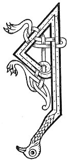

  
[Intangible Textual Heritage](../../../index) 
[Legends/Sagas](../../index)  [Celtic](../index)  [Carmina
Gadelica](../cg)  [Index](index)  [Previous](cg2053)  [Next](cg2055) 

------------------------------------------------------------------------

[Buy this Book at
Amazon.com](https://www.amazon.com/exec/obidos/ASIN/B0027P890O/internetsacredte)

------------------------------------------------------------------------

  
*Carmina Gadelica, Volume 2*, by Alexander Carmicheal, \[1900\], at
Intangible Textual Heritage

------------------------------------------------------------------------

 

<table data-border="0">
<colgroup>
<col style="width: 50%" />
<col style="width: 50%" />
</colgroup>
<tbody>
<tr class="odd">
<td data-valign="top" width="327">
p. 108
</td>
<td data-valign="top" width="327">
p. 109
</td>
</tr>
<tr class="even">
<td data-valign="top" width="327"><h3 id="seamarag-nam-buadh-171" data-align="center">SEAMARAG NAM BUADH [171]</h3></td>
<td data-valign="top" width="327"><h3 id="the-shamrock-of-power" data-align="center">THE SHAMROCK OF POWER</h3></td>
</tr>
</tbody>
</table>

 

<table data-border="0">
<colgroup>
<col style="width: 25%" />
<col style="width: 25%" />
<col style="width: 25%" />
<col style="width: 25%" />
</colgroup>
<tbody>
<tr class="odd">
<td data-valign="top">
 
</td>
<td data-valign="top">
p. 108
</td>
<td data-valign="top">
 
</td>
<td data-valign="top">
p. 109
</td>
</tr>
<tr class="even">
<td data-valign="top">
 
</td>
<td data-valign="top">
A SHEAMARAG nan duilleag, 
A sheamarag nam buadh, 
A sheamarag nan duilleag, 
Bha aig Muire fo bhruaich, 
A sheamarag mo ghraidh, 
Is ailinde snuadh, 
B' e mo mhiann anns a bhas, 
Thu bhi fas air m’ uaigh, 
    B’ e mo mhiann anns a bhas, 
    Thu bhi fas air m’ uaigh.
</td>
<td data-valign="top">
 
</td>
<td data-valign="top">
THOU shamrock of foliage, 
Thou shamrock of power, 
Thou shamrock of foliage, 
Which Mary had under the bank, 
Thou shamrock of my love, 
Of most beauteous hue, 
I would choose thee in death, 
To grow on my grave, 
    I would choose thee in death, 
    To grow on my grave.
</td>
</tr>
</tbody>
</table>

 

------------------------------------------------------------------------

[Next: 172. The 'Mothan'. Am Mothan](cg2055)
