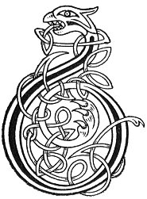

  
[Intangible Textual Heritage](../../../index) 
[Legends/Sagas](../../index)  [Celtic](../index)  [Carmina
Gadelica](../cg)  [Index](index)  [Previous](cg2056)  [Next](cg2058) 

------------------------------------------------------------------------

[Buy this Book at
Amazon.com](https://www.amazon.com/exec/obidos/ASIN/B0027P890O/internetsacredte)

------------------------------------------------------------------------

  
*Carmina Gadelica, Volume 2*, by Alexander Carmicheal, \[1900\], at
Intangible Textual Heritage

------------------------------------------------------------------------

 

<table data-border="0">
<colgroup>
<col style="width: 50%" />
<col style="width: 50%" />
</colgroup>
<tbody>
<tr class="odd">
<td data-valign="top" width="327">
p. 114
</td>
<td data-valign="top" width="327">
p. 115
</td>
</tr>
<tr class="even">
<td data-valign="top" width="327"><h3 id="am-mothan-174" data-align="center">AM MOTHAN [174]</h3></td>
<td data-valign="top" width="327"><h3 id="the-mothan" data-align="center">THE 'MOTHAN'</h3></td>
</tr>
</tbody>
</table>

 

<table data-border="0">
<colgroup>
<col style="width: 25%" />
<col style="width: 25%" />
<col style="width: 25%" />
<col style="width: 25%" />
</colgroup>
<tbody>
<tr class="odd">
<td data-valign="top">
 
</td>
<td data-valign="top">
p. 114
</td>
<td data-valign="top">
 
</td>
<td data-valign="top">
p. 115
</td>
</tr>
<tr class="even">
<td data-valign="top">
 
</td>
<td data-valign="top">
BUAINIDH mis am mothan suairce, 
An luibh is luachmhoire ’s an tom, 
Dulagan nan seachd sagart, 
’S an agallaich a ta n’ an com.

  *       *       *       * 
  *       *       *       * 
Gur liom an ciall ’s an codhail, 
Fad ’s a bhios am mothan liom.
</td>
<td data-valign="top">
 
</td>
<td data-valign="top">
I WILL pluck the gracious 'mothan,' 
Plant most precious in the field, 
That mine be the holiness of the seven priests, 
And the eloquence that is within them.

  *       *       *       * 
  *       *       *       * 
That mine be their wisdom and their counsel, 
While the 'mothan' is mine.
</td>
</tr>
</tbody>
</table>

 

------------------------------------------------------------------------

[Next: 175. The Passion-Flower of Virtues. Ceus-Chrann Nam
Buadh](cg2058)
