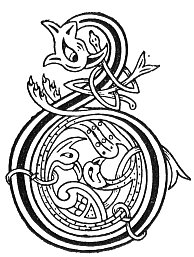

  
[Intangible Textual Heritage](../../../index.md) 
[Legends/Sagas](../../index)  [Celtic](../index.md)  [Carmina
Gadelica](../cg)  [Index](index)  [Previous](cg2060)  [Next](cg2062.md) 

------------------------------------------------------------------------

[Buy this Book at
Amazon.com](https://www.amazon.com/exec/obidos/ASIN/B0027P890O/internetsacredte.md)

------------------------------------------------------------------------

  
*Carmina Gadelica, Volume 2*, by Alexander Carmicheal, \[1900\], at
Intangible Textual Heritage

------------------------------------------------------------------------

 

<table data-border="0">
<colgroup>
<col style="width: 50%" />
<col style="width: 50%" />
</colgroup>
<tbody>
<tr class="odd">
<td data-valign="top" width="327">
p. 118
</td>
<td data-valign="top" width="327">
p. 119
</td>
</tr>
<tr class="even">
<td data-valign="top" width="327"><h3 id="a-chloimh-chat-178" data-align="center">A CHLOIMH CHAT [178]</h3></td>
<td data-valign="top" width="327"><h3 id="the-catkin-wool" data-align="center">THE CATKIN WOOL</h3></td>
</tr>
</tbody>
</table>

 

<table data-border="0">
<colgroup>
<col style="width: 25%" />
<col style="width: 25%" />
<col style="width: 25%" />
<col style="width: 25%" />
</colgroup>
<tbody>
<tr class="odd">
<td data-valign="top">
 
</td>
<td data-valign="top">
p. 118
</td>
<td data-valign="top">
 
</td>
<td data-valign="top">
p. 119
</td>
</tr>
<tr class="even">
<td data-valign="top">
 
</td>
<td data-valign="top">
BUAINIDH mi a chloimh chat, 
Mar a bhuain Mathair Chriosda tromh glac, 
Air bhuaidh, air bhuar, air bhleoghann, 
Air chual, ’s air thoradh na tana, 
Gun chall uan, gun chall caora, 
Gun chall maosa, gun chall lara, 
Gun chall bo, gun chall laogha, 
Gun chall maona, gun chall carda, 
     A uchd Ti nan dui, 
     ’S nan cursa comhla.
</td>
<td data-valign="top">
 
</td>
<td data-valign="top">
I WILL pluck the catkin wool, 
As plucked the Mother of Christ through her palm, 
For luck, for kine, for milking, 
For herds, for increase, for cattle, 
Without loss of lamb, without loss of sheep, 
Without loss of goat, without loss of mare, 
Without loss of cow, without loss of calf, 
Without loss of means, without loss of friends, 
     From the bosom of the God of life, 
     And the courses together.
</td>
</tr>
</tbody>
</table>

 

------------------------------------------------------------------------

[Next: 179. The Catkin Wool. A Chloimh Chat](cg2062.md)
