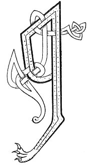

  
[Intangible Textual Heritage](../../../index) 
[Legends/Sagas](../../index)  [Celtic](../index)  [Carmina
Gadelica](../cg)  [Index](index)  [Previous](cg2062)  [Next](cg2064) 

------------------------------------------------------------------------

[Buy this Book at
Amazon.com](https://www.amazon.com/exec/obidos/ASIN/B0027P890O/internetsacredte)

------------------------------------------------------------------------

  
*Carmina Gadelica, Volume 2*, by Alexander Carmicheal, \[1900\], at
Intangible Textual Heritage

------------------------------------------------------------------------

 

<table data-border="0">
<colgroup>
<col style="width: 50%" />
<col style="width: 50%" />
</colgroup>
<tbody>
<tr class="odd">
<td data-valign="top" width="327">
p. 120
</td>
<td data-valign="top" width="327">
p. 121
</td>
</tr>
<tr class="even">
<td data-valign="top" width="327"><h3 id="eolas-a-bhun-deirg-180" data-align="center">EOLAS A BHUN DEIRG [180]</h3></td>
<td data-valign="top" width="327"><h3 id="incantation-of-the-red-water" data-align="center">INCANTATION OF THE RED WATER</h3></td>
</tr>
</tbody>
</table>

 

IN making the incantation of the red water, the
exorcist forms her two palms into a basin. She places this basin under
the urine of the cow or other animal affected, and throws the urine into
water, p. 121 preferably running water, to
carry away the demon of the complaint. Having washed her hands in clean
cold water, the woman forms them into a trumpet. She then faces the
rising sun, and intones the incantation through the trumpet as loudly as
she can.

 

<table data-border="0">
<colgroup>
<col style="width: 25%" />
<col style="width: 25%" />
<col style="width: 25%" />
<col style="width: 25%" />
</colgroup>
<tbody>
<tr class="odd">
<td data-valign="top">
 
</td>
<td data-valign="top">
p. 120
</td>
<td data-valign="top">
 
</td>
<td data-valign="top">
p. 121
</td>
</tr>
<tr class="even">
<td data-valign="top">
 
</td>
<td data-valign="top">
AN ainm Athar caoimh, 
An ainm Mic na caoidh, 
An ainm Spioraid Naoimh. 
                           Amen.

Muir mor, muir ruadh, 
Neart mara, neart cuain, 
Naoi tobraiche Mhic-a-Lir, 
Cobhair ort a shil, 
Casg a chur air t-fhuil, 
Ruith a chur air t-fhual. 
      [<em>An t-ainm</em>.]
</td>
<td data-valign="top">
 
</td>
<td data-valign="top">
IN name of the Father of love, 
In name of the Son of sorrow, 
In name of the Sacred Spirit. 
                            Amen.

Great wave, red wave, 
Strength of sea, strength of ocean, 
The nine wells of Mac-Lir, 
Help on thee to pour, 
Put stop to thy blood, 
Put flood to thy urine. 
       [<em>The name</em>.]
</td>
</tr>
</tbody>
</table>

 

------------------------------------------------------------------------

[Next: 181. Red Water Charm. Eolas Bun Deirg](cg2064)
