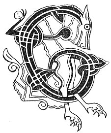

  
[Intangible Textual Heritage](../../../index.md) 
[Legends/Sagas](../../index)  [Celtic](../index.md)  [Carmina
Gadelica](../cg)  [Index](index)  [Previous](cg2065)  [Next](cg2067.md) 

------------------------------------------------------------------------

[Buy this Book at
Amazon.com](https://www.amazon.com/exec/obidos/ASIN/B0027P890O/internetsacredte.md)

------------------------------------------------------------------------

  
*Carmina Gadelica, Volume 2*, by Alexander Carmicheal, \[1900\], at
Intangible Textual Heritage

------------------------------------------------------------------------

 

<table data-border="0">
<colgroup>
<col style="width: 50%" />
<col style="width: 50%" />
</colgroup>
<tbody>
<tr class="odd">
<td data-valign="top" width="327">
p. 126
</td>
<td data-valign="top" width="327">
p. 127
</td>
</tr>
<tr class="even">
<td data-valign="top" width="327"><h3 id="an-stringlein-183" data-align="center">AN STRINGLEIN [183]</h3></td>
<td data-valign="top" width="327"><h3 id="the-strangles" data-align="center">THE STRANGLES</h3></td>
</tr>
</tbody>
</table>

 

<table data-border="0">
<colgroup>
<col style="width: 25%" />
<col style="width: 25%" />
<col style="width: 25%" />
<col style="width: 25%" />
</colgroup>
<tbody>
<tr class="odd">
<td data-valign="top">
 
</td>
<td data-valign="top">
p. 126
</td>
<td data-valign="top">
 
</td>
<td data-valign="top">
p. 127
</td>
</tr>
<tr class="even">
<td data-valign="top">
 
</td>
<td data-valign="top">
'EACH ’s an stringlein,' 
Orsa Calum-cille.

'Tillidh mis e,' 
Thubhairt Criosd.

'Moch Di-domhnaich?' 
Orsa Calum-cille.

'Romh eirigh ghreine,' 
Thubhairt Criosd.

'Tri postachan anns an tobar,' 
Orsa Calum-cille.

'Togaidh mis iad,' 
Thubhairt Criosd.

'An leighis sin e?' 
Ors Eoin Baistidh.

'Barantaich e,' 
Thubhairt Criosd.
</td>
<td data-valign="top">
 
</td>
<td data-valign="top">
'A HORSE in strangles,' 
Quoth Columba.

'I will turn it,' 
Said Christ.

'On Sunday morning? ' 
Quoth Columba.

'Ere rise of sun,' 
Said Christ.

'Three pillars in the well,' 
Quoth Columba.

'I will lift them,' 
Said Christ.

'Will that heal him?' 
Quoth John the Baptist.

'Assuredly,' 
Said Christ.
</td>
</tr>
</tbody>
</table>

 

------------------------------------------------------------------------

[Next: 184. The Spell of the Fox. Sian Sionnaich](cg2067.md)
