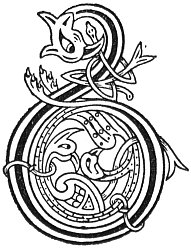

  
[Intangible Textual Heritage](../../../index.md) 
[Legends/Sagas](../../index)  [Celtic](../index.md)  [Carmina
Gadelica](../cg)  [Index](index)  [Previous](cg2066)  [Next](cg2068.md) 

------------------------------------------------------------------------

[Buy this Book at
Amazon.com](https://www.amazon.com/exec/obidos/ASIN/B0027P890O/internetsacredte.md)

------------------------------------------------------------------------

  
*Carmina Gadelica, Volume 2*, by Alexander Carmicheal, \[1900\], at
Intangible Textual Heritage

------------------------------------------------------------------------

 

<table data-border="0">
<colgroup>
<col style="width: 50%" />
<col style="width: 50%" />
</colgroup>
<tbody>
<tr class="odd">
<td data-valign="top" width="327">
p. 128
</td>
<td data-valign="top" width="327">
p. 129
</td>
</tr>
<tr class="even">
<td data-valign="top" width="327"><h3 id="sian-sionnaich-184" data-align="center">SIAN SIONNAICH [184]</h3></td>
<td data-valign="top" width="327"><h3 id="the-spell-of-the-fox" data-align="center">THE SPELL OF THE FOX</h3></td>
</tr>
</tbody>
</table>

 

THE fox was the plague of the people of the Highlands, killing their
sheep as the wolf killed their cattle, and as the foumart killed their
fowls. From the wildness of the land and the sparseness of the people,
the Highlands were the natural habitat of beasts and birds of prey and
other noxious creatures, which took the people much time and trouble to
subdue.

Much could be written of the intelligence of the fox. One of the tales
illustrating this intelligence is known as 'Sionnach na Maoile'--the Fox
of the Mull \[of Kintire\]. This fox never committed destruction near
his home--always going considerable distances to make his raids,
sometimes ten or twenty miles. He caused much injury to the sheep that
he attacked, and to the dogs that chased him. When pressed, the fox
leaped over a certain precipice and the dogs leaped over after him. The
dogs were found dead on the rocks below, but not the fox, who in due
time turned up as before.

Nothing could be seen from above nor from below the precipice to account
for the immunity of the fox. No shelf or ledge could be seen whereon the
fox could leap, and the people were puzzled. But the fox-hunter was not
satisfied, and procuring ropes, he went down the precipice and examined
it carefully. He found a sapling mountain ash growing out of the rock,
and marked as if to distinguish it from the saplings of ordinary ash,
bramble, plane, and other woods which were growing in the neighbourhood.
And he p. 129 found that by bending the
marked mountain ash to a certain degree from its perpendicular and at a
certain angle to the plane of the precipice, it touched a narrow
thread-like sinuous ledge that might yield a precarious footing to a
cat, to a marten, or possibly to a fox. This ledge led away to other
ledges up and down the cliff. The fox-hunter cut the marked sapling,
securing it, however, in its place. When the next havoc of the sheep had
occurred, and the next pursuit of the fox had followed, the fox was
found dead at the foot of the precipice, the marked mountain ash in his
mouth! Choosing the tough mountain ash sapling in preference to the
other less tough saplings showed sagacity, leaping from the precipice
and seizing the sapling in mid-air to arrest his fall showed courage,
and taking the precipice at an angle by which to get the sapling to land
him in the only possible spot showed intelligence of a high order in the
fox. The scene of this story has ever since been called 'Creag an
t-Sionnaich'--precipice of the fox.

The conduct of this fox gave rise to many sayings of the people, 'Co
carrach ri sionnach ruadh Maol Chinntire,'--as crafty as the red fox of
the Mull of Kintire. 'Co seolta ri sionnach na Maoile,'--as cunning as
the fox of the Mull. 'Co siogada sinn seanarach ri sionnach na
Maoile,'--as great-great-great-grandfatherish as the fox of the Mull.
'Bheir e leis a chreaig sibh mar a thug an sionnach na todhlairean,'--He
will lead you over the cliff as the fox led the hounds.

 

<table data-border="0">
<colgroup>
<col style="width: 25%" />
<col style="width: 25%" />
<col style="width: 25%" />
<col style="width: 25%" />
</colgroup>
<tbody>
<tr class="odd">
<td data-valign="top">
 
</td>
<td data-valign="top">
p. 128
</td>
<td data-valign="top">
 
</td>
<td data-valign="top">
p. 129
</td>
</tr>
<tr class="even">
<td data-valign="top">
 
</td>
<td data-valign="top">
BIODH sian a choin-choille, 
Mu chasaibh an t-sionnaich, 
Mu mhiann, mu ghoile, 
Mu shlugaid a ghionaich, 
Mu chorr fhiacail chorraich, 
Mu chorran a mhionaich.

Biodh sian an Domhnaich mu chaorail, 
Sian Chriosda chaoimh-ghil, chaoin-ghil, 
Sian Mhoire mhin-ghil, mhaoth-ghil, 
Romh chona, romh iana, romh dhaonail, 
Romh chona shithil, romh chona shaoghail, 
Far an t-saoghail a bhos, far an t-saoghail thall.
</td>
<td data-valign="top">
 
</td>
<td data-valign="top">
BE the spell of the wood dog, 
On the feet of the fox, 
On his heart, on his liver, 
On his gullet of greediness, 
On his surpassing pointed teeth, 
On the bend of his stomach.

Be the charm of the Lord upon the sheep-kind, 
The charm of Christ kindly-white, mild-white, 
The charm of Mary lovely-fair, tender-fair, 
Against dogs, against birds, against man-kind, 
Against fairy dogs, against world dogs, 
Of the world hither, of the world thither.
</td>
</tr>
</tbody>
</table>

 

------------------------------------------------------------------------

[Next: 185. Prayer of the Cattle-Fold. Ora Cuithe](cg2068.md)
