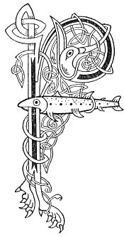

  
[Intangible Textual Heritage](../../../index.md) 
[Legends/Sagas](../../index)  [Celtic](../index.md)  [Carmina
Gadelica](../cg)  [Index](index)  [Previous](cg2068)  [Next](cg2070.md) 

------------------------------------------------------------------------

[Buy this Book at
Amazon.com](https://www.amazon.com/exec/obidos/ASIN/B0027P890O/internetsacredte.md)

------------------------------------------------------------------------

  
*Carmina Gadelica, Volume 2*, by Alexander Carmicheal, \[1900\], at
Intangible Textual Heritage

------------------------------------------------------------------------

 

<table data-border="0">
<colgroup>
<col style="width: 50%" />
<col style="width: 50%" />
</colgroup>
<tbody>
<tr class="odd">
<td data-valign="top" width="327">
p. 132
</td>
<td data-valign="top" width="327">
p. 133
</td>
</tr>
<tr class="even">
<td data-valign="top" width="327"><h3 id="feith-mhoire-186" data-align="center">FEITH MHOIRE [186]</h3></td>
<td data-valign="top" width="327"><h3 id="the-ditch-of-mary" data-align="center">THE DITCH OF MARY</h3></td>
</tr>
</tbody>
</table>

 

FLAT moorland is generally intersected with
innumerable veins, channels, and ditches. Sometimes these are serious
obstacles to cattle, more especially to cows, which are accurate judges.
When a cow hesitates to cross, the person driving her throws a stalk or
a twig into the ditch before the unwilling animal and sings the 'Feith
Mhoire,' Vein of Mary, to encourage her to cross, and to assure her that
a safe bridge is before her. The stalk may be of any corn or grass
except the reed, and the twig of any wood except the wild fig, the
aspen, and the thorn. All these are forbidden, or 'crossed' as the
people say, because of their ungracious conduct to the Gracious One. The
reed is 'crossed' because it carried the sponge dipped in vinegar; the
fig-tree because of its inhospitality; the aspen because it held up its
head haughtily, proud that the cross was made p.
133 of its wood, when all the trees of the forest--all save the
aspen alone--bowed their heads in reverence to the King of glory passing
by on the way to Calvary; and the thorn-tree because of its prickly
pride in having been made into a crown for the King of kings.
Notwithstanding, however, the wand of safety and the hymn of the
herdsman, a cow driven against her will sometimes sinks into the ditch
while crossing. This may necessitate the assistance of neighbours to
extricate her from her helpless position. Hence the proverb:--'Is e fear
na bo fein theid ’s an fheith an tos'--It is the man of the cow himself
who shall go into the ditch first. The practice of throwing down the
wand and repeating the hymn gave rise to a proverb among the more
sceptical of the people:--'Cha dean thu feith Mhoire orm-s’ idir a
mhicean'--Thou wilt not make a 'vein of Mary' upon me at all,
sonnie.

 

<table data-border="0">
<colgroup>
<col style="width: 25%" />
<col style="width: 25%" />
<col style="width: 25%" />
<col style="width: 25%" />
</colgroup>
<tbody>
<tr class="odd">
<td data-valign="top">
 
</td>
<td data-valign="top">
p. 132
</td>
<td data-valign="top">
 
</td>
<td data-valign="top">
p. 133
</td>
</tr>
<tr class="even">
<td data-valign="top">
 
</td>
<td data-valign="top">
      FEITH Mhoire, 
      Feith Mhoire; 
      Casa curra, 
      Casa curra; 
      Feith Mhoire, 
      Feith Mhoire; 
Casa curra fothaibh, 
Drochaid urra romhaibh.

      Chuir Moire gas ann, 
      Chuir Bride bas ann, 
      Chuir Calum cas ann, 
Chuir Padra clach fhuar.

      Feith Mhoire, 
      Feith Mhoire; 
      Casa curra, 
      Casa curra; 
      Feith Mhoire, 
      Feith Mhoire; 
Casa curra fothaibh, 
Drochaid urra romhaibh.
</td>
<td data-valign="top">
 
</td>
<td data-valign="top">
      DITCH of Mary, 
      Ditch of Mary; 
      Heron legs, 
      Heron legs; 
      Ditch of Mary, 
      Ditch of Mary; 
Heron legs under you, 
Bridge of warranty before you.

      Mary placed a wand in it, 
      Bride placed a hand in it, 
      Columba placed a foot in it, 
Patrick placed a cold stone.

      Ditch of Mary, 
      Ditch of Mary; 
      Heron legs, 
      Heron legs; 
      Ditch of Mary, 
      Ditch of Mary; 
Heron legs under you, 
Bridge of warranty before you.
</td>
</tr>
<tr class="odd">
<td data-valign="top">
 
</td>
<td data-valign="top">
p. 134
</td>
<td data-valign="top">
 
</td>
<td data-valign="top">
p. 135
</td>
</tr>
<tr class="even">
<td data-valign="top">
 
</td>
<td data-valign="top">
Chuir Muiril mirr ann, 
Chuir Uiril mil ann, 
Chuir Muirinn fion ann, 
’S chuir Micheal ann buadh.

      Feith Mhoire, 
      Feith Mhoire; 
      Casa curra, 
      Casa curra; 
      Feith Mhoire, 
      Feith Mhoire; 
Casa curra fodhaibh, 
Drochaid urra romhaibh.
</td>
<td data-valign="top">
 
</td>
<td data-valign="top">
Muirel placed myrrh in it, 
Uriel placed honey in it, 
Muirinn placed wine in it, 
And Michael placed in it power.

      Ditch of Mary, 
      Ditch of Mary; 
      Heron legs, 
      Heron legs; 
      Ditch of Mary, 
      Ditch of Mary; 
Heron legs under you, 
Bridge of warranty before you.
</td>
</tr>
</tbody>
</table>

 

------------------------------------------------------------------------

[Next: 187. The Hind. An Eilid](cg2070.md)
