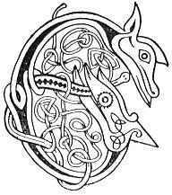

  
[Intangible Textual Heritage](../../../index.md) 
[Legends/Sagas](../../index)  [Celtic](../index.md)  [Carmina
Gadelica](../cg)  [Index](index)  [Previous](cg2071)  [Next](cg2073.md) 

------------------------------------------------------------------------

[Buy this Book at
Amazon.com](https://www.amazon.com/exec/obidos/ASIN/B0027P890O/internetsacredte.md)

------------------------------------------------------------------------

  
*Carmina Gadelica, Volume 2*, by Alexander Carmicheal, \[1900\], at
Intangible Textual Heritage

------------------------------------------------------------------------

 

<table data-border="0">
<colgroup>
<col style="width: 50%" />
<col style="width: 50%" />
</colgroup>
<tbody>
<tr class="odd">
<td data-valign="top" width="327">
p. 138
</td>
<td data-valign="top" width="327">
p. 139
</td>
</tr>
<tr class="even">
<td data-valign="top" width="327"><h3 id="eolas-a-mheirbhein-189" data-align="center">EOLAS A MHEIRBHEIN [189]</h3></td>
<td data-valign="top" width="327"><h3 id="the-indigestion-spell" data-align="center">THE INDIGESTION SPELL</h3></td>
</tr>
</tbody>
</table>

 

<table data-border="0">
<colgroup>
<col style="width: 25%" />
<col style="width: 25%" />
<col style="width: 25%" />
<col style="width: 25%" />
</colgroup>
<tbody>
<tr class="odd">
<td data-valign="top">
 
</td>
<td data-valign="top">
p. 138
</td>
<td data-valign="top">
 
</td>
<td data-valign="top">
p. 139
</td>
</tr>
<tr class="even">
<td data-valign="top">
 
</td>
<td data-valign="top">
EOLAS a rinn Calum, 
Dh’ aona bho caillich, 
Air a chraillich, air a ghaillich, 
Air a bholg, air a cholg, 
Air a mheirbhein;

Air a ghalar ghir, 
Air a ghalar chir, 
Air a ghalar mhir, 
Air a ghalar tolg, 
Air an tairbhein;

Air a ghalar chil, 
Air a ghalar mhil, 
Air a ghalar lioil, 
Air a ghalar dhearg, 
Air a mhearchann;

Sgoiltidh mi an crailleach, 
Sgoiltidh mi an gailleach, 
Sgoiltidh mi am bolg, 
Sgoiltidh mi an colg, 
Agus marbhaidh mi am meirbhein;

Sgoiltidh mi an gir, 
Sgoiltidh mi an cir, 
Sgoiltidh mi am mir, 
Sgoiltidh mi an tolg, 
Agus falbhaidh an tairbhein;

Sgoiltidh mi an cil, 
Sgoiltidh mi am mil, 
Sgoiltidh mi an lioil, 
Sgoiltidh mi an dearg, 
Is seargaidh am mearchann.
</td>
<td data-valign="top">
 
</td>
<td data-valign="top">
THE spell made of Columba, 
To the one cow of the woman, 
For the 'crailleach,' for the gum disease, 
For the bag, for the 'colg,' 
For the indigestion (?);

For the flux disease, 
For the cud disease, 
For the 'mir' disease, 
For the 'tolg' disease, 
For the surfeit (?);

For the 'cil' disease, 
For the 'mil' disease, 
For the water disease, 
For the red disease, 
For the madness (?);

I will cleave the 'crailleach,' 
I will cleave the gum disease, 
I will cleave the bag, 
I will cleave the 'colg,' 
And I will kill the indigestion (?);

I will cleave the flux, 
I will cleave the cud, 
I will cleave the 'mir,' 
I will cleave the 'tolg,' 
And drive away the surfeit (?);

I will cleave the 'cil,' 
I will cleave the 'mil,' 
I will cleave the water, 
I will cleave the red, 
And wither will the madness (?).
</td>
</tr>
</tbody>
</table>

 

------------------------------------------------------------------------

[Next: 190. Cud Chewing Charm. Eolas Chnamh Chir](cg2073.md)
