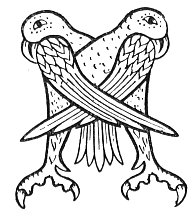

  
[Intangible Textual Heritage](../../../index.md) 
[Legends/Sagas](../../index)  [Celtic](../index.md)  [Carmina
Gadelica](../cg)  [Index](index)  [Previous](cg2072)  [Next](cg2074.md) 

------------------------------------------------------------------------

[Buy this Book at
Amazon.com](https://www.amazon.com/exec/obidos/ASIN/B0027P890O/internetsacredte.md)

------------------------------------------------------------------------

  
*Carmina Gadelica, Volume 2*, by Alexander Carmicheal, \[1900\], at
Intangible Textual Heritage

------------------------------------------------------------------------

 

<table data-border="0">
<colgroup>
<col style="width: 50%" />
<col style="width: 50%" />
</colgroup>
<tbody>
<tr class="odd">
<td data-valign="top" width="327">
p. 140
</td>
<td data-valign="top" width="327">
p. 141
</td>
</tr>
<tr class="even">
<td data-valign="top" width="327"><h3 id="eolas-chnamh-chir-190" data-align="center">EOLAS CHNAMH CHIR [190]</h3></td>
<td data-valign="top" width="327"><h3 id="cud-chewing-charm" data-align="center">CUD CHEWING CHARM</h3></td>
</tr>
</tbody>
</table>

 

THIS incantation is said over an animal suffering
from surfeit. It is repeated three times, representing the Three Persons
of the Trinity. If the surfeit is from eating too much grass or from
drinking too much water, the cow or other animal p.
141 affected begins to chew the cud on being appealed to. If the
animal does not begin to chew the cud, the cause of swelling must be
sought for otherwise, and the appropriate incantation applied.

 

<table data-border="0">
<colgroup>
<col style="width: 25%" />
<col style="width: 25%" />
<col style="width: 25%" />
<col style="width: 25%" />
</colgroup>
<tbody>
<tr class="odd">
<td data-valign="top">
 
</td>
<td data-valign="top">
p. 140
</td>
<td data-valign="top">
 
</td>
<td data-valign="top">
p. 141
</td>
</tr>
<tr class="even">
<td data-valign="top">
 
</td>
<td data-valign="top">
<a href="errata.htm#1">MU</a> dh’ ith thu fiar nan naodh beann, 
Nan naodh meall, nan naodh toman, 
Ma dh’ ol thu sian nan naodh steallt, 
Nan naodh allt, nan naodh lodan, 
A Ghruaigein thruaigh na maodail cruaidh, 
Cnamh, a luaidh, do chir. 
A Ghruaigein thruaigh na maodail cruaidh, 
Cnamh, a luaidh, do chir.
</td>
<td data-valign="top">
 
</td>
<td data-valign="top">
IF thou hast eaten the grass of the nine bens, 
Of the nine fells, of the nine hillocks, 
If thou hast drunk the water of the nine falls, 
Of the nine streams, of the nine lakelets, 
Poor 'Gruaigein' of the hard paunch, 
Loved one, chew thou thy cud. 
Poor 'Gruaigein' of the hard paunch, 
Loved one, chew thou thy cud.
</td>
</tr>
</tbody>
</table>

 

------------------------------------------------------------------------

[Next: 191 (notes). Charm of the Churn. Eolas A Chrannachain](cg2074.md)
