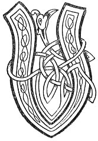

  
[Intangible Textual Heritage](../../../index.md) 
[Legends/Sagas](../../index)  [Celtic](../index.md)  [Carmina
Gadelica](../cg)  [Index](index)  [Previous](cg2076)  [Next](cg2078.md) 

------------------------------------------------------------------------

[Buy this Book at
Amazon.com](https://www.amazon.com/exec/obidos/ASIN/B0027P890O/internetsacredte.md)

------------------------------------------------------------------------

  
*Carmina Gadelica, Volume 2*, by Alexander Carmicheal, \[1900\], at
Intangible Textual Heritage

------------------------------------------------------------------------

 

<table data-border="0">
<colgroup>
<col style="width: 50%" />
<col style="width: 50%" />
</colgroup>
<tbody>
<tr class="odd">
<td data-valign="top" width="327">
p. 154
</td>
<td data-valign="top" width="327">
p. 155
</td>
</tr>
<tr class="even">
<td data-valign="top" width="327"><h3 id="ulc-a-dhean-mo-lochd-193" data-align="center">ULC A DHEAN MO LOCHD [193]</h3></td>
<td data-valign="top" width="327"><h3 id="the-wicked-who-would-me-harm" data-align="center">THE WICKED WHO WOULD ME HARM</h3></td>
</tr>
</tbody>
</table>

 

THIS and other poems were obtained from Isabella
Chisholm, a travelling tinker. Though old, Isabella Chisholm was still
tall and straight, fine-featured, and fresh-complexioned. She was
endowed with personal attraction, mental ability, and astute diplomacy
of no common order. Her father, John Chisholm, is said to have been a
'pious, prayerful man'--terms not usually applied to his class. Isabella
p. 155 Chisholm had none of the swarthy skin
and far-away look of the ordinary gipsy. But she had the gipsy habits
and the gipsy language, variously called 'Cant,' 'Shelta,' 'Romany,'
with rich fluent Gaelic and English. She had many curious spells, runes,
and hymns, that would have enriched Gaelic literature, and many rare
words and phrases and expressions that would have improved the Gaelic
dictionary.

 

<table data-border="0">
<colgroup>
<col style="width: 25%" />
<col style="width: 25%" />
<col style="width: 25%" />
<col style="width: 25%" />
</colgroup>
<tbody>
<tr class="odd">
<td data-valign="top">
 
</td>
<td data-valign="top">
p. 154
</td>
<td data-valign="top">
 
</td>
<td data-valign="top">
p. 155
</td>
</tr>
<tr class="even">
<td data-valign="top">
 
</td>
<td data-valign="top">
ULC a dhean mo lochd 
Gun gabh e ’n galar gluc gloc, 
Guirneanach, gioirneanach, guairneach, 
Gaornanach, garnanach, gruam.

Gum bu cruaidhe c na chlach, 
Gum bu duibhe e na ’n gual, 
Gum bu luaithe e na ’n lach, 
Gum bu truime e na ’n luaidh.

Gum bu gointe, gointe, geuire, gairbhe, guiniche e, 
Na’n cuilionn cruaidh cnea-chridheach, 
Gum bu gairge e na’n salann sion, sionn, searbh, sailte, 
Seachd seachd uair.

A turabal a null, 
A tarabal a nall, 
A treosdail a sios, 
A dreochail a suas,

A breochail a muigh, 
A geochail a staigh, 
Dol a mach minic, 
Tighinn a steach ainmic.
</td>
<td data-valign="top">
 
</td>
<td data-valign="top">
THE wicked who would do me harm 
May he take the [throat] disease, 
Globularly, spirally, circularly, 
Fluxy, pellety, horny-grim.

Be it harder than the stone, 
Be it blacker than the coal, 
Be it swifter than the duck, 
Be it heavier than the lead.

Be it fiercer, fiercer, sharper, harsher, more malignant, 
Than the hard, wound-quivering holly, 
Be it sourer than the sained, lustrous, bitter, salt salt, 
Seven seven times.

Oscillating thither, 
Undulating hither, 
Staggering downwards, 
Floundering upwards.

Drivelling outwards, 
Snivelling inwards, 
Oft hurrying out, 
Seldom coming in.
</td>
</tr>
<tr class="odd">
<td data-valign="top">
 
</td>
<td data-valign="top">
p. 156
</td>
<td data-valign="top">
 
</td>
<td data-valign="top">
p. 157
</td>
</tr>
<tr class="even">
<td data-valign="top">
 
</td>
<td data-valign="top">
Sop an luib gach laimhe, 
Cas an cois gach cailbhe, 
Lurg am bun gach ursann, 
Sput ga chur ’s ga chairbinn.

Gearrach fhala le cridhe, le crutha, le cnamha, 
Le gruthan, le sgumhan, le sgamha, 
Agus sgrudadh cuisil, ugan is arna, 
Dha mo luchd-tair agus tuaileis.

An ainm Dhia nam feart, 
A shiab uam gach olc, 
’S a dhion mi le neart, 
Bho lion mo luchd-freachd 
     Agus fuathachd.
</td>
<td data-valign="top">
 
</td>
<td data-valign="top">
A wisp the portion of each hand, 
A foot in the base of each pillar, 
A leg the prop of each jamb, 
A flux driving and dragging him.

A dysentery of blood from heart, from form, from bones, 
From the liver, from the lobe, from the lungs, 
And a searching of veins, of throat, and of kidneys, 
To my contemners and traducers.

In name of the God of might, 
Who warded from me every evil, 
And who shielded me in strength, 
From the net of my breakers 
     And destroyers.
</td>
</tr>
</tbody>
</table>

 

------------------------------------------------------------------------

[Next: 194. Augury of Mary. Frith Mhoire](cg2078.md)
