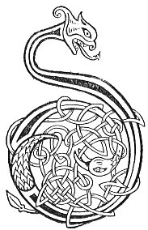

  
[Intangible Textual Heritage](../../../index.md) 
[Legends/Sagas](../../index)  [Celtic](../index.md)  [Carmina
Gadelica](../cg)  [Index](index)  [Previous](cg2077)  [Next](cg2079.md) 

------------------------------------------------------------------------

[Buy this Book at
Amazon.com](https://www.amazon.com/exec/obidos/ASIN/B0027P890O/internetsacredte.md)

------------------------------------------------------------------------

  
*Carmina Gadelica, Volume 2*, by Alexander Carmicheal, \[1900\], at
Intangible Textual Heritage

------------------------------------------------------------------------

 

<table data-border="0">
<colgroup>
<col style="width: 50%" />
<col style="width: 50%" />
</colgroup>
<tbody>
<tr class="odd">
<td data-valign="top" width="327">
p. 158
</td>
<td data-valign="top" width="327">
p. 159
</td>
</tr>
<tr class="even">
<td data-valign="top" width="327"><h3 id="frith-mhoire-194" data-align="center">FRITH MHOIRE [194]</h3></td>
<td data-valign="top" width="327"><h3 id="augury-of-mary" data-align="center">AUGURY OF MARY</h3></td>
</tr>
</tbody>
</table>

 

THE 'frith,' augury, was a species of divination enabling the 'frithir,'
augurer, to see into the unseen. This divination was made to ascertain
the position and condition of the absent and the lost, and was applied
to man and beast. The augury was made on the first Monday of the quarter
and immediately before sunrise. The augurer, fasting, and with bare
feet, bare head, and closed eyes, went to the doorstep and placed a hand
on each jamb. Mentally beseeching the God of the unseen to show him his
quest and to grant him his augury, the augurer opened his eyes and
looked steadfastly straight in front of him. From the nature and
position of the objects within his sight, he drew his conclusions.p. 159

Many men in the Highlands and Islands were famed augurers, and many
stories, realistic, romantic, and extremely curious, are still told of
their divinations.

The people say that the Virgin made an augury when Christ was missing,
and that it was by means of this augury that Mary and Joseph ascertained
that Christ was in the Temple disputing with the doctors. Hence this
divination is called 'frith Mhoire,'--the augury of Mary; and
'frithireachd Mhoire,'--the auguration of Mary.

The 'frith' of the Celt is akin to the 'frett' of the Norseman. Probably
the surnames Freer, Frere, are modifications of 'frithir,' augurer.
Persons bearing this name claim that their progenitors were astrologers
to the kings of Scotland.

 

<table data-border="0">
<colgroup>
<col style="width: 25%" />
<col style="width: 25%" />
<col style="width: 25%" />
<col style="width: 25%" />
</colgroup>
<tbody>
<tr class="odd">
<td data-valign="top">
 
</td>
<td data-valign="top">
p. 158
</td>
<td data-valign="top">
 
</td>
<td data-valign="top">
p. 159
</td>
</tr>
<tr class="even">
<td data-valign="top">
 
</td>
<td data-valign="top">
DIA faram, Dia fodham, 
Dia romham, Dia am dheoghainn, 
Mis air do shlighe Dhia, 
     Thus, a Dhia, air mo luirg.

Frith rinn Muire d’a Mac, 
Iobair Bride ri a glac, 
Am fac thu i, a Righ nan dul?-- 
     Ursa Righ nan dul gum fac.

Frith Muire da muirichinn fein, 
Trath dha bhi re ri cuairt, 
Fios firinn gun fios breuige, 
     Gum faic mi fein na bheil uam.

Mac Muire min-ghil, Righ nan dul, 
A shulachadh domh-s’ na bheil uam, 
Le gras nach falnaich, mu m’ choinneamh, 
     Gu brath nach smalaich ’s nach doillich.
</td>
<td data-valign="top">
 
</td>
<td data-valign="top">
GOD over me, God under me, 
God before me, God behind me, 
I on Thy path, O God, 
     Thou, O God, in my steps.

The augury made of Mary to her Son, 
The offering made of Bride through her palm, 
Sawest Thou it, King of life?-- 
     Said the King of life that He saw.

The augury made by Mary for her own offspring, 
When He was for a space amissing, 
Knowledge of truth, not knowledge of falsehood, 
     That I shall truly see all my quest.

Son of beauteous Mary, King of life, 
Give Thou me eyes to see all my quest, 
With grace that shall never fail, before me, 
     That shall never quench nor dim.
</td>
</tr>
</tbody>
</table>

 

------------------------------------------------------------------------

[Next: Header](cg2079.md)
