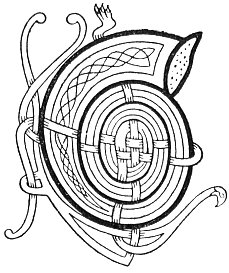

  
[Intangible Textual Heritage](../../../index.md) 
[Legends/Sagas](../../index)  [Celtic](../index.md)  [Carmina
Gadelica](../cg)  [Index](index)  [Previous](cg2079)  [Next](cg2081.md) 

------------------------------------------------------------------------

[Buy this Book at
Amazon.com](https://www.amazon.com/exec/obidos/ASIN/B0027P890O/internetsacredte.md)

------------------------------------------------------------------------

  
*Carmina Gadelica, Volume 2*, by Alexander Carmicheal, \[1900\], at
Intangible Textual Heritage

------------------------------------------------------------------------

 

<table data-border="0">
<colgroup>
<col style="width: 50%" />
<col style="width: 50%" />
</colgroup>
<tbody>
<tr class="odd">
<td data-valign="top" width="327">
p. 162
</td>
<td data-valign="top" width="327">
p. 163
</td>
</tr>
<tr class="even">
<td data-valign="top" width="327"><h3 id="ciad-miarail-chriosd-195" data-align="center">CIAD MIARAIL CHRIOSD [195]</h3></td>
<td data-valign="top" width="327"><h3 id="the-first-miracle-of-christ" data-align="center">THE FIRST MIRACLE OF CHRIST</h3></td>
</tr>
</tbody>
</table>

 

THIS poem was obtained in 1891 from Malcolm
Macmillan, crofter, Grimnis, Benbecula. Macmillan was then an old man.
He heard this and many other poems when a boy from old people who, when
evicted in Uist, emigrated to Prince Edward's Island, Nova Scotia, Cape
Breton, and other parts of the Canadian Dominion, and p. 163 to Australia. These old people took great
quantities of traditional Gaelic lore with them to their new homes, some
of which still lingers among their descendants. Many original and
translated songs of the Highlands and Islands are sung among these
settlers, whose hearts still yearn towards their motherland.

 

<table data-border="0">
<colgroup>
<col style="width: 25%" />
<col style="width: 25%" />
<col style="width: 25%" />
<col style="width: 25%" />
</colgroup>
<tbody>
<tr class="odd">
<td data-valign="top">
 
</td>
<td data-valign="top">
p. 162
</td>
<td data-valign="top">
 
</td>
<td data-valign="top">
p. 163
</td>
</tr>
<tr class="even">
<td data-valign="top">
 
</td>
<td data-valign="top">
CHAIDH Eosai is Mairi 
Chon aireamh a suas, 
’S chaidh eoin an geall caithream 
Ann an caille nan cuach.

Bha ’n dithis a siubhal slighe, 
Gon a ranuig iad coille tiugh, 
Is anns a choille bha miosan 
Bha co dearg ris na subh.

Sin an t-am an robh ise torrach, 
Anns an robh i giulan nigh nan gras, 
Is ghabh i miann air na miosan 
Bha air sliosrach an aigh.

Is labhair Mairi ri Eosai, 
Le guth malda, miamh, 
'Tabhair miosan domh, Eosai, 
Gon caisg mi mo mhiann.'

Is labhair Eosai ri Mairi, 
’S an cradh cruaidh na chom, 
'Bheir mi ’uit miosan, a Mhairi, 
Ach co is athair dha d’ throm?'
</td>
<td data-valign="top">
 
</td>
<td data-valign="top">
JOSEPH and Mary went 
To the numbering up, 
And the birds began chorusing 
In the woods of the turtle-doves.

The two were walking the way, 
Till they reached a thick wood, 
And in the wood there was fruit 
Which was as red as the rasp.

That was the time when she was great, 
That she was carrying the King of grace, 
And she took a desire for the fruit 
That was growing on the gracious slope.

Then spoke Mary to Joseph, 
In a voice low and sweet, 
'Give to me of the fruit, Joseph, 
That I may quench my desire.'

And Joseph spoke to Mary, 
And the hard pain in his breast, 
'I will give thee of the fruit, Mary, 
But who is the father of thy burthen?'
</td>
</tr>
<tr class="odd">
<td data-valign="top">
 
</td>
<td data-valign="top">
p. 164
</td>
<td data-valign="top">
 
</td>
<td data-valign="top">
p. 165
</td>
</tr>
<tr class="even">
<td data-valign="top">
 
</td>
<td data-valign="top">
Sin ’d uair labhair an Leanabh, 
A mach as a bru, 
'Lub a sios gach geug aluinn, 
Gon caisg mo Mhathair a ruth.'

’S o ’n mheanglan is airde, 
Chon a mheanglan is isde, 
Lub iad a sios gon a glun, 
’S ghabh Mairi dhe na miosan 
Ann am fearann fiosraidh a ruin.

An sin thuirt Eosai ri Mairi, 
’S e lan aithreachais trom, 
'Is ann air a ghiulan a tasa, 
Righ na glorach ’s nan grasa. 
Beannaicht thu, Mhairi, 
     Measg mnai gach fonn. 
Beannaicht thu, Mhairi, 
     Measg mnai gach fonn.'
</td>
<td data-valign="top">
 
</td>
<td data-valign="top">
Then it was that the Babe spoke, 
From out of her womb, 
'Bend ye down every beautiful bough, 
That my Mother may quench her desire.'

And from the bough that was highest, 
To the bough that was lowest, 
They all bent down to her knee, 
And Mary partook of the fruit 
In her loved land of prophecy.

Then Joseph said to Mary, 
And he full of heavy contrition, 
'It is carrying Him thou art, 
The King of glory and of grace. 
Blessed art thou, Mary, 
     Among the women of all lands. 
Blessed art thou, Mary, 
     Among the women of all lands.'
</td>
</tr>
</tbody>
</table>

 

------------------------------------------------------------------------

[Next: 196. The Virgin and Child. An Oigh Agus An Leanabh](cg2081.md)
