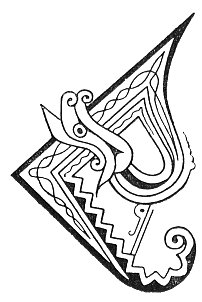

  
[Intangible Textual Heritage](../../../index) 
[Legends/Sagas](../../index)  [Celtic](../index)  [Carmina
Gadelica](../cg)  [Index](index)  [Previous](cg2080)  [Next](cg2082) 

------------------------------------------------------------------------

[Buy this Book at
Amazon.com](https://www.amazon.com/exec/obidos/ASIN/B0027P890O/internetsacredte)

------------------------------------------------------------------------

  
*Carmina Gadelica, Volume 2*, by Alexander Carmicheal, \[1900\], at
Intangible Textual Heritage

------------------------------------------------------------------------

 

<table data-border="0">
<colgroup>
<col style="width: 50%" />
<col style="width: 50%" />
</colgroup>
<tbody>
<tr class="odd">
<td data-valign="top" width="327">
p. 166
</td>
<td data-valign="top" width="327">
p. 167
</td>
</tr>
<tr class="even">
<td data-valign="top" width="327"><h3 id="an-oigh-agus-an-leanabh-196" data-align="center">AN OIGH AGUS AN LEANABH [196]</h3></td>
<td data-valign="top" width="327"><h3 id="the-virgin-and-child" data-align="center">THE VIRGIN AND CHILD</h3></td>
</tr>
</tbody>
</table>

 

<table data-border="0">
<colgroup>
<col style="width: 25%" />
<col style="width: 25%" />
<col style="width: 25%" />
<col style="width: 25%" />
</colgroup>
<tbody>
<tr class="odd">
<td data-valign="top">
 
</td>
<td data-valign="top">
p. 166
</td>
<td data-valign="top">
 
</td>
<td data-valign="top">
p. 167
</td>
</tr>
<tr class="even">
<td data-valign="top">
 
</td>
<td data-valign="top">
CHUNNACAS an Oigh a teachd, 
Criosda gu h-og na h-uchd, 
Ainghle a lubadh dhaibh umhlachd, 
Righ nan dul a dubhradh gur ceart.

An Oigh is or-dhealta cleachd, 
An t-Ios is ro ghile na ’n sneachd, 
Searapha ciuil a seinn an cliu, 
Righ nan dul a dubhradh gur ceart.
</td>
<td data-valign="top">
 
</td>
<td data-valign="top">
THE Virgin was seen approaching, 
Christ so young on her breast, 
Angels making them obeisance, 
The King of glory saying it is just.

The Virgin of gold-bedewed locks, 
The Jesu whiter than snow, 
Seraphs of song singing their praise, 
The King of glory saying it is just.
</td>
</tr>
</tbody>
</table>

 

------------------------------------------------------------------------

[Next: 197. God of the Moon. Dia Na Gile](cg2082)
