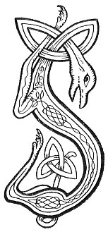

  
[Intangible Textual Heritage](../../../index.md) 
[Legends/Sagas](../../index)  [Celtic](../index.md)  [Carmina
Gadelica](../cg)  [Index](index)  [Previous](cg2086)  [Next](cg2088.md) 

------------------------------------------------------------------------

[Buy this Book at
Amazon.com](https://www.amazon.com/exec/obidos/ASIN/B0027P890O/internetsacredte.md)

------------------------------------------------------------------------

  
*Carmina Gadelica, Volume 2*, by Alexander Carmicheal, \[1900\], at
Intangible Textual Heritage

------------------------------------------------------------------------

 

<table data-border="0">
<colgroup>
<col style="width: 50%" />
<col style="width: 50%" />
</colgroup>
<tbody>
<tr class="odd">
<td data-valign="top" width="327">
p. 176
</td>
<td data-valign="top" width="327">
p. 177
</td>
</tr>
<tr class="even">
<td data-valign="top" width="327"><h3 id="an-coileach-sin-202" data-align="center">AN COILEACH SIN [202]</h3></td>
<td data-valign="top" width="327"><h3 id="that-cock" data-align="center">THAT COCK</h3></td>
</tr>
</tbody>
</table>

 

<table data-border="0">
<colgroup>
<col style="width: 25%" />
<col style="width: 25%" />
<col style="width: 25%" />
<col style="width: 25%" />
</colgroup>
<tbody>
<tr class="odd">
<td data-valign="top">
 
</td>
<td data-valign="top">
p. 176
</td>
<td data-valign="top">
 
</td>
<td data-valign="top">
p. 177
</td>
</tr>
<tr class="even">
<td data-valign="top">
 
</td>
<td data-valign="top">
SIN ’d uair labhair a bhean bhorb-- 
'Is iad na coirb a rinn mo chreach, 
Cuir am breugaire sios fo lorg, 
’S bidh do bheatha nios dha m’ theach.

An coileach sin agad ’s a phoit, 
Air a phronnadh cho broit ri cal, 
Cha teid am breugadair an sloc 
Gon an goir e air an sparr.'

Chair an coileach air an sparr, 
Chairich e dha sgiath r’a chorp, 
Ghoir e ann gu blasdar, binn, 
Is thainig mo Righ bho ’n chroibh.

An dream nach miannach le Dia 
Luchd nam breug is luchd nam mionn; 
B’ annsa leis an urnuigh fhior 
Is li nan rosg a ruith gu teann.
</td>
<td data-valign="top">
 
</td>
<td data-valign="top">
IT was then spoke the rude woman-- 
'It was the wicked who made my ruin, 
Drive the liar down below the beam, 
And thou shalt be welcome to my house.

That cock thou hast in the pot, 
Chopped as broken as the kail, 
The liar shall not go to the pit 
Till he shall crow upon the spar.'

The cock went upon the spar, 
He placed his two wings to his body, 
He crew sweetly, melodiously, 
And my King came from the tree.

The people not liked of God 
Are those who lie and those who swear; 
Rather would He have the genuine prayer 
And water from the eyelids flowing swiftly.
</td>
</tr>
</tbody>
</table>

 

------------------------------------------------------------------------

[Next: 203. Omens. Manaidh](cg2088.md)
