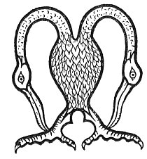

  
[Intangible Textual Heritage](../../../index) 
[Legends/Sagas](../../index)  [Celtic](../index)  [Carmina
Gadelica](../cg)  [Index](index)  [Previous](cg2087)  [Next](cg2089) 

------------------------------------------------------------------------

[Buy this Book at
Amazon.com](https://www.amazon.com/exec/obidos/ASIN/B0027P890O/internetsacredte)

------------------------------------------------------------------------

  
*Carmina Gadelica, Volume 2*, by Alexander Carmicheal, \[1900\], at
Intangible Textual Heritage

------------------------------------------------------------------------

 

<table data-border="0">
<colgroup>
<col style="width: 50%" />
<col style="width: 50%" />
</colgroup>
<tbody>
<tr class="odd">
<td data-valign="top" width="327">
p. 178
</td>
<td data-valign="top" width="327">
p. 179
</td>
</tr>
<tr class="even">
<td data-valign="top" width="327"><h3 id="manaidh-203" data-align="center">MANAIDH [203]</h3></td>
<td data-valign="top" width="327"><h3 id="omens" data-align="center">OMENS</h3></td>
</tr>
</tbody>
</table>

 

THE people believed in omens of birds and beasts, fishes and insects,
and of men and women. These omens were innumerable, and a few only can
be mentioned.

The fisher would deem it a bad omen to meet a red-haired woman when on
his way to fish; and were the woman defective in mind or body, probably
the man would return home muttering strong adjectives beneath his
breath. On the other p. 179 hand, it was
lucky for a girl to find the red hair of a woman in the nest of certain
birds, particularly in the nest of the wheatear.

<table data-border="0">
<colgroup>
<col style="width: 33%" />
<col style="width: 33%" />
<col style="width: 33%" />
</colgroup>
<tbody>
<tr class="odd">
<td data-valign="top">
'Gruag ruadh boirionnaich, 
Fiasag liath firionnaich, 
Ruth agus rath na leirist 
Gheobh an nead a chlacharain.' 
     [bhigirein
</td>
<td data-valign="top">
 
</td>
<td data-valign="top">
The red hair of a woman, 
The grey beard of a man, 
Are love and luck to the sloven 
Who gets them in the nest of the 
wheatear.                     [tit.
</td>
</tr>
</tbody>
</table>

 

<table data-border="0">
<colgroup>
<col style="width: 25%" />
<col style="width: 25%" />
<col style="width: 25%" />
<col style="width: 25%" />
</colgroup>
<tbody>
<tr class="odd">
<td data-valign="top">
 
</td>
<td data-valign="top">
p. 178
</td>
<td data-valign="top">
 
</td>
<td data-valign="top">
p. 179
</td>
</tr>
<tr class="even">
<td data-valign="top">
 
</td>
<td data-valign="top">
MOCH maduinn Luan, 
Chualas meaghal uan,

Agus meigead eunaraig, 
Seimh am shuidhe crom,

Agus cuthag liath-ghorm, 
’S gun am biadh am bhronn.

Feasgar finidh Mhart, 
Chunnas air lic mhin, 
Seilicheag shlim, bhan,

Agus an clacharan fionn 
Air barr a gharraidh toll,

Searrach seann larach 
Spagail ’s a chula rium.

Dh’ aithnich mi fein ’n an deigh 
Nach eireadh a bhliadhna liom.
</td>
<td data-valign="top">
 
</td>
<td data-valign="top">
EARLY on the morning of Monday, 
I heard the bleating of a lamb,

And the kid-like cry of snipe, 
While gently sitting bent,

And the grey-blue cuckoo, 
And no food on my stomach.

On the fair evening of Tuesday, 
I saw on the smooth stone, 
The snail slimy, pale,

And the ashy wheatear 
On the top of the dyke of holes,

The foal of the old mare 
Of sprauchly gait and its back to me.

And I knew from these 
That the year would not go well with me.
</td>
</tr>
</tbody>
</table>

 

------------------------------------------------------------------------

[Next: 204. Early Easter Monday. Moch La Luan Casg](cg2089)
