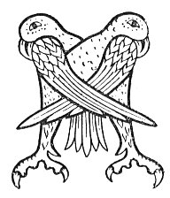

  
[Intangible Textual Heritage](../../../index.md) 
[Legends/Sagas](../../index)  [Celtic](../index.md)  [Carmina
Gadelica](../cg)  [Index](index)  [Previous](cg2088)  [Next](cg2090.md) 

------------------------------------------------------------------------

[Buy this Book at
Amazon.com](https://www.amazon.com/exec/obidos/ASIN/B0027P890O/internetsacredte.md)

------------------------------------------------------------------------

  
*Carmina Gadelica, Volume 2*, by Alexander Carmicheal, \[1900\], at
Intangible Textual Heritage

------------------------------------------------------------------------

 

<table data-border="0">
<colgroup>
<col style="width: 50%" />
<col style="width: 50%" />
</colgroup>
<tbody>
<tr class="odd">
<td data-valign="top" width="327">
p. 180
</td>
<td data-valign="top" width="327">
p. 181
</td>
</tr>
<tr class="even">
<td data-valign="top" width="327"><h3 id="moch-la-luan-casg-204" data-align="center">MOCH LA LUAN CASG [204]</h3></td>
<td data-valign="top" width="327"><h3 id="early-easter-monday" data-align="center">EARLY EASTER MONDAY</h3></td>
</tr>
</tbody>
</table>

 

<table data-border="0">
<colgroup>
<col style="width: 25%" />
<col style="width: 25%" />
<col style="width: 25%" />
<col style="width: 25%" />
</colgroup>
<tbody>
<tr class="odd">
<td data-valign="top">
 
</td>
<td data-valign="top">
p. 180
</td>
<td data-valign="top">
 
</td>
<td data-valign="top">
p. 181
</td>
</tr>
<tr class="even">
<td data-valign="top">
 
</td>
<td data-valign="top">
MOCH La Luan Casg, 
Chunna mi air sal 
Lach is eala bhan 
     A snamh le cheile.

Chuala mi Di-mart 
Eunarag nan trath, 
Meannanaich ’s an ard 
     ’S ag eigheach.

Di-ciadain bha mi 
Buain na feamain-chir, 
Is chunna mi na tri 
     Ri eirigh.

Dh’ aithnich mi air ball 
Gun robh an imirig ann, 
Beannachd nach biodh ann 
     An deigh sin.

Comraig Bhride bhith, 
Comraig Mhoire mhin, 
Comraig Mhicheil mhil, 
Dhomh fhi’ ’s dha m’ eudail, 
     Dhomh fhi’ ’s dha m’ eudail.
</td>
<td data-valign="top">
 
</td>
<td data-valign="top">
EARLY on the day of Easter Monday, 
I saw on the brine 
A duck and a white swan 
     Swim together.

I heard on Tuesday 
The snipe of the seasons, 
Bleating on high 
     And calling.

On Wednesday I had been 
Cutting the channelled fucus, 
And then saw I the three 
     Arising.

I knew immediately 
That a flitting there was, 
Blessing there would not be 
     After that.

The girth of Bride calm, 
The girth of Mary mild, 
The girth of Michael strong, 
Upon me and mine, 
     Upon me and mine.
</td>
</tr>
</tbody>
</table>

 

------------------------------------------------------------------------

[Next: 205. Omen of the Swans. Manadh Nan Eala](cg2090.md)
