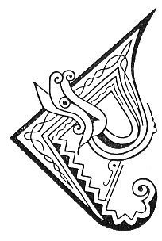

  
[Intangible Textual Heritage](../../../index.md) 
[Legends/Sagas](../../index)  [Celtic](../index.md)  [Carmina
Gadelica](../cg)  [Index](index)  [Previous](cg2089)  [Next](cg2091.md) 

------------------------------------------------------------------------

[Buy this Book at
Amazon.com](https://www.amazon.com/exec/obidos/ASIN/B0027P890O/internetsacredte.md)

------------------------------------------------------------------------

  
*Carmina Gadelica, Volume 2*, by Alexander Carmicheal, \[1900\], at
Intangible Textual Heritage

------------------------------------------------------------------------

 

<table data-border="0">
<colgroup>
<col style="width: 50%" />
<col style="width: 50%" />
</colgroup>
<tbody>
<tr class="odd">
<td data-valign="top" width="327">
p. 182
</td>
<td data-valign="top" width="327">
p. 183
</td>
</tr>
<tr class="even">
<td data-valign="top" width="327"><h3 id="manadh-nan-eala-205" data-align="center">MANADH NAN EALA [205]</h3></td>
<td data-valign="top" width="327"><h3 id="omen-of-the-swans" data-align="center">OMEN OF THE SWANS</h3></td>
</tr>
</tbody>
</table>

 

<table data-border="0">
<colgroup>
<col style="width: 25%" />
<col style="width: 25%" />
<col style="width: 25%" />
<col style="width: 25%" />
</colgroup>
<tbody>
<tr class="odd">
<td data-valign="top">
 
</td>
<td data-valign="top">
p. 182
</td>
<td data-valign="top">
 
</td>
<td data-valign="top">
p. 183
</td>
</tr>
<tr class="even">
<td data-valign="top">
 
</td>
<td data-valign="top">
CHUALA mi guth binn nan eala, 
Ann an dealachadh nan trath, 
Glugalaich air sgiathaibh siubhlach, 
     Cur nan cura dhiubh gu h-ard.

Ghrad sheas mi, cha d’ rinn mi gluasad, 
Suil dh’an tug mi bhuam co bha 
Deanamh iuil air an toiseach? 
     Righinn an t-sonais an eala bhan.

Bha seo air feasgar Di-aona, 
Bha mo smaontan air Di-mart-- 
Chaill mi mo chuid ’s mo dhaona 
     Bliadhn o’n Aona sin gu brath.

Ma chi thu eala air Di-aona, 
Moch ’s a mhaduinn fhaoilidh, agh, 
Bidh cinneas air do chuid ’s do dhaona, 
     Do bhuar cha chaochail a ghnath.
</td>
<td data-valign="top">
 
</td>
<td data-valign="top">
I HEARD the sweet voice of the swans, 
At the parting of night and day, 
Gurgling on the wings of travelling, 
     Pouring forth their strength on high.

I quickly stood me, nor made I move, 
A look which I gave from me forth 
Who should be guiding in front? 
     The queen of luck, the white swan.

This was on the evening of Friday, 
My thoughts were of the Tuesday-- 
I lost my means and my kinsfolk 
     A year from that Friday for ever.

Shouldst thou see a swan on Friday, 
In the joyous morning dawn, 
There shall be increase on thy means and thy kin, 
     Nor shall thy flocks be always dying.
</td>
</tr>
</tbody>
</table>

 

------------------------------------------------------------------------

[Next: 206. Omens. Manaidh](cg2091.md)
