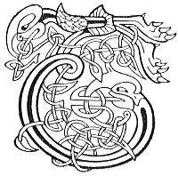

  
[Intangible Textual Heritage](../../../index.md) 
[Legends/Sagas](../../index)  [Celtic](../index.md)  [Carmina
Gadelica](../cg)  [Index](index)  [Previous](cg2093)  [Next](cg2095.md) 

------------------------------------------------------------------------

[Buy this Book at
Amazon.com](https://www.amazon.com/exec/obidos/ASIN/B0027P890O/internetsacredte.md)

------------------------------------------------------------------------

  
*Carmina Gadelica, Volume 2*, by Alexander Carmicheal, \[1900\], at
Intangible Textual Heritage

------------------------------------------------------------------------

 

<table data-border="0">
<colgroup>
<col style="width: 50%" />
<col style="width: 50%" />
</colgroup>
<tbody>
<tr class="odd">
<td data-valign="top" width="327">
p. 190
</td>
<td data-valign="top" width="327">
p. 191
</td>
</tr>
<tr class="even">
<td data-valign="top" width="327"><h3 id="duan-nan-daol-208" data-align="center">DUAN NAN DAOL [208]</h3></td>
<td data-valign="top" width="327"><h3 id="poem-of-the-beetles" data-align="center">POEM OF THE BEETLES</h3></td>
</tr>
</tbody>
</table>

 

<table data-border="0">
<colgroup>
<col style="width: 25%" />
<col style="width: 25%" />
<col style="width: 25%" />
<col style="width: 25%" />
</colgroup>
<tbody>
<tr class="odd">
<td data-valign="top">
 
</td>
<td data-valign="top">
p. 190
</td>
<td data-valign="top">
 
</td>
<td data-valign="top">
p. 191
</td>
</tr>
<tr class="even">
<td data-valign="top">
 
</td>
<td data-valign="top">
TRATH bha Ti nan dul fo choill, 
Agus daoibhidh air a dheigh, 
De thuirt daolaire na doill, 
     Ris an daol ’s an dealan-de?

'Am facas seach an diugh no ’n raoir, 
Mac mo ghaoil-sa--Mac De?' 
'Chunnas, chunnas,' os an daol, 
     'Mac na saorsa seach an de.'

'Cearr! cearr! cearr thu fhe,' 
Os an cearr-dubhan feach; 
'A bhliadhna mhor chon an de 
     Chaidh Mac De seach.'
</td>
<td data-valign="top">
 
</td>
<td data-valign="top">
WHEN the Being of glory was in retreat, 
And wicked men in pursuit of Him, 
What said the groveller of blindness, 
     To the beetle and the butterfly?

'Saw ye passing to-day or yestreen, 
The Son of my love--the Son of God?' 
'We saw, we saw,' said the black beetle, 
     'The Son of freedom pass yesterday.'

'Wrong! wrong! wrong art thou,' 
Said the sacred beetle earthy; 
'A big year it was yestreen 
     Since the Son of God passed.'
</td>
</tr>
</tbody>
</table>

 

------------------------------------------------------------------------

[Next: 209. Poem of the Beetles. Duan Nan Daol](cg2095.md)
