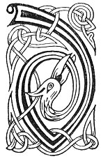

  
[Intangible Textual Heritage](../../../index.md) 
[Legends/Sagas](../../index)  [Celtic](../index.md)  [Carmina
Gadelica](../cg)  [Index](index)  [Previous](cg2094)  [Next](cg2096.md) 

------------------------------------------------------------------------

[Buy this Book at
Amazon.com](https://www.amazon.com/exec/obidos/ASIN/B0027P890O/internetsacredte.md)

------------------------------------------------------------------------

  
*Carmina Gadelica, Volume 2*, by Alexander Carmicheal, \[1900\], at
Intangible Textual Heritage

------------------------------------------------------------------------

 

<table data-border="0">
<colgroup>
<col style="width: 50%" />
<col style="width: 50%" />
</colgroup>
<tbody>
<tr class="odd">
<td data-valign="top" width="327">
p. 192
</td>
<td data-valign="top" width="327">
p. 193
</td>
</tr>
<tr class="even">
<td data-valign="top" width="327"><h3 id="duan-nan-daol-209" data-align="center">DUAN NAN DAOL [209]</h3></td>
<td data-valign="top" width="327"><h3 id="poem-of-the-beetles" data-align="center">POEM OF THE BEETLES</h3></td>
</tr>
</tbody>
</table>

 

<table data-border="0">
<colgroup>
<col style="width: 25%" />
<col style="width: 25%" />
<col style="width: 25%" />
<col style="width: 25%" />
</colgroup>
<tbody>
<tr class="odd">
<td data-valign="top">
 
</td>
<td data-valign="top">
p. 192
</td>
<td data-valign="top">
 
</td>
<td data-valign="top">
p. 193
</td>
</tr>
<tr class="even">
<td data-valign="top">
 
</td>
<td data-valign="top">
D UAIR bha Criosda fo choill, 
     Agus naimhdean air a dheigh, 
Is e thuirt faochaire na foill, 
     Ris an daol ’s an dealan-de--

'Am facas seach an diugh no ’n raoir, 
     Mac mo ghaol-sa, Mac De?' 
'Chunna, chunna,' ors an daol, 
     'Mac na saorsa seach an de.'

'Breug! breug! breug!' 
     Orsa cearran cre nan each, 
'A bhliadhna mhor chon an de, 
     Chaidh Mac De seach.'
</td>
<td data-valign="top">
 
</td>
<td data-valign="top">
WHEN Christ was under the wood, 
     And enemies were pursuing Him, 
The crooked one of deception, 
     Said to the black beetle and the butterfly

'Saw ye pass to-day or yesterday, 
     The Son of my love, the Son of God?' 
'We saw! we saw!' said the black beetle, 
     'The Son of redemption pass yesterday.'

'False! false! false!' 
     Said the little clay beetle of horses, 
'A full year yesterday, 
     The Son of God went by.'
</td>
</tr>
</tbody>
</table>

 

------------------------------------------------------------------------

[Next: 210. Poem of the Beetle. Duan An Daoil](cg2096.md)
