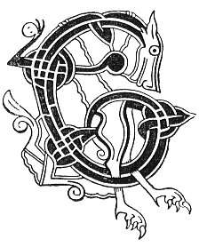

  
[Intangible Textual Heritage](../../../index) 
[Legends/Sagas](../../index)  [Celtic](../index)  [Carmina
Gadelica](../cg)  [Index](index)  [Previous](cg2096)  [Next](cg2098) 

------------------------------------------------------------------------

[Buy this Book at
Amazon.com](https://www.amazon.com/exec/obidos/ASIN/B0027P890O/internetsacredte)

------------------------------------------------------------------------

  
*Carmina Gadelica, Volume 2*, by Alexander Carmicheal, \[1900\], at
Intangible Textual Heritage

------------------------------------------------------------------------

 

<table data-border="0">
<colgroup>
<col style="width: 50%" />
<col style="width: 50%" />
</colgroup>
<tbody>
<tr class="odd">
<td data-valign="top" width="327">
p. 194
</td>
<td data-valign="top" width="327">
p. 195
</td>
</tr>
<tr class="even">
<td data-valign="top" width="327"><h3 id="taladh-211" data-align="center">TALADH [211]</h3></td>
<td data-valign="top" width="327"><h3 id="lullaby" data-align="center">LULLABY</h3></td>
</tr>
</tbody>
</table>

 

THE swan is a favourite bird and of good omen. To hear it in the morning
fasting--especially on a Tuesday morning--is much to be desired. To see
seven, or a multiple of seven, swans on the wing ensures peace and
prosperity for seven, or a multiple of seven years.

In windy, snowy, or wet weather swans fly low, but in calm, bright, or
frosty weather they fly high; but even when the birds are only specks in
the distant blue lift above, their soft, silvery, flute-like notes
penetrate to earth below. Swans are said to be ill-used religious ladies
under enchantment, driven from their homes and forced to wander, and to
dwell where most kindly treated and p. 195
where least molested. They are therefore regarded with loving pity and
veneration, and the man who would injure a swan would thereby hurt the
feelings of the community.

A woman found a wounded swan on a frozen lake near her house, and took
it home, where she set the broken wing, dressed the bleeding feet, and
fed the starving bird with lintseed and water. The woman had an ailing
child, and as the wounds of the swan healed the health of the child
improved, and the woman believed that her treatment of the swan caused
the recovery of her child, and she rejoiced accordingly and composed the
following lullaby to her restored child:--

 

<table data-border="0">
<colgroup>
<col style="width: 25%" />
<col style="width: 25%" />
<col style="width: 25%" />
<col style="width: 25%" />
</colgroup>
<tbody>
<tr class="odd">
<td data-valign="top">
 
</td>
<td data-valign="top">
p. 194
</td>
<td data-valign="top">
 
</td>
<td data-valign="top">
p. 195
</td>
</tr>
<tr class="even">
<td data-valign="top">
 
</td>
<td data-valign="top">
EALA bhan thu, 
    Hu hi! ho ho!

’S truagh do charamh, 
    Hu hi! ho ho!

’S truagh mar tha thu, 
    Hu hi! ho ho!

’S t-fhuil a t’ fhagail, 
    Hu hi! ho ho! 
    Hu hi! ho ho!

Eala bhan thu, 
    Hu hi! ho ho!

Cian o d’ chairdiu, 
    Hu hi! ho ho!

Bean do mhanrain, 
    Hu hi! ho ho!

 
</td>
<td data-valign="top">
 
</td>
<td data-valign="top">
THOU white swan, 
    Hu hi! ho ho!

Sad thy condition, 
    Hu hi! ho ho!

Pitiful thy state, 
    Hu hi! ho ho!

Thy blood flowing, 
    Hu hi! ho ho! 
    Hu hi! ho ho!

Thou white swan, 
    Hu hi! ho ho!

Far from thy friends, 
    Hu hi! ho ho!

Dame of thy converse, 
    Hu hi! ho ho!

 
</td>
</tr>
<tr class="odd">
<td data-valign="top">
 
</td>
<td data-valign="top">
p. 196
</td>
<td data-valign="top">
 
</td>
<td data-valign="top">
p. 197
</td>
</tr>
<tr class="even">
<td data-valign="top">
 
</td>
<td data-valign="top">
Fan am nabachd, 
    Hu hi! ho ho! 
    Hu hi! ho ho!

Leigh an aigh thu, 
    Hu hi! ho ho!

Sian mo phaisdean, 
    Hu hi! ho ho!

Dion o ’n bhas e, 
    Hu hi! ho ho!

Greas gu slaint e, 
    Hu hi! ho ho!

Mar is ail leat, 
    Hu hi! ho ho! 
    Hu hi! hi ho!

Pian is anradh 
    Hu hi! ho ho!

Dh’ fhear do sharuich, 
    Hu hi! ho ho! 
    Hu hi! hi ho!

Mile failt ort, 
    Hu hi! ho ho!

Buan is slan thu, 
    Hu hi! ho ho!

Linn an aigh dhut, 
    Hu hi! ho ho!

 
</td>
<td data-valign="top">
 
</td>
<td data-valign="top">
Remain near me, 
    Hi hi! ho ho! 
    Hu hi! ho ho!

Leech of gladness thou, 
    Hu hi! ho ho!

Sain my little child, 
    Hu hi! ho ho!

Shield him from death, 
    Hu hi! ho ho!

Hasten him to health, 
    Hu hi! ho ho!

As thou desirest, 
    Hu hi! ho ho! 
    Hu hi! hi ho!

Pain and sorrow 
    Hu hi! ho ho!

To thine injurer, 
    Hu hi! ho ho! 
    Hu hi! hi ho!

A thousand welcomes to thee, 
    Hu hi! ho ho!

Life and health be thine, 
    Hu hi! ho ho!

The age of joy be thine, 
    Hu hi! ho ho!

 
</td>
</tr>
<tr class="odd">
<td data-valign="top">
 
</td>
<td data-valign="top">
p. 198
</td>
<td data-valign="top">
 
</td>
<td data-valign="top">
p. 199
</td>
</tr>
<tr class="even">
<td data-valign="top">
 
</td>
<td data-valign="top">
Anns gach aite, 
    Hu hi! ho ho! 
    Hu hi! hi ho!

   *   *   *   *

Furt is fas dha, 
    Hi hi! ho ho!

Neart is nas dha, 
    Hu hi! ho ho!

Buadh na larach, 
    Hu hi! ho ho!

Anns gach ait dha, 
    Hu hi! ho ho! 
    Hu hi! hi ho!

Moire Mhathair, 
    Hu hi! ho ho!

Mhin ghil aluinn, 
    Hu hi! ho ho!

Bhi da d’ bhriodal, 
    Hu hi! ho ho!

Bhi dha d’ mhanran, 
    Hu hi! ho ho!

Bhi dha d’ lithiu, 
    Hu hi! ho ho!

Bhi dha d’ arach, 
    Hu hi! ho ho!

 
</td>
<td data-valign="top">
 
</td>
<td data-valign="top">
In every place, 
    Hu hi! ho ho! 
    Hu hi! hi ho!

   *   *   *   *

Peace and growth to him, 
    Hu hi! ho ho!

Strength and worth to him, 
    Hu hi! ho ho!

Victory of place, 
    Hu hi! ho ho!

Everywhere to him, 
    Hu hi! ho ho! 
    Hu hi! hi ho!

The Mary Mother, 
    Hu hi! ho ho!

Fair white lovely, 
    Hu hi! ho ho!

Be fondling thee, 
    Hu hi! ho ho!

Be dandling thee, 
    Hu hi! ho ho!

Be bathing thee, 
    Hu hi! ho ho!

Be rearing thee, 
    Hu hi! ho ho!

 
</td>
</tr>
<tr class="odd">
<td data-valign="top">
 
</td>
<td data-valign="top">
p. 200
</td>
<td data-valign="top">
 
</td>
<td data-valign="top">
p. 201
</td>
</tr>
<tr class="even">
<td data-valign="top">
 
</td>
<td data-valign="top">
Bhi dha d’ dhion 
    Hu hi! ho ho!

Bho lion do namhu; 
    Hu hi! ho ho! 
    Hu hi! ho ho!

Bhi dha d’ bheadru, 
    Hu hi! ho ho!

Bhi dha d’ naisdiu, 
    Hu hi! ho ho!

Bhi dha d’ lionu 
    Hu hi! ho ho!

Leis na grasu; 
    Hu hi! ho ho! 
    Hu hi! hi ho!

Gaol do mhathar thu, 
    Hu hi! ho ho!

Gaol a graidh thu, 
    Hu hi! ho ho!

Gaol nan ainghlean thu, 
    Hu hi! ho ho!

Ann am Paras! 
    Hu hi! ho ho! 
    Hu hi! hi ho!
</td>
<td data-valign="top">
 
</td>
<td data-valign="top">
Be shielding thee 
    Hu hi! ho ho!

From the net of thine enemy; 
    Hu hi! ho ho! 
    Hu hi! ho ho!

Be caressing thee, 
    Hu hi! ho ho!

Be guarding thee, 
    Hu hi! ho ho!

Be filling thee 
    Hu hi! ho ho!

With the graces; 
    Hu hi! ho ho! 
    Hu hi! hi ho!

The love of thy mother, thou, 
    Hu hi! ho ho!

The love of her love, thou, 
    Hu hi! ho ho!

The love of the angels, thou, 
    Hu hi! ho ho!

In Paradise! 
    Hu hi! ho ho! 
    Hu hi! hi ho!
</td>
</tr>
</tbody>
</table>

 

------------------------------------------------------------------------

[Next: 212. The Melodious Lady-Lord. Ban-Tighearna Bhinn](cg2098)
