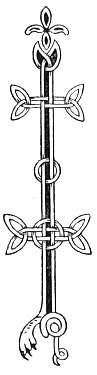

  
[Intangible Textual Heritage](../../../index) 
[Legends/Sagas](../../index)  [Celtic](../index)  [Carmina
Gadelica](../cg)  [Index](index)  [Previous](cg2098)  [Next](cg2100) 

------------------------------------------------------------------------

[Buy this Book at
Amazon.com](https://www.amazon.com/exec/obidos/ASIN/B0027P890O/internetsacredte)

------------------------------------------------------------------------

  
*Carmina Gadelica, Volume 2*, by Alexander Carmicheal, \[1900\], at
Intangible Textual Heritage

------------------------------------------------------------------------

 

<table data-border="0">
<colgroup>
<col style="width: 50%" />
<col style="width: 50%" />
</colgroup>
<tbody>
<tr class="odd">
<td data-valign="top" width="327">
p. 208
</td>
<td data-valign="top" width="327">
p. 209
</td>
</tr>
<tr class="even">
<td data-valign="top" width="327"><h3 id="righinn-nam-buadh-213" data-align="center">RIGHINN NAM BUADH [213]</h3></td>
<td data-valign="top" width="327"><h3 id="queen-of-grace" data-align="center">QUEEN OF GRACE</h3></td>
</tr>
</tbody>
</table>

 

<table data-border="0">
<colgroup>
<col style="width: 25%" />
<col style="width: 25%" />
<col style="width: 25%" />
<col style="width: 25%" />
</colgroup>
<tbody>
<tr class="odd">
<td data-valign="top">
 
</td>
<td data-valign="top">
p. 208
</td>
<td data-valign="top">
 
</td>
<td data-valign="top">
p. 209
</td>
</tr>
<tr class="even">
<td data-valign="top">
 
</td>
<td data-valign="top">
IS min a has, 
Is fin a cas, 
Is caomh a cruth, 
Is caoin a guth, 
Is binn a cainn, 
Is grinn a meinn, 
Is blath sealladh a sul, 
Is tlath meaghail a gnuis, 
’S a brollach graidh-gheal a snamh ’n a com 
Mar chra-fhaoileag air bharr nan tonn.

Is naomhar an oigh is or-dhealta cul, 
Le maotharan og am bonn nan stuc, 
Gun lon dhaibh le cheil fo chorr nan speur, 
Gun sgoth fo ’n ghrein bho ’n namhaid.

Ta sgiath Mhic De da comhdach, 
Ta ciall Mhic De da seoladh, 
Ta briathar Mhic De mar bhiadh di fein, 
Ta reul ’n a leirsinn mhoir di.

Ta duibhre na h-oidhche dhi mar shoillse an lo, 
Ta an lo dhi a ghnath ’n a sholas, 
Ta Moir oigh nan gras ’s a h-uile h-ait, 
Le na seachd graidh ’g a comhnadh, 
     Na seachd graidh ’g a comhnadh.
</td>
<td data-valign="top">
 
</td>
<td data-valign="top">
SMOOTH her hand, 
Fair her foot, 
Graceful her form, 
Winsome her voice, 
Gentle her speech, 
Stately her mien, 
Warm the look of her eye, 
Mild the expression of her face, 
While her lovely white breast heaves on her bosom 
Like the black-headed sea-gull on the gently heaving wave.

Holy is the virgin of gold-mist hair, 
With tenderest babe at the base of the bens, 
No food for either of them under the arch of the sky, 
No shelter under the sun to shield them from the foe.

The shield of the Son of God covers her, 
The inspiration of the Son of God guides her, 
The word of the Son of God is food to her, 
His star is a bright revealing light to her.

The darkness of night is to her as the brightness of day, 
The day to her gaze is always a joy, 
While the Mary of grace is in every place, 
With the seven beatitudes compassing her, 
     The seven beatitudes compassing her.
</td>
</tr>
</tbody>
</table>

 

------------------------------------------------------------------------

[Next: 214. Killmoluag. Cill-Moluag](cg2100)
