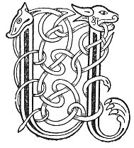

  
[Intangible Textual Heritage](../../../index) 
[Legends/Sagas](../../index)  [Celtic](../index)  [Carmina
Gadelica](../cg)  [Index](index)  [Previous](cg2099)  [Next](cg2101) 

------------------------------------------------------------------------

[Buy this Book at
Amazon.com](https://www.amazon.com/exec/obidos/ASIN/B0027P890O/internetsacredte)

------------------------------------------------------------------------

  
*Carmina Gadelica, Volume 2*, by Alexander Carmicheal, \[1900\], at
Intangible Textual Heritage

------------------------------------------------------------------------

 

<table data-border="0">
<colgroup>
<col style="width: 50%" />
<col style="width: 50%" />
</colgroup>
<tbody>
<tr class="odd">
<td data-valign="top" width="327">
p. 210
</td>
<td data-valign="top" width="327">
p. 211
</td>
</tr>
<tr class="even">
<td data-valign="top" width="327"><h3 id="cill-moluag-214" data-align="center">CILL-MOLUAG [214]</h3></td>
<td data-valign="top" width="327"><h3 id="killmoluag" data-align="center">KILLMOLUAG</h3></td>
</tr>
</tbody>
</table>

 

A curious ceremony was current in the Island of
Lismore. When several boys gathered together, two p.
211 boys seized a third by the head and heels, and swaying him
from side to side sang an eerie chant over him.

<table style="width:100%;" data-border="0">
<colgroup>
<col style="width: 16%" />
<col style="width: 16%" />
<col style="width: 16%" />
<col style="width: 16%" />
<col style="width: 16%" />
<col style="width: 16%" />
</colgroup>
<tbody>
<tr class="odd">
<td data-valign="top">
 
</td>
<td data-valign="top">
p. 210
</td>
<td data-valign="top">
 
</td>
<td data-valign="top">
 
</td>
<td data-valign="top">
 
</td>
<td data-valign="top">
p. 211
</td>
</tr>
<tr class="even">
<td rowspan="2" data-valign="top">
 
</td>
<td data-valign="top">
UILL! hill! uill! O! 
Co chill an teid seo?

 
</td>
<td data-valign="top">
 
</td>
<td data-valign="top">
FIRST BOY 
 

</td>
<td data-valign="top">
 
</td>
<td data-valign="top">
UILL! hill! uill! O! 
In what kill shall this go?

 
</td>
</tr>
<tr class="odd">
<td data-valign="top">
Cill-Moluag an Lios-mor, 
Far an cinn na cnoimheagan!

Uill! hill! uill! O! 
Co chill an teid seo?

Cill-Moluag an Lios-mor, 
Loisealam na greine.

Uill! hill! uill! O! 
Co chill an teid seo?

Cill-Moluag an Lios-mor, 
Boid nach dean e eiridh!
</td>
<td data-valign="top">
 
</td>
<td data-valign="top">
SECOND BOY
</td>
<td data-valign="top">
 
</td>
<td data-valign="top">
In Killmoluag of Lismore, 
Where the maggots grow!

Uill! hill! uill! O! 
In what kill shall this go?

In Killmoluag of Lismore, 
Fairest ’neath the sun.

Uill! hill! uill! O! 
In what kill shall this go?

In Killmoluag of Lismore, 
I vow he shall not rise!
</td>
</tr>
</tbody>
</table>

p. 210

After more questions and more answers, the boy was carried round in
procession sunwise to a wailing march, in which all the boys joined. The
boy was then laid upon a rock or knoll for an altar. After more singing
and more p. 211 ceremonial the victim was
laid in some convenient hollow for a grave, to the music of another
eerie lament and the laughter of the boys. The writer was an actor in
this boyish drama, but what the drama represented he does not know.

 

------------------------------------------------------------------------

[Next: 215 (notes). The Kertch. Am Breid](cg2101)
