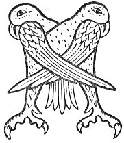

  
[Intangible Textual Heritage](../../../index.md) 
[Legends/Sagas](../../index)  [Celtic](../index.md)  [Carmina
Gadelica](../cg)  [Index](index)  [Previous](cg2101)  [Next](cg2103.md) 

------------------------------------------------------------------------

[Buy this Book at
Amazon.com](https://www.amazon.com/exec/obidos/ASIN/B0027P890O/internetsacredte.md)

------------------------------------------------------------------------

  
*Carmina Gadelica, Volume 2*, by Alexander Carmicheal, \[1900\], at
Intangible Textual Heritage

------------------------------------------------------------------------

 

<table data-border="0">
<colgroup>
<col style="width: 50%" />
<col style="width: 50%" />
</colgroup>
<tbody>
<tr class="odd">
<td data-valign="top" width="327">
p. 214
</td>
<td data-valign="top" width="327">
p. 215
</td>
</tr>
<tr class="even">
<td data-valign="top" width="327"><h3 id="am-breid-215" data-align="center">AM BREID [215]</h3></td>
<td data-valign="top" width="327"><h3 id="the-kertch" data-align="center">THE KERTCH</h3></td>
</tr>
</tbody>
</table>

 

<table data-border="0">
<colgroup>
<col style="width: 25%" />
<col style="width: 25%" />
<col style="width: 25%" />
<col style="width: 25%" />
</colgroup>
<tbody>
<tr class="odd">
<td data-valign="top">
 
</td>
<td data-valign="top">
p. 214
</td>
<td data-valign="top">
 
</td>
<td data-valign="top">
p. 215
</td>
</tr>
<tr class="even">
<td data-valign="top">
 
</td>
<td data-valign="top">
MILE failte dhut fo d’ bhreid, 
Ri do re gu robh thu slan, 
Luth is laithean dhut le sith, 
     Do pharas le do ni bhi fas.

An tus do chomh-ruith is tu og, 
An tus do lo iarr Ti nan dul, 
Cha churam dha nach toir e ceart 
     Gach foil is feart a bhios ’nad run.

An coron-ceile a chuir thu suas, 
Is tric a fhuair e buaidh do mhnai; 
Bi-sa subhailc ach bi suairc, 
     Bi-sa stuam an lid ’s an laimh.

Bi-sa fialaidh ach bi glic, 
Bi-sa misneachail ach stold, 
Bi-sa bruithneach ach bi balbh, 
     Bi-sa caimeineach ach coir.

Na dean criontaireachd an toirt, 
Na dean brosg ach na bi fuar, 
Na labhair fos air neach ge h-olc, 
     Ma labhrar ort na toir-sa fuath.

Bi-sa gleidhteach air h-ainm, 
Bi-sa sgeimineach ach suairc, 
Lamh Dhe biodh air h-eilm, 
     An deilbh, an gniamh ’s an smuain.

Na bi gearanach fo d’ chrois, 
Siubhail socair fo chopan lan, 
A chaoidh dh’an olc na toir-sa speis, 
     ’S le do bhreid dhut ceud mile failt!
</td>
<td data-valign="top">
 
</td>
<td data-valign="top">
A THOUSAND hails to thee beneath thy kertch, 
During thy course mayest thou be whole, 
Strength and days be thine in peace, 
     Thy paradise with thy means increase.

In beginning thy dual race, and thou young, 
In beginning thy course, seek thou the God of life, 
Fear not but He will rightly rule 
     Thine every secret need and prayer.

This spousal crown thou now hast donned, 
Full oft has gotten grace to woman, 
Be thou virtuous, but be gracious, 
     Be thou pure in word and hand.

Be thou hospitable, yet be wise, 
Be thou courageous, but be calm, 
Be thou frank, but be reserved, 
     Be thou exact, yet generous.

Be not miserly in giving, 
Do not flatter, yet be not cold, 
Speak not ill of man, though ill he be, 
     If spoken of, show not resentment.

Be thou careful of thy name, 
Be thou dignified yet kind, 
The hand of God be on thine helm, 
     In inception, in act, and in thought.

Be not querulous beneath thy cross, 
Walk thou warily when thy cup is full, 
Never to evil give thou countenance, 
     And with thy kertch, to thee a hundred thousand hails!
</td>
</tr>
</tbody>
</table>

 

------------------------------------------------------------------------

[Next: 216. Fragment. Fuigheal](cg2103.md)
