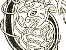

  
[Intangible Textual Heritage](../../../index) 
[Legends/Sagas](../../index)  [Celtic](../index)  [Carmina
Gadelica](../cg)  [Index](index)  [Previous](cg2109)  [Next](cg2111) 

------------------------------------------------------------------------

[Buy this Book at
Amazon.com](https://www.amazon.com/exec/obidos/ASIN/B0027P890O/internetsacredte)

------------------------------------------------------------------------

  
*Carmina Gadelica, Volume 2*, by Alexander Carmicheal, \[1900\], at
Intangible Textual Heritage

------------------------------------------------------------------------

### F

*Fabhradh*, swirl, whirl, eddy. 'Fabhradh nimheil na gaoithe ’n
ear'--the venomous swirl of the east wind.

 

*Fad-buinn*, door-step, lit. sole-sod. The name originated when a grassy
turf was, as it still is occasionally, the door-step. 'Fad-buinn' is
also applied to a wooden, but not to a stone step, which is called
'starsach.'

 

*Fadhdach*, black, blackness, confusion; *cf*. 'fadhbhag,' 'fadhtag,'
cuttle-fish.

 

*Fad-seilbh*, possession sod, infeftment; the sod or handful of earth
given by the seller to the buyer of land.

 

*Faileagan*, meadows, little lawns; from 'fal,' sod, turf. 'Fal' enters
into many combinations, as 'foid-fail,' the sod laid on the top of the
wall of a thatched house; 'garradh-fail,' turf-dyke, fail-dyke; 'fal,'
divots, in some places 'sgrath.'

 

*Fairig*, dead bird, dead fish, dead seal or dead whale, any creature
found dead on the sea or shore.

 

*Fairir*, *far-thir*, probably 'oirthir,' border, coast.

 

*Falach fuinn*, land hiding; from 'falach,' hiding, and 'fuinn,' oblique
of 'form,' land. 'Thainig ceo draogh air na fearaibh, agus rinn iad
falach fuinn'--Magic mist came upon the men, and they made land hiding.

 

p. 286

*Falc*, flood, flooding, bathe, dip.

<table data-border="0">
<colgroup>
<col style="width: 33%" />
<col style="width: 33%" />
<col style="width: 33%" />
</colgroup>
<tbody>
<tr class="odd">
<td data-valign="top">
'Tobar Tiobartain nam buadh 
A chasgas gach falc is fual. 
An eilean iomartach a chuain 
Am fior iomal an domhain mhoir.'
</td>
<td data-valign="top">
 
</td>
<td data-valign="top">
The well of Tiobartain of efficacy 
To quell flood and gravel, 
In remotest isle of the ocean, 
On the very verge of the great domain.
</td>
</tr>
</tbody>
</table>

'Tiobartan' is on the west side and in the south end of South Uist.
According to tradition, the well of Tiobartan was famous in olden times,
pilgrims resorting to it from afar. Then a man brought his sick horse to
it, and the spirit of the well fled shrieking, and never returned. The
well is in the machair, near the sea, and is now filled up with drift
sand. The term 'Tobar Tiobartain' or 'Tobar Tibirt' is curious as
showing a duplication of words. 'Tiobar' means a well, synonymous with
'tobar.' 'Tobar Tiobartain' might mean 'well of wells.' There is 'Aber
Tibirt' at the head of Loch Tiacais in Morvern.

'Tobar nan naoi beo,'--the well of the nine lives. This well is said to
have kept nine children alive during a famine.

Healing and holy wells are very numerous in the Highlands, as elsewhere
in Britain, scarcely a district being without one or more. Much
interesting lore is connected with these wells, and with their curative
powers and the rites observed at them.

 

*Falluinn*, *falluing*, garment, mantle, robe.

<table data-border="0">
<colgroup>
<col style="width: 33%" />
<col style="width: 33%" />
<col style="width: 33%" />
</colgroup>
<tbody>
<tr class="odd">
<td data-valign="top">
'Faodaidh luchd nam falluinne dearga, 
Gun an calg a bhi fuilteach.'
</td>
<td data-valign="top">
 
</td>
<td data-valign="top">
The tribe of the red robes [deer] 
Need not have their hair bloody.
</td>
</tr>
</tbody>
</table>

\[paragraph continues\] The robe was
asseverated upon--

<table data-border="0">
<colgroup>
<col style="width: 33%" />
<col style="width: 33%" />
<col style="width: 33%" />
</colgroup>
<tbody>
<tr class="odd">
<td data-valign="top">
'Air m’ fhalluinn fhein tha.'

'A nighean donn nam meal-shuilean, 
Air m’ fhalluinn thug mi speis dhut.'
</td>
<td data-valign="top">
 
</td>
<td data-valign="top">
Upon mine own robe it is.

Brown maiden of the liquid eyes, 
By my robe I gave thee love.
</td>
</tr>
</tbody>
</table>

 

*Farah-bhual*, *famh-fhual*, *lamh-fhual*, water-mole, from 'famh,'
mole, and 'bual,' water. Several names are applied to the water-shrew,
as 'famh-bhual,' water-mole; 'lamh-fhual,' 'labh-alan,' water-vole, and
'bad-alan,' water-vole. Probably 'labh' and 'lamh,' arise from the
influence of the *n* of the article on aspirated 'famh,' mole. The names
of the water-mole have their counterparts in the names of the land-mole.
'Famh,' 'fomh,' mole; 'famh-uir,' earth-mole; 'famh-thalmhan,'
ground-mole, 'dith-reodha' in Perthshire. The 'famh-bhual,' the mole of
the water, is the counterpart of the 'famh-uir,' the mole of the earth.
The two moles resemble one another in appearance and habits, but not

p. 287

 

in habitats. The land-mole abides under the earth, living upon
earth-plants, earth-roots, and earth-insects, and moving about under the
earth with surprising speed. The water-mole abides under the water,
living upon water-plants, water-roots, and water-insects, and moving
about under the water with marvellous rapidity.

The mysterious water-mole was much dreaded by the people. Its touch was
supposed to cause paralysis, mortification, and death.

In the inimitable burlesque of *Brigis Mhic Ruaraidh*, the poet warns
his friends against allowing the trouserless man to the moorland lest
the water-shrew should come and strike him.

<table data-border="0">
<colgroup>
<col style="width: 33%" />
<col style="width: 33%" />
<col style="width: 33%" />
</colgroup>
<tbody>
<tr class="odd">
<td data-valign="top">
'Na leigibh bho bhail e, 
Do mhointeach nan coileach, 
Mu’n tig an labh-alan 
  ’S gum buail i e.'
</td>
<td data-valign="top">
 
</td>
<td data-valign="top">
Do not allow him from townland, 
To moorland of grouse cocks, 
Lest the water-mole should come 
  And smite him.
</td>
</tr>
</tbody>
</table>

\[paragraph continues\] The giants who
live in caves and underground structures go under the names of 'famh,'
mole, 'famhair' and 'fuamhaire,' giant. A man much addicted to burrowing
underground is called 'famh,' mole; 'famhair' and 'fuamhaire,' giant.
Perhaps the 'famhair,' 'fuamhaire,' was the Titan of the Celt, the
Cyclop of his underground structures, and the Fomorian of his history.

 

*Faochaire*, a knave, a betrayer, a perjurer, Judas; from 'faoch,' a
curve, from which also 'faochag,' periwinkle.

<table data-border="0">
<colgroup>
<col style="width: 33%" />
<col style="width: 33%" />
<col style="width: 33%" />
</colgroup>
<tbody>
<tr class="odd">
<td data-valign="top">
As crooked as the worm of the whelk.

As crooked as the black whelk of the strand.
</td>
<td data-valign="top">
 
</td>
<td data-valign="top">
'Co cama ri cruim na faochaig.'

'Co cama ri faochag dhubh a chladaich.'
</td>
</tr>
</tbody>
</table>

\[paragraph continues\] --morally oblique.

<table data-border="0">
<colgroup>
<col style="width: 33%" />
<col style="width: 33%" />
<col style="width: 33%" />
</colgroup>
<tbody>
<tr class="odd">
<td data-valign="top">
'Falt faochaidh fionn, 
Cama lubaidh donn.'
</td>
<td data-valign="top">
 
</td>
<td data-valign="top">
Hair curving fair, 
Curly winding brown.
</td>
</tr>
</tbody>
</table>

 

*Faoigh*, *faigh*, *foigh*, thig, thigging, genteel begging.

|                   |     |                       |
|-------------------|-----|-----------------------|
| 'Chan fhaoigh e.' |     | It is not a thigging. |

\[paragraph continues\] The wool for the
web had not been obtained by 'thigging,' which was a common practice in
Britain in the Middle Ages, nor is it yet wholly extinct. In 1414 the
Scottish Parliament passed an Act against 'thiggers' and 'sorners,'
these being the social pests of the period. The thing begged was
indicated as 'faoigh eorna,' barley thigging; 'faoigh chruidh,' cattle
thigging. An old proverb says:

<table data-border="0">
<colgroup>
<col style="width: 33%" />
<col style="width: 33%" />
<col style="width: 33%" />
</colgroup>
<tbody>
<tr class="odd">
<td data-valign="top">
'Chan i mhuc is fearr 
A gheobh fear na faoighe.'
</td>
<td data-valign="top">
 
</td>
<td data-valign="top">
It is not the best pig 
That the man of the thigging gets.
</td>
</tr>
</tbody>
</table>

p. 288

\[paragraph continues\] When the sons and
daughters of the higher classes married, they went 'air faoighe,'
a-thigging, to help them to set up in the world. Others followed their
example down to the lowest grade. The writer conversed with an old man
of ninety-nine years of age who went round thigging with the daughter of
his chief after her marriage. The lady, who was very lovely, rode a
beautiful black pony, and my informant was her 'coiseachan,' footman.
She and her husband were well received and hospitably entertained
everywhere, and after an absence of some weeks they returned home with a
miscellaneous herd, enough to stock a large farm.

 

*Faoilleach*, *Faoilleach*, *Faoiltheachd*, possibly 'the Carnival
Season,' but folk-etymology, leaning upon 'faol,' wolf, makes it
'wolf-month.' During this proverbially hard period the wolf, driven from
wood and mountain, approached dwellings. There are many sayings about
this pressing period of the year:

<table data-border="0">
<colgroup>
<col style="width: 20%" />
<col style="width: 20%" />
<col style="width: 20%" />
<col style="width: 20%" />
<col style="width: 20%" />
</colgroup>
<tbody>
<tr class="odd">
<td data-valign="top">
'Mi Faoillich, 
Naoi la Gearrain, 
Seachdain Feadaig, 
Seachdain Caillich, 
Tri la Sguabaig, 
  Suas an t-earrach!'
</td>
<td data-valign="top">
 
</td>
<td data-valign="top">
Month of 'Faoilleach,' 
Nine days of 'Gearran,' 
A week of 'Feadag,' 
A week of 'Cailleach,' 
Three days of 'Sguabag,' 
  Up with the Spring!
</td>
<td data-valign="top">
 
</td>
<td data-valign="top">
[sharp, ravenous, tearing wind. 
[galloping wind, like a garron. 
[sharp, piping wind. 
[a few semi-calm days. 
[the soughing blast which 
  ushers in the spring.
</td>
</tr>
</tbody>
</table>

These lines personify the weather under the names of animals and other
figures. Here we see myths in the making.

 

<table data-border="0">
<colgroup>
<col style="width: 33%" />
<col style="width: 33%" />
<col style="width: 33%" />
</colgroup>
<tbody>
<tr class="odd">
<td data-valign="top">
'Tri la luchair ’s an Fhaoilleach, 
Tri la Faoilleach ’s an Iuchar.'
</td>
<td data-valign="top">
 
</td>
<td data-valign="top">
Three days of Dog-days in Wolf-month, 
Three days of Wolf-month in Dog-days.
</td>
</tr>
</tbody>
</table>

 

<table data-border="0">
<colgroup>
<col style="width: 33%" />
<col style="width: 33%" />
<col style="width: 33%" />
</colgroup>
<tbody>
<tr class="odd">
<td data-valign="top">
'Thubhairt an Gearran ris an Fhaoilleach, 
"C’ait, a ghaoil, an gamhuinn bochd?" 
"Fhir a chuir mi chon an t-saoghail, 
Chuir mi mhaodal air an stochd." 
"Och mo leireadh," ors an Ceitein, 
"’S truagh an eirig a thig ort, 
Nan d’ fhuair mise bogadh chluas dheth, 
Chuir mi suas e ris a chnoc."'
</td>
<td data-valign="top">
 
</td>
<td data-valign="top">
The 'Gearran' said to the 'Faoilleach,' 
'Where, love, the lean stirk?' 
'Thou who didst send me into the world, 
I placed his paunch upon the stake.' 
'O! my grief,' said the 'Ceitein,' 
'Great the ransom upon thee, 
Had I at all got hold of his ears, 
I would have sent him up the hill.'
</td>
</tr>
</tbody>
</table>

The people disliked heat in the 'Faoilleach,' deeming it unnatural.

<table data-border="0">
<colgroup>
<col style="width: 33%" />
<col style="width: 33%" />
<col style="width: 33%" />
</colgroup>
<tbody>
<tr class="odd">
<td data-valign="top">
'Faoilleach, Faoilleach, crodh air teas, 
Caoidh us caoineadh dheanadh mis, 
Faoilleach, Faoilleach, crodh am preas, 
Gaire caomha dheanainn ris.'
</td>
<td data-valign="top">
 
</td>
<td data-valign="top">
'Faoilleach,' 'Faoilleach,' cattle fleeing from heat, 
Weeping and wailing I would make to it, 
'Faoilleach,' 'Faoilleach,' cattle fleeing to bushes, 
Laughter and hail I would make to it.
</td>
</tr>
</tbody>
</table>

p. 289

\[paragraph continues\] The 'Gobag,'
voracious one, began the day before the 'Faoilleach,' and is on this
account called the mother of the 'Faoilleach'

<table data-border="0">
<colgroup>
<col style="width: 33%" />
<col style="width: 33%" />
<col style="width: 33%" />
</colgroup>
<tbody>
<tr class="odd">
<td data-valign="top">
'Gobag! Gobag! mathair Faoillich fuair, 
A mharbh a chaor agus a chaoluan, 
A mharbh a ghobhar ghlas ri dha, 
Agus an gamhuinn breac ri aon trath.'
</td>
<td data-valign="top">
 
</td>
<td data-valign="top">
'Gobag'! 'Gobag'! mother of the Wolf-month cold, 
That didst kill the sheep and the lean Iamb, 
That didst kill the grey goat in two watches, 
And the speckled stirk in one.
</td>
</tr>
</tbody>
</table>

\[paragraph continues\] The old people
wished to have the furrows filled three times during the
Wolf-month--'lan uisge, lan sneachda, lan tugha nan taighean'--full of
water, full of snow, full of the thatch of the houses.

 

*Far*, the preposition 'on' used in compounds, *e.g.* 'farasg,' false
fish, fish found dead on the sea or shore; spent fish, as 'fara-bhreac,'
spent trout; 'fara-bhradan,' spent salmon; 'fara-laogh,' false calf,
monstrosity; 'fara-ghaol,' false love; 'far-thir,' an out-of-the-way
place; 'far-thagh,' 'foireagh,' a certain amount of farm produce allowed
to farm servants in olden times.

 

*Farch*, *farch-chiuil*, *fairchil*, a musical instrument, possibly the
lute, probably the lyre. The 'farch' is mentioned in the 'Lay of
Fraoch,' taken down in 1861 from Kenneth Morrison, Trithion, Skye:

<table data-border="0">
<colgroup>
<col style="width: 33%" />
<col style="width: 33%" />
<col style="width: 33%" />
</colgroup>
<tbody>
<tr class="odd">
<td data-valign="top">
'B’ fhaide do shleagh na slat shiuil, 
  Bu bhinne na farch-chiuil do ghuth, 
Snamhaiche cho fāth ri Fraoch 
  Cha do shin a thaobh ri sruth.'
</td>
<td data-valign="top">
 
</td>
<td data-valign="top">
Longer thy spear than the yard of the sail, 
  Sweeter than the lyre of melody thy voice, 
A swimmer as swift as Fraoch 
  Never stretched his side to flood.
</td>
</tr>
</tbody>
</table>

\[paragraph continues\] Probably 'farch,'
the musical instrument, is from the same root as 'farchin,'
'farch-chrann,' 'fara-chrann,' bread-toaster. Both being sharply curved,
the one may have borrowed the name from the other, or both may have
borrowed from a common source.

 

*Fā*, *fāth*, vista, perspective, a long, narrow glen. 'Fath fad air
falbh,' a view far away. 'Chi mi fath air na feidh'--I see a distant
view of the deer. 'Ni ’m fait mi fath dhiubh'--Nor see I a view of them.
Probably cognate with 'faire,' 'faireadh,' horizon.

<table data-border="0">
<colgroup>
<col style="width: 33%" />
<col style="width: 33%" />
<col style="width: 33%" />
</colgroup>
<tbody>
<tr class="odd">
<td data-valign="top">
'Chi mi, chi mi fad air faireadh, 
Air bharr na roide ruaidhe 
Am mac a tighinn o’n mhathair 
Am mathair a tighinn uaithe.
</td>
<td data-valign="top">
 
</td>
<td data-valign="top">
I see, I see in the far vista 
On the top of the red bog-myrtle, 
The son coming from the mother, 
The mother coming from him.
</td>
</tr>
</tbody>
</table>

 

p. 290

*Feaman-chir*, *feamain-chirein*, *feamain chireineach*, the channelled
fucus, the crested seaweed. This seaweed lies highest on the strand--the
last submerged by the flood, and first exposed by the ebb. It is said to
contain more potash than any other seaweed, and on this account is much
used by the people for poulticing and medicinal purposes. Boiled and
mixed with meal it is given to cows and calves, pigs and poultry,
principally in spring.

 

*Fearan*, *fearain*, dove, stock-dove, wood-pigeon.

 

*Feūn*, the arm, the hand, the hollow of the palm.

 

*Fideag*, flute, whistle, whistling.

<table data-border="0">
<colgroup>
<col style="width: 33%" />
<col style="width: 33%" />
<col style="width: 33%" />
</colgroup>
<tbody>
<tr class="odd">
<td data-valign="top">
'Co shinneas an fhideag airgid-- 
Mac mo righ air tir an Albain!'
</td>
<td data-valign="top">
 
</td>
<td data-valign="top">
Who will play the silver flute-- 
The son of my king ashore in Alban!
</td>
</tr>
</tbody>
</table>

 

*Fiodhag*, *fiodhagach*, bird-cherry. The bird-cherry takes the place of
the wild fig-tree in popular lore. The people say that the wild fig-tree
is banned because of the incident of the barren fig-tree. They do not
use it for any structural purpose, but in some districts a decoction of
the wood is made for certain diseases in cattle.

When 'MacMhuirich Mor' seized 'isean na beist,' the young of the beast,
the mother besought him to give her back her young, and that she would
perform for him whatever service he demanded. Never thinking that she
could accomplish such a thing, 'MacMhuirich Mor' asked the 'beast' to
build him a house of nine couples, and to thatch it with the down and
feathers of birds, no two feathers to be alike.

The 'beast' was dismayed at the ransom demanded of her, but she set to
work resolutely and completed her task before the old cock crowed. She
could be heard in the midnight air cheerily singing as she flew about to
and fro, the burden of her song being

<table data-border="0">
<colgroup>
<col style="width: 33%" />
<col style="width: 33%" />
<col style="width: 33%" />
</colgroup>
<tbody>
<tr class="odd">
<td data-valign="top">
'Sgrith! sgrath! sgolban! 
Taobh taigh a chealgair!'
</td>
<td data-valign="top">
 
</td>
<td data-valign="top">
Turf! divot! and splint! 
To the side of the house of the rogue!
</td>
</tr>
</tbody>
</table>

The 'beast' would then change the measure of her song, and sing--

<table data-border="0">
<colgroup>
<col style="width: 33%" />
<col style="width: 33%" />
<col style="width: 33%" />
</colgroup>
<tbody>
<tr class="odd">
<td data-valign="top">
'Gach fiodh ’s a choill ach fiodhagach, 
Gach fiodh ’s a choill ach fiodhagach, 
Gach fiodh ’s a choill ach crithionn crainn, 
Druidhinn dreang, iubhar cam is 
  fiodhagach.'
</td>
<td data-valign="top">
 
</td>
<td data-valign="top">
Any tree in the forest save the wild fig-tree, 
Any tree in the forest save the wild fig-tree, 
Any tree in the forest save the aspen tree, 
The thorn of pain, the crooked yew, 
  and the wild fig-tree.
</td>
</tr>
</tbody>
</table>

 

p. 291

*Fiolan*, *fiollan*, *fealian*, a fly, a worm, an insect, an animal, a
parasite, the bot-fly.

It is difficult to determine the precise meaning attached to 'fiolan' in
these incantations. Probably 'fiolan fionn' is the gadfly; 'fiolan
donn,' the earwig; 'fiolan fada,' long insect, the centipede; 'fiolan
feoir,' the shrew; 'fiolan luachair,' the lizard, ordinarily 'dearc
luachrach.'

'Fiolag,' a fly, a flighty person. From the frequent mention of the
'fiolan fionn,' it must have been a common pest among the people.
Probably sleeping much in the open air was conducive to this--the insect
depositing its eggs in the necks and faces of the people, as it deposits
its eggs in the backs and rumps of cattle.

The 'fiolan' moves about 'eadar bian is sithionn,' between skin and
flesh, causing intense pain and suffering. The people applied poultices
of water-cress and other plants to the part affected, and rubbed it with
honey, hog's lard, and other specifics.

Similar insect pests are common in South America, Africa, and India,
causing much trouble, sometimes resulting in permanent injuries to
natives and Europeans.

 

*Fion*, wine. Wine is frequently mentioned in old Gaelic lore, whisky
never. The following lines occur in a song taken down in Miunghlaidh,
one of the islands of Barra, in the summer of 1865:--

<table data-border="0">
<colgroup>
<col style="width: 33%" />
<col style="width: 33%" />
<col style="width: 33%" />
</colgroup>
<tbody>
<tr class="odd">
<td data-valign="top">
'Is e mac Aoidh an duine treubhach, 
Ni e sioda dh’an chloimh Cheitein, 
’S fion air bharr an fhraoich, 
  Nam b’ fheudar.'
</td>
<td data-valign="top">
 
</td>
<td data-valign="top">
The son of Aodh is the brave man, 
He could make silk of the May wool, 
And wine from the heather-top, 
  If it were necessary.
</td>
</tr>
</tbody>
</table>

 

*Fitheach*, *biadhtach*, raven. Ravens are seldom gregarious, generally
going in ones, twos, or threes. Occasionally they congregate in flocks
of many hundreds when a dead animal is on the moor or on the shore, when
they gorge themselves by day and sleep in the rocks by night. At such
times they become a nuisance to the people of the place, who try to
capture one of them. When secured, the bird is tarred, painted, plucked
or clipped, and placed on the carcase. The rest of the ravens hold a
court over the unfortunate bird, standing round it and talking loudly
and simultaneously. After a time one goes forward and gives a peck at
the hapless bird, then another and another, till the whole of them crowd
round the victim and end him. Sometimes the ravens

p. 292

simply look at the injured one, and then sail away as silently and as
variously as they came, till in a minute or two not a raven is to be
seen.

Of a man who has arrived accidentally and opportunely it is said:--

<table data-border="0">
<colgroup>
<col style="width: 33%" />
<col style="width: 33%" />
<col style="width: 33%" />
</colgroup>
<tbody>
<tr class="odd">
<td data-valign="top">
'Tha fios fithich aige.'

 
</td>
<td data-valign="top">
 
</td>
<td data-valign="top">
He has raven's knowledge.

 
</td>
</tr>
<tr class="even">
<td data-valign="top">
'Fios fithich en roic.'
</td>
<td data-valign="top">
 
</td>
<td data-valign="top">
Raven's knowledge to a feast.
</td>
</tr>
</tbody>
</table>

When a raven is killed during nidification, the bereaved mate goes away,
and after a short absence returns with another raven. When one of these
is in turn killed, the other raven goes away and brings a new mate. This
process is repeated till the third time, but if one be killed after that
the remaining bird leaves the place and never returns. The term
'biadhtach,' feeder, is applied to the raven, and sometimes to a
gluttonous man or boy.

One of the Lords of the Isles was going along Bac, in Barra--some say
Greinetobht, North Uist,--when he saw a black-haired, unkempt boy
sitting at the edge of a cornfield husking ears of corn while basking in
the sun and tending the cattle. Being a ready-witted poet, like many of
the old Highland chiefs, the Lord of the Isles said:--

<table data-border="0">
<colgroup>
<col style="width: 33%" />
<col style="width: 33%" />
<col style="width: 33%" />
</colgroup>
<tbody>
<tr class="odd">
<td data-valign="top">
'A bhiadhtaich sin, s' a bhiadhtaich, 
Is math a chrimeas to na diasan, 
Is e mo ghuidhe air Righ na cruinne 
Thu bhi gun ionga, gun fhiacail.'
</td>
<td data-valign="top">
 
</td>
<td data-valign="top">
Thou raven there, and thou raven, 
Right well thou nibblest ears of corn, 
It is my prayer to the King of the sphere 
That thou be without nail, without tooth.
</td>
</tr>
</tbody>
</table>

The boy promptly replied:--

<table data-border="0">
<colgroup>
<col style="width: 33%" />
<col style="width: 33%" />
<col style="width: 33%" />
</colgroup>
<tbody>
<tr class="odd">
<td data-valign="top">
'Ma ’s a tusa Mag-omhnuill, 
Gun dean an Domhnach a dhiol dhut, 
Ca’n cualas riamh fear dha d’ chinneadh 
Ag aoireadh gille ma dhiasan?'
</td>
<td data-valign="top">
 
</td>
<td data-valign="top">
If thou be the Macdonald, 
May the Lord make thee recompense, 
Where was ever heard a man of thy name 
Satirising a boy for ears of corn?
</td>
</tr>
</tbody>
</table>

(When the Lord of the Isles is meant, and then only, the name
'MacDhomhnuill' is pronounced 'Mag-omhnuill.')

The ready wit and the implied compliment in the rebuke pleased the Lord
of the Isles, and under his care the boy rose to position and founded a
family.

A raven dance is curious. My wife and I once had the privilege of seeing
this; and as I have never met with an account of a similar occurrence, I
quote the description written at the time:--

'Mrs Carmichael and I were driving from Scolpaig to Newton,

p. 293

\[paragraph continues\] North Uist.
Immediately on coming to the top of Cnoc ’ic Eoghain looking across the
"ob"--bay within a bay--of Geireann, we saw near the strand a number of
ravens going through some shuttle-cock movements that puzzled us much.
Intervening hillocks, windings of the road, and rapid driving prevented
us for a time from having a continuous view of what was going on; but
having come to a place where we had a near and full view of the birds,
we stopped our little phaeton, and watched their singular proceedings in
breathless silence.

'There were ten or twelve ravens in all, I forget which, on the smooth
green grass adjoining the dry strand, and about a hundred yards below
where we stood. On a small elevation hard by stood a large,
noble-looking raven, probably the MacCrimmon of his race, and piped a
"port-a-bial," mouth-tune, loud, fast, and furious. To this all the
other ravens responded by running, and hopping, and jumping rapidly and
regularly from certain given points in two opposite directions. "They
reeled, they crossed," but I cannot say they "cleekit," like the witches
in old Alloway Kirk. But they certainly went through certain movements
and evolutions, now singularly resembling the "Reel of Tulloch," and now
absurdly like the "Lancers' Quadrille." While these strange movements
were gone through by the ravens on the ground, another raven flew to and
fro overhead, now making a wide circuit, now a narrow one, and now an
angle, and evidently guarding against surprise. Ultimately this strange
dance--as I think I am justified in calling it--ceased, having lasted,
from the time we noticed the birds first, some eight or ten minutes.
Immediately thereafter all the ravens flew away, not in a body, and in
one direction, as their congeners the crows would have done, but like a
gang of thieves taken by surprise, all in different directions, and in
various ways, no two of them going together. I have been familiar with
ravens all my life, and at various times and in various places have seen
numbers of them together; but I never before saw a ravens' quadrille,
and probably shall never see the same thing again.'

 

*Farlos*, *farlus*, *fairleus*, the smoke-hole in the ridge of a house
for the egress of smoke and the ingress of light, from 'far,' over, and
'leus,' light.

 

*Flathas*, heaven, an abbreviated form of 'flathanas,' 'flaitheamhnas.'
Sometimes taken to be 'flaithinnis,' isle of the noble; from 'flath,'

p. 294

noble, and 'innis,' isle. This mysterious isle lay far away under the
western main and beneath the setting sun. There men and women retained
perpetual youth, perpetual life, and perpetual love, amidst the chase,
the song, and the story.

 

*Fō*, brink; 'fō a bhais,' brink of death.

 

*Foirich*, *foiriche*, lump, mallet, pestle, the stone used in crushing
the corn in the 'pollag,' corn mortar.

 

*Foirinn*, border land, debatable land, land held in dispute and
therefore watched.

 

*Foiriridh*, *foirireadh*, keen observation, anxious waiting, wake,
watching the corpse.

 

*Forach*, *forch*, *foirch*, *foiriche*, a projection, a swelling, a
rock, a reef in the sea, ordinarily called 'bogha.' These invisible
reefs are sources of extreme danger along the Atlantic side of the Outer
Isles, and in arms of the sea opening on the Atlantic. On a calm day,
when the water is smooth, the sea may suddenly and noiselessly rise from
five to fifteen feet, and then rush along roaring for a distance of
fifty or a hundred yards, falling down in a grand cascade.

This sudden rising of the sea in the neighbourhood of sunken reefs has
been fatal to many boats, among others to that of the chief of Ulva's
isle in 'Loch-nan-Ceall,' Mull. The fatal reef is well known, and lies
half-way between Gribonn and Ulva; for the ballad of 'Lord Ullin's
Daughter' is founded upon fact, as are all Campbell's ballads.

*Fosg*, lark, 'fosgag,' little lark, from 'fosg,' open, bird of the
open, bird of the open sky. 'Fosgag Moire,' 'fosgag Mhoire,' the little
lark of Mary, endearingly applied to the skylark.

<table data-border="0">
<colgroup>
<col style="width: 33%" />
<col style="width: 33%" />
<col style="width: 33%" />
</colgroup>
<tbody>
<tr class="odd">
<td data-valign="top">
'Tha fosgag bheag a cheileir ghrinn 
  Os cionn mo chinn ri oran; 
Cha dhuisg i dhomh-sa solas binn 
  ’S mo chridhe tinn an dolas.'
</td>
<td data-valign="top">
 
</td>
<td data-valign="top">
The little lark of melodious trill 
  Is over my head singing; 
But she will not awaken in me joy of music, 
  And that my heart is sick in sorrow.
</td>
</tr>
</tbody>
</table>

 

*Fosglan*, a porch; 'fosglan air an fhosglan,' an opening on the
opening--porch; 'am fosg,' the space above us; 'anns an fhosg,' in
space.

 

*Freigh*, *fraigh*, *fragh*, wall, partition, division, shelf. 'Crog
fraigh,' hand shadow, shadow pictures thrown on the wall.

<table data-border="0">
<colgroup>
<col style="width: 33%" />
<col style="width: 33%" />
<col style="width: 33%" />
</colgroup>
<tbody>
<tr class="odd">
<td data-valign="top">
'Is duilich banas taighe 
Dheanamh air fraighibh fàsa.'
</td>
<td data-valign="top">
 
</td>
<td data-valign="top">
Difficult it is housewifery 
To make upon empty walls.
</td>
</tr>
</tbody>
</table>

 

p. 295

*Frīd*, *frīde*, gnome, pigmy, elf, rock-elfin. The people apply the
term 'fride' and its derivatives 'fridean,' 'frideag,' 'fridich,' to
creatures which they allege dwell in the internal rocks and in the
innermost parts of the earth. They say that these gnomes eat and drink
like men, and that it is not right to deprive them of the crumbs that
fall to the ground. When crumbs of food or drops of milk fall on the
floor the old people deprecate removing them, saying, 'Gabh ealla ris,
is ioma bial feumach tha feitheamh air'--Let it be, many are the needy
mouths awaiting it. 'MacMhuirich Mor' of Staoligearry was losing his
cattle through 'dosgaidh,' mischance. As he sat on a rock musing over
his losses he heard a gnome mother singing to her child--

<table data-border="0">
<colgroup>
<col style="width: 33%" />
<col style="width: 33%" />
<col style="width: 33%" />
</colgroup>
<tbody>
<tr class="odd">
<td data-valign="top">
'Uist a lurain, uist a luaidh, 
Uist a chuilean nan cas luath, 
D uair a shuidhichear clar MhicMhuirich, 
Gheobh mo luran iodh is uachd.'
</td>
<td data-valign="top">
 
</td>
<td data-valign="top">
Hush, thou dearie, hush, thou pet, 
Hush, thou darling of the rapid feet, 
When MacVuirich’s board is set, 
My darling will get corn and cream.
</td>
</tr>
</tbody>
</table>

\[paragraph continues\] 'MacMhuirich Mor'
went home; and though he never went into his kitchen before, he went in
that day. His baking-woman was making bread, and bits of dough and
grains of meal were falling from her in the process. She took no notice
of these till a piece fell from the bannock on her palm, and then she
stooped down and lifted it. MacVuirich noticed her, and he went over and
gave her a tap on the back of the hand with the switch he had, saying,
'Gabh ealla ris, a mhuirneag, is ioma bial feumach tha feitheamh
air'--'Leave it alone, maiden, many a needful mouth is waiting for it.
And as long as thou shalt stand in my house, never again remove the
fragments of food from the floor; they are the rightful dues of "fridich
nan creag," the gnomes of the rocks.' And as long as MacVuirich lived he
went daily to the knoll with an offering of crumbs of bread and drops of
milk to the gnomes. Never again did 'MacMhuirich Mor' lose his kine or
his sheep or his horses. 'We must remember the smallest of God's
creatures if we are to thrive in this world below and to live in the
world beyond,' and the aged narrator had acted on her belief throughout
her long life, though she had never once seen nor heard the recipients
of her bounty.

 

*Frīth*, augury, divination. (Vol. ii. pp. [158](cg2078.htm#page_158),
159.)

 

*Frith*, small, diminutive, infinitesimal--generally a prefix.
'Frith-ghaol,' small love, 'frith-ghaoth,' weak wind, 'frith-cheol,' low
music, 'frith-cheol min nan sitheach seang,' the soft music of the

p. 296

slender fairies. 'Frith-iasg,' small fish--generally applied to garvies,
matties, and to immature fish; 'traigh frith-eisg,' strand of small
fish, implying sand-eels; 'frith-thraigh,' small ebb; 'frith-rathad,'
footpath, in contradistinction to 'rathad mor,' high-road; 'frith-ainm,'
by-name, tee-name; 'frith-bhuille,' small blow, 'frith-bhuille
bhreabadair,' the small stroke of the weaver. The weaver who contents
himself with a weak stroke of the sleay makes flimsy cloth.

 

*Fruan*, acclivity, steepness, a steep hill; akin to 'fraon.'

 

*Fuarag*, a mixture of meal and cream, or of meal and milk, or of meal
and water. In some districts the 'fuarag' is called 'stapag.'

After the battle of Inverlochy in 1431 the Earl of Mar in course of his
flight was forced to seek food from an aged woman, who had nothing by
her except a little barley meal. This he mixed with cold water in the
heel of his shoe. On the woman regretting the poorness of the provision,
the Earl said--

<table data-border="0">
<colgroup>
<col style="width: 33%" />
<col style="width: 33%" />
<col style="width: 33%" />
</colgroup>
<tbody>
<tr class="odd">
<td data-valign="top">
'Is math an cocair an t-acras; 
Is meinig a dhean tarcuis air biadh. 
Fuarag eorn a sail mo bhroige 
Biadh a b’ fhearr a fhuair mi riamh.'
</td>
<td data-valign="top">
 
</td>
<td data-valign="top">
A good cook is hunger; 
Woe to him who would <a href="errata.htm#3">despise</a> food. 
A mixture of barley-meal in the heel of my shoe 
Was the best food that I ever got.
</td>
</tr>
</tbody>
</table>

 

*Fuath*, a spectre, a kelpie, a demon, a water-fiend frequenting glens,
rivers, and waterfalls.

 

*Fuidheag*, thrum, the warp-thread, ten or twelve inches long, remaining
unwoven at the end of the web.

 

*Fuidir*, fool, lout, clown; akin to 'fuidse,' coward, also to 'buidir,'
a witling.

 

*Fuil*, blood. The blood of a friend was drunk as a mark of affection.
When Campbell of Breadalbane and his son Colin slew Grigor Macgregor,
the husband of Breadalbane's daughter, the lady said:--

<table data-border="0">
<colgroup>
<col style="width: 33%" />
<col style="width: 33%" />
<col style="width: 33%" />
</colgroup>
<tbody>
<tr class="odd">
<td data-valign="top">
'Chuir iad do cheann air stoc daraich, 
Is dhoirt iad t’fhuil gu lar; 
Nan robh agam-s’ an sin copan, 
Dh’ olainn dhith mo shath.'
</td>
<td data-valign="top">
 
</td>
<td data-valign="top">
They placed thy head on a block of oak, 
And they poured thy blood to the ground; 
Had I there a cup in my hand, 
I would have drunk of it my fill.
</td>
</tr>
</tbody>
</table>

Ann Campbell, daughter of Donald Campbell, the entertainer of Prince
Charlie at Scalpay, Harris, was exceptionally handsome. She was about to
be married to Captain Allan Morrison

p. 297

\[paragraph continues\] Crossbost, Lewis.
He was drowned on the way to his marriage. Ann Campbell composed a
beautiful lament for her lover, in which she says:

<table data-border="0">
<colgroup>
<col style="width: 33%" />
<col style="width: 33%" />
<col style="width: 33%" />
</colgroup>
<tbody>
<tr class="odd">
<td data-valign="top">
'Is truagh, a Righ! nach mi bha lamh riut, 
Ge b’e eilb na ob an traigh thu, 
Dh’olainn deoch ge b’oil le cach e, 
Cha b’ann a dh’fhion dearg na Spainne 
Fuil do chuim a ghraidh a b’fhearr liom, 
An fhuil tha nuas o lag do bhraghaid.'
</td>
<td data-valign="top">
 
</td>
<td data-valign="top">
Would, O I King! that I were near thee, 
On whatever bank or creek thou art stranded, 
I would drink a drink, gainsay it who would, 
Not of the rich red wine of Spain, 
The blood of thy body, love, would I prefer, 
The blood that comes down from the hollow of thy throat.
</td>
</tr>
</tbody>
</table>

The following occurs in a song composed by 'Nic Coiseam' to her
foster-son, 'Mac Iain ’ic Sheumais,' the famous warrior-poet of the
Macdonalds, after the battle of Carnish in 1601:--

<table data-border="0">
<colgroup>
<col style="width: 33%" />
<col style="width: 33%" />
<col style="width: 33%" />
</colgroup>
<tbody>
<tr class="odd">
<td data-valign="top">
'Bha full do chuirp chubhraidh 
A drudhadh thromh t’anart, 
Bha mi fein ga sughadh 
  Gon do thuch air m’anail.'
</td>
<td data-valign="top">
 
</td>
<td data-valign="top">
The blood of thy fragrant body 
Was soaking through thy linen, 
I myself was sucking it 
Till my breath became hoarse.
</td>
</tr>
</tbody>
</table>

Another song says:--

<table data-border="0">
<colgroup>
<col style="width: 33%" />
<col style="width: 33%" />
<col style="width: 33%" />
</colgroup>
<tbody>
<tr class="odd">
<td data-valign="top">
'Chasg mi do chreuchd, 
’S fad gu leir ro lionmhor, 
’S dh’ol mi d’ fhuil chra, 
’S i na b’fhearr na’m fion liom.'
</td>
<td data-valign="top">
 
</td>
<td data-valign="top">
I stanched thy wounds, 
And they all too numerous, 
And I drank of thy red blood, 
More sweet to me than wine.
</td>
</tr>
</tbody>
</table>

Shakespeare speaks of drinking the blood of a friend.

Spenser tells of a case at Limerick where he saw a woman drink the blood
of her foster-son on his being executed.

 

*Furadh*, *furaradh*, *fiuirireadh*, parching corn, a mode of drying
grain to make the cakes for Christmas and other festivals. 'Min
fhuiriridh,' parched-corn meal.

------------------------------------------------------------------------

[Next: G](cg2111)
