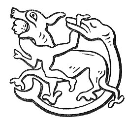

  
[Intangible Textual Heritage](../../../index) 
[Legends/Sagas](../../index)  [Celtic](../index)  [Carmina
Gadelica](../cg)  [Index](index)  [Previous](cg2120)  [Next](cg2122) 

------------------------------------------------------------------------

[Buy this Book at
Amazon.com](https://www.amazon.com/exec/obidos/ASIN/B0027P890O/internetsacredte)

------------------------------------------------------------------------

  
*Carmina Gadelica, Volume 2*, by Alexander Carmicheal, \[1900\], at
Intangible Textual Heritage

------------------------------------------------------------------------

### U

*Udail*, oscillate, oscillation; 'udalan' a swivel.

 

*Uilm*, *uilim*, coffer, treasury, offertory, a bag for alms; akin to
'ulaidh,' treasure?

 

*Uinicinn*, lamb-skin; from 'uan,' lamb, 'cionn,' skin.

 

p. 373

*Uraisg*, a monster, half-human, half-goat, with abnormally long hair,
long teeth, and long claws, frequenting glens, corries, reedy lakes, and
sylvan streams; an unkempt, untidy man.

A glen in Killninver, Argyll, is called 'Gleann-uraisg,' 'Gleann na
h-uraisg,' glen of 'uraisg,' glen of the 'uraisg.' Many stories are told
of the 'uraisg' possessing this glen, the appearance, the action, and
the speech of this supernatural creature being graphically described.
The 'uraisg' is not unfriendly to the friendly beyond showing them
scenes, and telling them of events above the world, upon the world, and
below the world, that fill them with terror. Strong men avoid the glen
of the 'uraisg' at night.

In the Coolin Hills, Skye, there is a place called 'Coire nan uraisg,'
corrie of the 'uraisgs,' and adjoining it another place called 'Bealach
Coire nan uraisg,' the pass of the corrie of the 'uraisgs.'

 

*Usga*, *usgar*, holy, sacred, precious, jewels.

<table data-border="0">
<colgroup>
<col style="width: 33%" />
<col style="width: 33%" />
<col style="width: 33%" />
</colgroup>
<tbody>
<tr class="odd">
<td data-valign="top">
Siud mar dh’ orduichinn-sa dhusa, 
Nighean righ le or ’s le usga.'
</td>
<td data-valign="top">
 
</td>
<td data-valign="top">
That is what I would ordain to thee, 
The daughter of a king, with gold and gems.
</td>
</tr>
</tbody>
</table>

 

 

 

 

------------------------------------------------------------------------

[Next: Names of Those From Whose Recitation the Poems Have Been
Recorded](cg2122)
