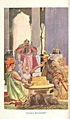
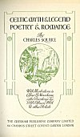
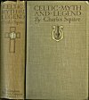

  
[Intangible Textual Heritage](../../../index.md) 
[Legends/Sagas](../../index)  [Celtic](../index)  [Index](index.md) 
[Next](cml01.md) 

------------------------------------------------------------------------

[Buy this Book at
Amazon.com](https://www.amazon.com/exec/obidos/ASIN/0809531534/internetsacredte.md)

------------------------------------------------------------------------

# CELTIC MYTH & LEGEND

# POETRY & ROMANCE

## By

## Charles Squire

#### With Illustrations in Colour and Monochrome after Paintings by J.H.F. Bacon, A.R.A. & other Artists

#### THE GRESHAM PUBLISHING COMPANY, LIMITED

#### 66 CHANDOS STREET COVENT GARDEN LONDON

###### \[Original Title: The Mythology of the British Islands; and introduction to Celtic Myth, Legend, Poetry and Romance, published London, Blackie and Son Limited\]

#### \[1905\]

[  
Click to enlarge](img/front.jpg.md)  
LUGH'S ENCLOSURE  

[  
Click to enlarge](img/title.jpg.md)  
Title Page  

[  
Click to enlarge](img/cover.jpg.md)  
Cover  

Scanned at Intangible Textual Heritage, November 2005. Proofed and
formatted by John Bruno Hare. This text is in the public domain in the
United States because it was published prior to January 1st, 1923. These
files may be used for any non-commercial purpose, provided this notice
of attribution is left intact in all copies.

 

------------------------------------------------------------------------

[Next: Preface](cml01.md)
