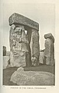

  
[Intangible Textual Heritage](../../../index) 
[Legends/Sagas](../../index)  [Celtic](../index)  [Index](index) 
[Previous](cml07)  [Next](cml09) 

------------------------------------------------------------------------

[Buy this Book at
Amazon.com](https://www.amazon.com/exec/obidos/ASIN/0809531534/internetsacredte)

------------------------------------------------------------------------

p. 31 

### CHAPTER IV

### THE RELIGION OF THE ANCIENT BRITONS AND DRUIDISM

The ancient inhabitants of Britain--the Gaelic and British Celts--have
been already described as forming a branch of what are roughly called
the "Aryans". This name has, however, little reference to race, and
really signifies the speakers of a group of languages which can be all
shown to be connected, and to descend remotely from a single source--a
hypothetical mother-tongue spoken by a hypothetical people which we term
"Aryan", or, more correctly, "Indo-European". This primeval speech,
evolved, probably, upon some part of the great plain which stretches
from the mountains of Central Europe to the mountains of Central Asia,
has spread, superseding, or amalgamating with the tongues of other
races, until branches of it are spoken over almost the whole of Europe
and a great portion of Asia. All the various Latin, Greek, Slavic,
Teutonic, and Celtic languages are "Aryan", as well as Persian and other
Asiatic dialects derived from the ancient "Zend", and the numerous
Indian languages which trace their origin to Sanscrit.

Not very long ago, it was supposed that this

p. 32

common descent of language involved a common descent of blood. A real
brotherhood was enthusiastically claimed for all the principal European
nations, who were also invited to recognize Hindus and Persians as their
long-lost cousins. Since then, it has been conceded that, while the
Aryan speech survived, though greatly modified, the Aryan blood might
well have disappeared, diluted beyond recognition by crossing with the
other races whom the Aryans conquered, or among whom they more or less
peacefully settled. As a matter of fact, there are no European
nations--perhaps no people at all except a few remote savage
tribes--which are not made up of the most diverse elements. Aryan and
non-Aryan long ago blended inextricably, to form by their fusion new
peoples.

But, just as the Aryan speech influenced the new languages, and the
Aryan customs the new civilizations, so we can still discern in the
religions of the Aryan-speaking nations similar ideas and expressions
pointing to an original source of mythological conceptions. Hence,
whether we investigate the mythology of the Hindus, the Greeks, the
Teutons, or the Celts, we find the same mythological ground-work. In
each, we see the powers of nature personified, and endowed with human
form and attributes, though bearing, with few exceptions, different
names. Like the Vedic brahmans, the Greek and Latin poets, and the Norse
scalds, the Celtic bards--whether Gaels or Britons--imagined the sky,
the sun, the moon, the earth, the sea, and the dark underworld, as well
as the mountains, the streams,

 

[  
Click to enlarge](img/03200.jpg)  
CELTIC WORSHIP  
*From the Drawing by E. Wallcousins*  

 

p. 33

and the woods, to be ruled by beings like their own chiefs, but
infinitely more powerful; every passion, as War and Love, and every art,
as Poetry and Smithcraft, had its divine founder, teacher, and exponent;
and of all these deities and their imagined children, they wove the
poetical and allegorical romances which form the subject of the present
volume.

Like other nations, too, whether Aryan or non-Aryan, the Celts had,
besides their mythology, a religion. It is not enough to tell tales of
shadowy gods; they must be made visible by sculpture, housed in groves
or temples, served with ritual, and propitiated with sacrifices, if one
is to hope for their favours. Every cult must have its priests living by
the altar.

The priests of the Celts are well-known to us by name as the "Druids"--a
word derived from a root DR which signifies a tree, and especially the
oak, in several Aryan languages. [1](#fn_30)
This is generally--though not by all scholars--taken as proving that
they paid an especial veneration to the king of trees. It is true that
the mistletoe--that strange parasite upon the oak--was prominent among
their "herbs of power", and played a part in their ritual; [2](#fn_31) but this is equally true of other Aryan
nations. By the Norse it was held sacred to the god Balder, while the
Romans believed it to be the "golden bough" that gave access to
Hades. [3](#fn_32)

p. 34

The accounts both of the Latin and Gaelic writers give us a fairly
complete idea of the nature of the Druids, and especially of the high
estimation in which they were held. They were at once the priests, the
physicians, the wizards, the diviners, the theologians, the scientists,
and the historians of their tribes. All spiritual power and all human
know-ledge were vested in them, and they ranked second only to the kings
and chiefs. They were freed from all contribution to the State, whether
by tribute or service in war, so that they might the better apply
themselves to their divine offices. Their decisions were absolutely
final, and those who disobeyed them were laid under a terrible
excommunication or "boycott". [1](#fn_33)
Classic writers tell us how they lorded it in Gaul, where, no doubt,
they borrowed splendour by imitating their more civilized neighbours.
Men of the highest rank were proud to cast aside the insignia of mere
mortal honour to join the company of those who claimed to be the direct
mediators with the sky-god and the thunder-god, and who must have
resembled the ecclesiastics of mediæval Europe in the days of their
greatest power, combining, like them, spiritual and temporal dignities,
and possessing the highest culture of their age. Yet it was not among
these Druids of Gaul, with their splendid temples and vestments and
their elaborate rituals, that the metropolis of Druidism was to be
sought. We learn from Caesar that the Gallic Druids believed

p. 35

their religion to have come to them, originally, from Britain, and that
it was their practice to send their "theological students" across the
Channel to learn its doctrines at their purest source. [1](#fn_34) To trace a cult backwards is often to take
a retrograde course in culture, and it was no doubt in Britain--which
Pliny the Elder tells us "might have taught magic to Persia" [2](#fn_35)--that the sufficiently primitive and
savage rites of the Druids of Gaul were preserved in their still more
savage and primitive forms. It is curious corroboration of this alleged
British origin of Druidism that the ancient Irish also believed their
Druidism to have come from the sister island. Their heroes and seers are
described as only gaining the highest knowledge by travelling to
Alba. [3](#fn_36) However this may be, we may
take it as certain that this Druidism was the accepted religion of the
Celtic race.

Certain scholars look deeper for its origin, holding its dark
superstitions and savage rites to bear the stamp of lower minds than
those of the poetic and manly Celts. Professor Rhys inclines to see
three forms of religion in the British Islands at the time of the Roman
invasion: the "Druidism" of the Iberian aborigines; the pure polytheism
of the Brythons, who, having come later into the country, had mixed but
little with the natives; and the mingled Aryan and non-Aryan cults of
the Goidels, who were already largely amalgamated with them. [4](#fn_37)

p. 36

\[paragraph continues\] But many
authorities dissent from this view, and, indeed, we are not obliged to
postulate borrowing from tribes in a lower state of culture, to explain
primitive and savage features underlying a higher religion. The "Aryan"
nations must have passed, equally with all others, through a state of
pure savagery; and we know that the religion of the Greeks, in many
respects so lofty, sheltered features and legends as barbarous as any
that can be attributed to the Celts. [1](#fn_38)

Of the famous teaching of the Druids we know little, owing to their
habit of never allowing their doctrines to be put into writing. Caesar,
however, roughly records its scope. "As one of their leading dogmas", he
says, "they inculcate this: that souls are not annihilated, but pass
after death from one body to another, and they hold that by this
teaching men are much encouraged to valour, through disregarding the
fear of death. They also discuss and impart to the young many things
concerning the heavenly bodies and their movements, the size of the
world and of our earth, natural science, and of the influence and power
of the immortal gods." [2](#fn_39) The Romans
seem to have held their wisdom in some awe, though it is not unlikely
that the Druids themselves borrowed whatever knowledge they may have had
of science and philosophy from the classical culture. That their creed
of transmigration was not, however, merely taken over from the Greeks
seems certain from its appearance in the

p. 37

ancient Gaelic myths. Not only the "shape-shifting" common to the magic
stories of all nations, but actual reincarnation was in the power of
privileged beings. The hero Cuchulainn was urged by the men of Ulster to
marry, because they knew "that his rebirth would be of himself", [1](#fn_40) and they did not wish so great a warrior
to be lost to their tribe. Another legend tells how the famous Finn mac
Coul was reborn, after two hundred years, as an Ulster king called
Mongan. [2](#fn_41)

Such ideas, however, belonged to the metaphysical side of Druidism. Far
more important to the practical primitive mind are ritual and sacrifice,
by the due performance of which the gods are persuaded or compelled to
grant earth's increase and length of days to men. Among the Druids, this
humouring of the divinities took the shape of human sacrifice, and that
upon a scale which would seem to have been unsurpassed in horror even by
the most savage tribes of West Africa or Polynesia. "The whole Gaulish
nation", says Caesar, "is to a great degree devoted to superstitious
rites; and on this account those who are afflicted with severe diseases,
or who are engaged in battles and dangers, either sacrifice human beings
for victims, or vow that they will immolate themselves, and these employ
the Druids as ministers for such sacrifices, because they think that,
unless the life of man be repaid for the life of man, the will of the
immortal gods cannot be

p. 38

appeased. They also ordain national offerings of the same kind. Others
make wicker-work images of vast size, the limbs of which they fill with
living men and set on fire." [1](#fn_42)

We find evidence of similarly awful customs in pagan Ireland. Among the
oldest Gaelic records are tracts called *Dinnsenchus*, in which famous
places are enumerated, together with the legends relating to them. Such
topographies are found in several of the great Irish mediæval
manuscripts, and therefore, of course, received their final
transcription at the hands of Christian monks. But these ecclesiastics
rarely tampered with compositions in elaborate verse. Nor can it be
imagined that any monastic scribe could have invented such a legend as
this one which describes the practice of human sacrifice among the
ancient Irish. The poem (which is found in the Books of Leinster, of
Ballymote, of Lecan, and in a document called the Rennes MS.) [2](#fn_43) records the reason why a spot near the
present village of Ballymagauran, in County Cavan, received the name of
Mag Slecht, the "Plain of Adoration".

"Here used to be  
A high idol with many fights,  
Which was named the Cromm Cruaich;  
It made every tribe to be without peace.

"’T was a sad evil!  
Brave Gaels used to worship it. p. 39  
From it they would not without tribute ask  
To be satisfied as to their portion of the hard world.

"He was their god,  
The withered Cromm with many mists,  
The people whom he shook over every host,  
The everlasting kingdom they shall not have.

"To him without glory  
They would kill their piteous, wretched offspring  
With much wailing and peril,  
To pour their blood around Cromm Cruaich.

"'Milk and corn  
They would ask from him speedily  
In return for one-third of their healthy issue:  
Great was the horror and the scare of him.

"To him  
Noble Gaels would prostrate themselves,  
From the worship of him, with many manslaughters,  
The plain is called "Mag Slecht".

     .     .     .     .     .     .

"They did evil,  
They beat their palms, they pounded their bodies,  
Wailing to the demon who enslaved them,  
They shed falling showers of tears.

     .     .     .     .     .     .

"Around Cromm Cruaich  
There the hosts would prostrate themselves;  
Though he put them under deadly disgrace,  
Their name clings to the noble plain.

"In their ranks (stood)  
Four times three stone idols;  
To bitterly beguile the hosts,  
The figure of the Cromm was made of gold. p.
40

"Since the rule  
Of Herimon [1](#fn_44), the noble man of
grace,  
There was worshipping of stones  
Until the coming of good Patrick of Macha.

"A sledge-hammer to the Cromm  
He applied from crown to sole,  
He destroyed without lack of valour  
The feeble idol which was there."

Such, we gather from a tradition which we may deem authentic, was human
sacrifice in early Ireland. According to the quoted verse, one third of
the healthy children were slaughtered, presumably every year, to wrest
from the powers of nature the grain and grass upon which the tribes and
their cattle subsisted. In a prose *dinnsenchus* preserved in the Rennes
MS., [2](#fn_45) there is a slight variant. "’T
is there", (at Mag Slecht), it runs, "was the king idol of Erin, namely
the Crom Croich, and around him were twelve idols made of stones, but he
was of gold. Until Patrick's advent he was the god of every folk that
colonized Ireland. To him they used to offer the firstlings of every
issue and the chief scions of every clan." The same authority also tells
us that these sacrifices were made at "Hallowe’en", which took the
place, in the Christian calendar, of the heathen *Samhain*--"Summer's
End"--when the sun's power waned, and the strength of the gods of
darkness, winter, and the underworld grew great.

p. 41

Who, then, was this bloodthirsty deity? His name, *Cromm Cruaich*, means
the "Bowed One of the Mound", and was evidently applied to him only
after his fall from godhead. It relates to the tradition that, at the
approach of the all-conquering Saint Patrick, the "demon" fled from his
golden image, which thereupon sank forward in the earth in homage to the
power that had come to supersede it. [1](#fn_46)
But from another source we glean that the word *cromm* was a kind of pun
upon *cenn*, and that the real title of the "king idol of Erin" was
*Cenn Cruaich*, "Head" or "Lord" of the Mound. Professor Rhys, in his
*Celtic Heathendom*, [2](#fn_47) suggests that
he was probably the Gaelic heaven-god, worshipped, like the Hellenic
Zeus, upon "high places", natural or artificial. At any rate, we may see
in him the god most revered by the Gaels, surrounded by the other twelve
chief members of their Pantheon.

It would appear probable that the Celtic State worship was what is
called "solar". All its chief festivals related to points in the sun's
progress, the equinoxes having been considered more important than the
solstices. It was at the spring equinox (called by the Celts
"Beltaine" [3](#fn_48)) in every nineteenth year
that, we learn from Diodorus the Sicilian, a writer contemporary with
Julius Caesar, Apollo himself appeared to his worshippers, and was seen
harping and dancing in the sky until the rising of the Pleiades. [4](#fn_49) The other corresponding festival was

p. 42

\[paragraph continues\] "Samhain" [1](#fn_50), the autumn equinox. As Beltaine marked
the beginning of summer, so Samhain recorded its end. The summer
solstice was also a great Celtic feast. It was held at the beginning of
August in honour of the god called Lugus by the Gauls, Lugh by the
Gaels, and Lleu by the Britons--the pan-Celtic Apollo, and, probably,
when the cult of the war-god had fallen from its early prominence, the
chief figure of the common Pantheon.

It was doubtless at Stonehenge that the British Apollo was thus seen
harping and dancing. That marvellous structure well corresponds to
Diodorus's description of a "magnificent temple of Apollo" which he
locates "in the centre of Britain". "It is a circular enclosure," he
says, "adorned with votive offerings and tablets with Greek inscriptions
suspended by travellers upon the walls. The rulers of the temple and
city are called 'Boreadæ' [2](#fn_51), and they
take up the government from each other according to the order of their
tribes. The citizens are given up to music, harping and chanting in
honour of the sun." [3](#fn_52) Stonehenge,
therefore, was a sacred religious centre, equally revered by and equally
belonging to all the British tribes--a Rome or Jerusalem of our ancient
paganism.

The same great gods were, no doubt, adored by all the Celts, not only of
Great Britain and Ireland, but of Continental Gaul as well. Sometimes
they can be traced by name right across the ancient

 

[  
Click to enlarge](img/04200.jpg)  
PORTION OF THE CIRCLE, STONEHENGE.--Frith  

 

p. 43

\[paragraph continues\] Celtic world. In
other cases, what is obviously the same personified power of nature is
found in various places with the same attributes, but with a different
title. Besides these, there must have been a multitude of lesser gods,
worshipped by certain tribes alone, to whom they stood as ancestors and
guardians. "I swear by the gods of my people", was the ordinary oath of
a hero in the ancient Gaelic sagas. The aboriginal tribes must also have
had their gods, whether it be true or not that their religion influenced
the Celtic Druidism. Professor Rhys inclines to see in the *genii
locorum*, the almost nameless spirits of well and river, mountain and
wood--shadowy remnants of whose cults survive today,--members of a
swarming Pantheon of the older Iberians. [1](#fn_53) These local beings would in no way
conflict with the great Celtic nature-gods, and the two worships could
exist side by side, both even claiming the same votary. It needs the
stern faith of mono-theism to deny the existence of the gods of others.
Polytheistic nations have seldom or never risen to such a height. In
their dealings with a conquered people, the conquerors naturally held
their own gods to be the stronger. Still, it could not be denied that
the gods of the conquered were upon their own ground; they knew, so to
speak, the country, and might have unguessed powers of doing evil! What
if, to avenge their worshippers and themselves, they were to make the
land barren and useless to the conquerors? So that conquering pagan
nations have usually been quite ready to stretch out the hand of

p. 44

welcome to the deities of their new subjects, to propitiate them by
sacrifice, and even to admit them within the pale of their own Pantheon.

This raises the question of the exact nationality of the gods whose
stories we are about to tell. Were they all Aryan, or did any of the
greater aboriginal deities climb up to take their place among the Gaelic
tribe of the goddess Danu, or the British children of the goddess Dôn?
Some of the Celtic gods have seemed to scholars to bear signs of a
non-Aryan origin. [1](#fn_54) The point,
however, is at present very obscure. Neither does it much concern us.
Just as the diverse deities of the Greeks--some Aryan and Hellenic, some
pre-Aryan and Pelasgian, some imported and Semitic--were all gathered
into one great divine family, so we may consider as members of one
national Olympus all these gods whose legends make up "The Mythology of
the British Islands".

------------------------------------------------------------------------

### Footnotes

[33:1](cml08.htm#fr_30) See Schrader:
*Prehistoric Antiquities of the Aryan Peoples*, pp. 138, 272.

[33:2](cml08.htm#fr_31) A description of the
Druidical cult of the mistletoe is given by Pliny: *Natural History*,
XVI, chap. xcv.

[33:3](cml08.htm#fr_32) See Frazer: *The Golden
Bough*, chap. IV.

[34:1](cml08.htm#fr_33) Caesar: *De Bello
Gallico*, Book VI, chaps. XIII, XIV. But for a full exposition of what
is known of the Druids the reader is referred to M. d’Arbois de
Jubainville's *Introduction d l’Etude de la Littérature Celtique*, Vol.
I of his *Cours de Littérature Celtique*.

[35:1](cml08.htm#fr_34) Caesar: *De Bello
Gallico*, Book VI, chap. XIII.

[35:2](cml08.htm#fr_35) Pliny: *Natural
History*, XXX.

[35:3](cml08.htm#fr_36) See [chap.
XII](cml16.htm#ch-12), *The Irish Iliad*.

[35:4](cml08.htm#fr_37) Rhys: *Celtic Britain*,
chap. II. See also Gomme: *Ethnology in Folk-lore*, pp. 58-62; *Village
Community*, p. 104.

[36:1](cml08.htm#fr_38) Abundant evidence of
this is contained in Pausanias' *Description of Greece*.

[36:2](cml08.htm#fr_39) Caesar: *De Bello
Gallico*, Book VI, chap. XIV.

[37:1](cml08.htm#fr_40) *The Wooing of Emer*.

[37:2](cml08.htm#fr_41) It is contained in the
Book of the Dun Cow, and has been translated or commented upon by Eugene
O’Curry (*Manners and Customs of the Ancient Irish*), De Jubainville
(*Cycle Mythologique Irlandais*), and Nutt (*Voyage of Bran*).

[38:1](cml08.htm#fr_42) Caesar: *De Bello
Gallico*, Book VI, chap. XVI.

[38:2](cml08.htm#fr_43) The following
translation was made by Dr. Kuno Meyer, and appears as Appendix B to
Nutt's *Voyage of Bran*. Three verses, here omitted, will be found later
as a note to [chap. XII](cml16.htm#ch-12)--"The Irish Iliad".

[40:1](cml08.htm#fr_44) The first King of the
Milesians. The name is more usually spelt Eremon.

[40:2](cml08.htm#fr_45) The Rennes *Dinnsenchus*
has been translated by Dr. Whitley Stokes iii Vol. XVI of the *Revue
Celtique*.

[41:1](cml08.htm#fr_46) Told in the Tripartite
Life of Saint Patrick, a fifteenth-century combination of three very
ancient Gaelic MSS.

[41:2](cml08.htm#fr_47) The *Hibbert Lectures*
for 1886. Lecture II--"The Zeus of the Insular Celts"

[41:3](cml08.htm#fr_48) Pronounced *Baltinna*.

[41:4](cml08.htm#fr_49) *Diodorus Siculus*: Book
II, chap. III.

[42:1](cml08.htm#fr_50) Pronounced Sowin.

[42:2](cml08.htm#fr_51) It has been suggested
that this title is an attempt to reproduce the ancient British word for
"bards".

[42:3](cml08.htm#fr_52) *Diodorus Siculus*: Book
II, chap. III.

[43:1](cml08.htm#fr_53) *Hibbert Lectures*,
1886. Lecture I--"The Gaulish Pantheon"

[44:1](cml08.htm#fr_54) See Rhys: *Lectures on
Welsh Philology*, pp. 426, 552, 659.

------------------------------------------------------------------------

[Next: Chapter V. The Gods of the Gaels](cml09)
