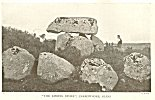

  
[Intangible Textual Heritage](../../../index.md) 
[Legends/Sagas](../../index)  [Celtic](../index)  [Index](index.md) 
[Previous](cml12)  [Next](cml14.md) 

------------------------------------------------------------------------

[Buy this Book at
Amazon.com](https://www.amazon.com/exec/obidos/ASIN/0809531534/internetsacredte.md)

------------------------------------------------------------------------

p. 107 

### CHAPTER IX

### THE WAR WITH THE GIANTS [1](#fn_134.md)

By this time the seven years of preparation had come to an end. A week
before the Day of Samhain, the Morrígú discovered that the Fomors had
landed upon Erin. She at once sent a messenger to tell the Dagda, who
ordered his druids and sorcerers to go to the ford of the River Unius,
in Sligo, and utter incantations against them.

The people of the goddess Danu, however, were not yet quite ready for
battle. So the Dagda decided to visit the Fomorian camp as an
ambassador, and, by parleying with them, to gain a little more time. The
Fomors received him with apparent courtesy, and, to celebrate his
coming, prepared him a feast of porridge; for it was well-known how fond
he was of such food. They poured into their king's cauldron, which was
as deep as five giant's fists, fourscore gallons of new milk, with meal
and bacon in proportion. To this they added the whole carcasses of
goats, sheep, and pigs; they boiled the mixture together, and poured it
into a hole in the ground. "Now," said they, "if you do not

p. 108

eat it all, we shall put you to death, for we will not have you go back
to your own people and say that the Fomors are inhospitable." But they
did not succeed in frightening the Dagda. He took his spoon, which was
so large that two persons of our puny size might have reclined
comfortably in the middle of it, dipped it into the porridge, and fished
up halves of salted pork and quarters of bacon.

"If it tastes as good as it smells," he said, "it is good fare." And so
it proved; for he ate it all, and scraped up even what remained at the
bottom of the hole. Then he went away to sleep it off, followed by the
laughter of the Fomors; for his stomach was so swollen with food that he
could hardly walk. It was larger than the biggest cauldron in a large
house, and stood out like a sail before the wind.

But the Fomors' little practical joke upon the Dagda had given the
Tuatha Dé Danann time to collect their forces. It was on the eve of
Samhain that the two armies came face to face. Even then the Fomors
could not believe that the people of the goddess Danu would offer them
much resistance.

"Do you think they will really dare to give us battle?" said Bress to
Indech, the son of Domnu. "If they do not pay their tribute, we will
pound their bones for them," he replied.

The war of gods and giants naturally mirrored the warfare of the Gaels,
in whose battles, as in those of most semi-barbarous people, single
combat figured largely. The main armies stood still, while, every day,
duels took place between ambitious combatants

p. 109

\[paragraph continues\] But no great
warriors either of the Tuatha Dé Danann or of the Fomors took part in
them.

Sometimes a god, sometimes a giant would be the victor; but there was a
difference in the net results that astonished the Fomors. If their own
swords and lances were broken, they were of no more use, and if their
own champions were killed, they never came back to life again; but it
was quite otherwise with the people of the goddess Danu. Weapons
shattered on one day reappeared upon the next in as good condition as
though they had never been used, and warriors slain on one day came back
upon the morrow unhurt, and ready, if necessary, to be killed again.

The Fomors decided to send someone to discover the secret of these
prodigies. The spy they chose was Ruadan, the son of Bress and of
Brigit, daughter of the Dagda, and therefore half-giant and half-god. He
disguised himself as a Tuatha Dé Danann warrior, and went to look for
Goibniu. He found him at his forge, together with Luchtainé, the
carpenter, and Credné, the bronze-worker. He saw how Goibniu forged
lance-heads with three blows of his hammer, while Luchtainé cut shafts
for them with three blows of his axe, and Credné fixed the two parts
together so adroitly that his bronze nails needed no hammering in. He
went back and told the Fomors, who sent him again, this time to try and
kill Goibniu.

He reappeared at the forge, and asked for a javelin. Without suspicion,
Goibniu gave him one, and, as soon as he got it into his hand, he thrust
it

p. 110

through the smith's body. But Goibniu plucked it out, and, hurling it
back at his assailant, mortally wounded him. Ruadan went home to die,
and his father Bress and his mother Brigit mourned for him, inventing
for the purpose the Irish "keening". Goibniu, on the other hand, took no
harm. He went to the physician Diancecht, who, with his daughter Airmid,
was always on duty at a miraculous well called the "spring of health".
Whenever one of the Tuatha Dé Danann was killed or wounded, he was
brought to the two doctors, who plunged him into the wonder-working
water, and brought him back to life and health again.

The mystic spring was not long, however, allowed to help the people of
the goddess. A young Fomorian chief, Octriallach son of Indech, found it
out. He and a number of his companions went to it by night, each
carrying a large stone from the bed of the River Drowes. These they
dropped into the spring, until they had filled it, dispersed the healing
water, and formed a cairn above it. Legend has identified this place by
the name of the "Cairn of Octriallach".

This success determined the Fomors to fight a pitched battle. They drew
out their army in line. There was not a warrior in it who had not a coat
of mail and a helmet, a stout spear, a strong buckler, and a heavy
sword. "Fighting the Fomors on that day", says the old author, "could
only be compared to one of three things--beating one's head against a
rock, or plunging it into a fire, or putting one's hand into a serpent's
nest."

p. 111

All the great fighters of the Tuatha Dé Danann were drawn out opposite
to them, except Lugh. A council of the gods had decided that his varied
accomplishments made his life too valuable to be risked in battle. They
had, therefore, left him behind, guarded by nine warriors. But, at the
last moment, Lugh escaped from his warders, and appeared in his chariot
before the army. He made them a patriotic speech. "Fight bravely," he
said, "that your servitude may last. no longer; it is better to face
death than to live in vassalage and pay tribute." With these encouraging
words, he drove round the ranks, standing on tiptoe, so that all the
Tuatha Dé Danann might see him.

The Fomors saw him too, and marvelled. "It seems wonderful to me," [1](#fn_135.md) said Bress to his druids, "that the sun
should rise in the west to-day and in the east every other day." "It
would be better for us if it were so," replied the druids. "What else
can it be, then?" asked Bress. "It is the radiance of the face of Lugh
of the Long Arms," said they.

Then the two armies charged each other with a great shout. Spears and
lances smote against shields, and so great was the shouting of the
fighters, the shattering of shields, the clattering of swords, the
rattling of quivers, and the whistling of darts and javelins that it
seemed as if thunder rolled everywhere.

They fought so closely that the heads, hands, and

p. 112

feet of those on one side were touching the heads, hands, and feet of
those on the other side; they shed so much blood on to the ground that
it became hard to stand on it without slipping; and the river of Unsenn
was filled with dead bodies, so hard and swift and bloody and cruel was
the battle.

Many great chiefs fell on each side. Ogma, the champion of the Tuatha Dé
Danann, killed Indech, the son of the goddess Domnu. But, meanwhile,
Balor of the Mighty Blows raged among the gods, slaying their king,
Nuada of the Silver Hand, as well as Macha, one of his warlike wives. At
last he met with Lugh. The sun-god shouted a challenge to his
grandfather in the Fomorian speech. Balor heard it, and prepared to use
his death-dealing eye.

"Lift up my eyelid," he said to his henchmen, "that I may see this
chatterer who talks to me.

The attendants lifted Balor's eye with a hook, and if the glance of the
eye beneath had rested upon Lugh, he would certainly have perished. But,
when it was half opened, Lugh flung a magic stone which struck Balor's
eye out through the back of his head. The eye fell on the ground behind
Balor, and destroyed a whole rank of thrice nine Fomors who were unlucky
enough to be within sight of it.

An ancient poem has handed down the secret of this magic stone. It is
there called a *tathlum*, meaning a "concrete ball" such as the ancient
Irish warriors used sometimes to make out of the brains of dead enemies
hardened with lime.

p. 113

"A tathlum, heavy, fiery, firm,  
Which the Tuatha Dé Danann had with them,  
It was that broke the fierce Balor's eye,  
Of old, in the battle of the great armies.

"The blood of toads and furious bears,  
And the blood of the noble lion,  
The blood of vipers and of Osmuinn's trunks;--  
It was of these the tathlum was composed.

"The sand of the swift Armorian sea,  
And the sand of the teeming Red Sea;--  
All these, being first purified, were used  
In the composition of the tathlum.

"Briun, the son of Bethar, no mean warrior,  
Who on the ocean's eastern border reigned;--  
It was he that fused, and smoothly formed,  
It was he that fashioned the tathlum.

"To the hero Lugh was given  
This concrete ball,--no soft missile;--  
In Mag Tuireadh of shrieking wails,  
From his hand he threw the tathlum." [1](#fn_136.md)

This blinding of the terrible Balor turned the fortunes of the fight;
for the Fomors wavered, and the Morrígú came and encouraged the people
of the goddess Danu with a song, beginning "Kings arise to the battle",
so that they took fresh heart, and drove the Fomors headlong back to
their country underneath the sea.

Such was the battle which is called in Irish *Mag Tuireadh na
b-Fomorach*, that is to say, the

p. 114

\[paragraph continues\] "Plain of the
Towers of the Fomors", and, more popularly, the "Battle of Moytura the
Northern", to distinguish it from the other Battle of Moytura fought by
the Tuatha Dé Danann against the Fir Bolgs farther to the south. More of
the Fomors were killed in it, says the ancient manuscript, than there
are stars in the sky, grains of sand on the sea-shore, snow-flakes in
winter, drops of dew upon the meadows in spring-time, hailstones during
a storm, blades of grass trodden under horses' feet, or Manannán son of
Lêr's white horses, the waves of the sea, when a tempest breaks. The
"towers" or pillars said to mark the graves of the combatants still
stand upon the plain of Carrowmore, near Sligo, and form, in the opinion
of Dr. Petrie, the finest collection of prehistoric monuments in the
world, with the sole exception of Carnac, in Brittany. [1](#fn_137.md) Megalithic structures of almost every
kind are found among them--stone cairns with dolmens in their interiors,
dolmens standing open and alone, dolmens surrounded by one, two, or
three circles of stones, and circles without dolmens--to the number of
over a hundred. Sixty-four of such prehistoric remains stand together
upon an elevated plateau not more than a mile across, and make the
battle-field of Moytura, though the least known, perhaps the most
impressive of all primeval ruins. What they really commemorated we may
never know, but, in all probability, the place was the scene of some
important and decisive early battle, the monuments marking the graves of
the chieftains who were interred as the

 

[  
Click to enlarge](img/11400.jpg.md)  
''THE KISSING STONE'', CARROWMORE, SLIGO.--R. Welch  

 

p. 115

result of it. Those which have been examined were found to contain burnt
wood and the half-burnt bones of men and horses, as well as implements
of flint and bone. The actors, therefore, were still in the Neolithic
Age. Whether the horses were domesticated ones buried with their riders,
or wild ones eaten at the funeral feasts, it would be hard to decide.
The history of the real event must have been long lost even at the early
date when its relics were pointed out as the records of a battle between
the gods and the giants of Gaelic myth.

The Tuatha Dé Danann, following the routed Fomors, overtook and captured
Bress. He begged Lugh to spare his life.

"What ransom will you pay for it?" asked Lugh.

"I will guarantee that the cows of Ireland shall always be in milk,"
promised Bress.

But, before accepting, Lugh took counsel with his druids.

"What good will that be," they decided, "if Bress does not also lengthen
the lives of the cows?"

This was beyond the power of Bress to do; so he made another offer.

"Tell your people," he said to Lugh, "that, if they will spare my life,
they shall have a good wheat harvest every year."

But they said: "We already have the spring to plough and sow in, the
summer to ripen the crops, the autumn for reaping, and the winter in
which to eat the bread; and that is all we want."

Lugh told this to Bress. But he also said: "You

p. 116

shall have your life in return for a much less service to us than that."

"What is it?" asked Bress.

"Tell us when we ought to plough, when we ought to sow, and when we
ought to harvest."

Bress replied: "You should plough on a Tuesday, sow on a Tuesday, and
harvest on a Tuesday."

And this lying maxim (says the story) saved Bress's life.

Lugh, the Dagda, and Ogma still pursued the Fomors, who had carried off
in their flight the Dagda's harp. They followed them into the submarine
palace where Bress and Elathan lived, and there they saw the harp
hanging on the wall. This harp of the Dagda's would not play without its
owner's leave. The Dagda sang to it:

"Come, oak of the two cries!  
Come, hand of fourfold music!  
Come, summer! Come, winter!  
Voice of harps, bellows [1](#fn_138.md), and
flutes!"

\[paragraph continues\] For the Dagda's
harp had these two names; it was called "Oak of the two cries" and "Hand
of four-fold music".

It leaped down from the wall, killing nine of the Fomors as it passed,
and came into the Dagda's hand. The Dagda played to the Fomors the three
tunes known to all clever harpists--the weeping-tune, the laughing-tune,
and the sleeping-tune. While he played the weeping-tune, they were bowed
with weeping; while he played the laughing-tune,

p. 117

they rocked with laughter; and when he played the sleeping-tune, they
all fell asleep. And while they slept, Lugh, the Dagda, and. Ogma got
away safely.

Next, the Dagda brought the black-maned heifer which he had, by the
advice of Angus son of the Young, obtained from Bress. The wisdom of
Angus had been shown in this advice, for it was this very heifer that
the cattle of the people of the goddess Danu were accustomed to follow,
whenever it lowed. Now, when it lowed, all the cattle which the Fomors
had taken away from the Tuatha Dé Danann came back again.

Yet the power of the Fomors was not wholly broken. Four of them still
carried on a desultory warfare by spoiling the corn, fruit, and milk of
their conquerors. But the Morrígú and Badb and Mider and Angus pursued
them, and drove them out of Ireland for ever. [1](#fn_139.md)

Last of all, the Morrígú and Badb went up on to the summits of all the
high mountains of Ireland, and proclaimed the victory. All the lesser
gods who had not been in the battle came round and heard the news. And
Badb sang a song which began:

"Peace mounts to the heavens,  
The heavens descend to earth,  
Earth lies under the heavens,  
Everyone is strong."

but the rest of it has been lost and forgotten.

Then she added a prophecy in which she foretold

p. 118

the approaching end of the divine age, and the beginning of a new one in
which summers would be flowerless and cows milkless and women shameless
and men strengthless, in which there would be trees without fruit and
seas without fish, when old men would give false judgments and
legislators make unjust laws, when warriors would betray one another,
and men would be thieves, and there would be no more virtue left in the
world.

------------------------------------------------------------------------

### Footnotes

[107:1](cml13.htm#fr_134.md) This chapter is, with
slight interpolations, based upon the Harleian MS. in the British Museum
numbered 5280, and called the *Second Battle of Moytura*, of rather from
translations made of it by Dr. Whitley Stokes, published in the *Revue
Celtique*, Vol. XII, and by M. de Jubainville in his *L’Épopée Celtique
en Irlande*.

[111:1](cml13.htm#fr_135.md) I have interpolated
this picturesque passage from the account of a fight between the Tuatha
Dé Danann and the Fomors in the "Fate of the Children of Tuirenn",
O’Curry's translation in *Atlantis*, Vol. IV.

[113:1](cml13.htm#fr_136.md) This translation was
made by Eugene O’Curry from an ancient vellum MS. formerly belonging to
Mr. W. Monck Mason, but since sold by auction in London. See his
*Manners and Customs of the Ancient Irish*, Lecture XII, p. 252.

[114:1](cml13.htm#fr_137.md) See Fergusson: Rude
Stone Monuments, pp. 180, &c.

[116:1](cml13.htm#fr_138.md) ? Bagpipes.

[117:1](cml13.htm#fr_139.md) *Book of Fermoy*. See
*Revue Celtique*, Vol. I.--"The Ancient Irish Goddess of War".

------------------------------------------------------------------------

[Next: Chapter X. The Conquest of the Gods by Mortals](cml14.md)
