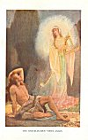

  
[Intangible Textual Heritage](../../../index.md) 
[Legends/Sagas](../../index)  [Celtic](../index)  [Index](index.md) 
[Previous](cml14)  [Next](cml16.md) 

------------------------------------------------------------------------

[Buy this Book at
Amazon.com](https://www.amazon.com/exec/obidos/ASIN/0809531534/internetsacredte.md)

------------------------------------------------------------------------

p. 132 

### CHAPTER XI

### THE GODS IN EXILE

But though mortals had conquered gods upon a scale unparalleled in
mythology, they had by no means entirely subdued them. Beaten in battle,
the people of the goddess Danu had yet not lost their divine attributes,
and could use them either to help or hurt. "Great was the power of the
Dagda", says a tract preserved in the Book of Leinster, "over the sons
of Milé, even after the conquest of Ireland; for his subjects destroyed
their corn and milk, so that they must needs make a treaty of peace with
the Dagda. Not until then, and thanks to his. good-will, were they able
to harvest corn and drink the milk of their cows." [1](#fn_151.md) The basis of this lost treaty seems to
have been that the Tuatha Dé Danann, though driven from the soil, should
receive homage and offerings from their successors. We are told in the
verse *dinnsenchus* of Mag Slecht, that--

"Since the rule  
Of Eremon, the noble man of grace,  
There was worshipping of stones  
Until the coming of good Patrick of Macha". [2](#fn_152.md)

p. 133

Dispossessed of upper earth, the gods had, however, to seek for new
homes. A council was convened, but its members were divided between two
opinions. One section of them chose to shake the dust of Ireland off its
disinherited feet, and seek refuge in a paradise over-seas, situate in
some unknown, and, except for favoured mortals, unknowable island of the
west, the counterpart in Gaelic myth of the British

           . . . "island-valley of Avilion;  
Where falls not hail, or rain, or any snow,  
Nor ever wind blows loudly; but it lies  
Deep-meadow’d, happy, fair with orchard-lawns  
And bowery hollows crown’d with summer sea" [1](#fn_153.md)

\[paragraph continues\] --a land of
perpetual pleasure and feasting, described variously as the "Land of
Promise" (*Tir Tairngiré)*, the "Plain of Happiness" (*Mag Mell*), the
"Land of the Living" (*Tir-nam-beo*), the "Land of the Young"
(*Tir-nan-ōg*), and "Breasal's Island" (*Hy-Breasail*). Celtic mythology
is full of the beauties and wonders of this mystic country, and the
tradition of it has never died out. Hy-Breasail has been set down on old
maps as a reality again and again; [2](#fn_154.md)
some pioneers in the Spanish seas thought they had discovered it, and
called the land they found "Brazil"; and it is still said, by lovers of
old lore, that a patient watcher, after long gazing westward from the
westernmost shores of Ireland or Scotland,

p. 134

may sometimes be lucky enough to catch a glimpse against the sunset of
its--

"summer isles of Eden lying in dark-purple spheres of sea".

Of these divine emigrants the principal was Manannán son of Lêr. But,
though he had cast in his lot beyond the seas, he did not cease to visit
Ireland. An old Irish king, Bran, the son of Febal, met him, according
to a seventh-century poem, as Bran journeyed to, and Manannán from, the
earthly paradise. Bran was in his boat, and Manannán was driving a
chariot over the tops of the waves, and he sang: [1](#fn_155.md)

"Bran deems it a marvellous beauty  
In his coracle across the clear sea:  
While to me in my chariot from afar  
It is a flowery plain on which he rides about.

"What is a clear sea  
For the prowed skiff in which Bran is,  
That is a happy plain with profusion of flowers  
To me from the chariot of two wheels.

"Bran sees  
The number of waves beating across the clear sea:  
I myself see in Mag Mon [2](#fn_156.md)  
Red-headed flowers without fault.

"Sea-horses glisten in summer  
As far as Bran has stretched his glance:  
Rivers pour forth a stream of honey  
In the land of Manannán son of Lêr.p. 135

"The sheen of the main, on which thou art,  
The white hue of the sea, on which thou rowest about,  
Yellow and azure are spread out,  
It is land, and is not rough.

"Speckled salmon leap from the womb  
Of the white sea, on which thou lookest:  
They are calves, they are coloured lambs  
With friendliness, without mutual slaughter.

"Though but one chariot-rider is seen  
In Mag Mell [1](#fn_157.md) of many flowers,  
There are many steeds on its surface,  
Though them thou seest not.

"Along the top of a wood has swum  
Thy coracle across ridges,  
There is a wood of beautiful fruit  
Under the prow of thy little skiff.

"A wood with blossom and fruit,  
On which is the vine's veritable fragrance;  
A wood without decay, without defect,  
On which are leaves of a golden hue."

\[paragraph continues\] And, after this
singularly poetical enunciation of the philosophical and mystical
doctrine that all things are, under their diverse forms, essentially the
same, he goes on to describe to Bran the beauties and pleasures of the
Celtic Elysium.

But there were others--indeed, the most part--of the gods who refused to
expatriate themselves. For these residences had to be found, and the
Dagda, their new king, proceeded to assign to each of those who stayed
in Ireland a *sídh*. These *sídhe* were barrows, or hillocks, each being
the door to an underground

p. 136

realm of inexhaustible splendour and delight, according to the somewhat
primitive ideas of the Celts. A description is given of one which the
Dagda kept for himself, and out of which his son Angus cheated him,
which will serve as a fair example of all. There were apple-trees there
always in fruit, and one pig alive and another ready roasted, and the
supply of ale never failed. One may still visit in Ireland the *sídhe*
of many of the gods, for the spots are known, and the traditions have
not died out. To Lêr was given *Sídh Fionnachaidh* [1](#fn_158.md), now known as the "Hill of the White
Field", on the top of Slieve Fuad, near Newtown Hamilton, in County
Armagh. Bodb Derg received a *sídh* called by his own name, *Sídh
Bodb* [2](#fn_159.md), just to the south of
Portumna, in Galway. Mider was given the *sídh* of *Bri Leith*, now
called Slieve Golry, near Ardagh, in County Longford. Ogma's *sídh* was
called *Airceltrai*; to Lugh was assigned *Rodrubân*; Manannán's son,
Ilbhreach, received *Sídh Eas Aedha Ruaidh* [3](#fn_160.md), now the Mound of Mullachshee, near
Ballyshannon, in Donegal; Fionnbharr [4](#fn_161.md) had *Sídh Meadha*, now "Knockma", about
five miles west of Tuam, where, as present king of the fairies, he is
said to live to-day; while the abodes of other gods of lesser fame are
also recorded. For himself the Dagda retained two, both near the River
Boyne, in Meath, the best of them being the famous Brugh-na-Boyne. None
of the members of the Tuatha Dé Danann were left unprovided for, save
one.

 

[  
Click to enlarge](img/13600.jpg.md)  
ENTRANCE TO THE GREAT CAIRN OF NEW GRANGE, ON THE BOYNE, NEAR
DROGHEDA.--R. Welch  

 

p. 137

It was from this time that the Gaelic gods received the name by which
the peasantry know them to-day--*Aes Sídhe*, the "People of the Hills",
or, more shortly, the *Sídhe*. Every god, or fairy, is a
*Fer-Sídhe* [1](#fn_162.md), a "Man of the Hill";
and every goddess a *Bean-Sídhe*, a "Woman of the Hill", the banshee of
popular legend. [2](#fn_163.md)

The most famous of such fairy hills are about five miles from
Drogheda. [3](#fn_164.md) They are still connected
with the names of the Tuatha Dé Danann, though they are now not called
their dwelling-places, but their tombs. On the northern bank of the
Boyne stand seventeen barrows, three of which--Knowth, Dowth, and New
Grange--are of great size. The last named, largest, and best preserved,
is over 300 feet in diameter, and 70 feet high, while its top makes a
platform 120 feet across. It has been explored, and Roman coins, gold
torques, copper pins, and iron rings and knives have been found in it;
but what else it may have once contained will never be known, for, like
Knowth and Dowth, it was thoroughly ransacked by Danish spoilers in the
ninth century. It is entered by a square doorway, the rims of which are
elaborately ornamented with a kind of spiral pattern. This entrance
leads to a stone passage, more than 60 feet long, which gradually widens
and rises, until it opens into a chamber with a conical dome 20 feet
high. On each side of this central chamber is a recess, with a shallow
oval

p. 138

stone basin in it. The huge slabs of which the whole is built are
decorated upon both the outer and the inner faces with the same spiral
pattern as the doorway.

The origin of these astonishing prehistoric monuments is unknown, but
they are generally attributed to the race that inhabited Ireland before
the Celts. Gazing at marvellous New Grange, one might very well echo the
words of the old Irish poet Mac Nia, in the Book of Ballymote:

"Behold the *Sídh* before your eyes,  
It is manifest to you that it is a king's mansion,  
Which was built by the firm Dagda,  
It was a wonder, a court, an admirable hill." [1](#fn_165.md)

It is not, however, with New Grange, or even with Knowth or Dowth, that
the Dagda's name is now associated. It is a smaller barrow, nearer to
the Boyne, which is known as the "Tomb of the Dagda". It has never been
opened, and Dr. James Fergusson, the author of *Rude Stone Monuments*,
who holds the Tuatha Dé Danann to have been a real people, thinks that
"the bones and armour of the great Dagda may still be found in his
honoured grave". [2](#fn_166.md) Other Celtic
scholars might not be so sanguine, though verses as old as the eleventh
century assert that the Tuatha Dé Danann used the brughs for burial. It
was about this period that the mythology of Ireland was being rewoven
into spurious history. The poem, which is called the "Chronicles of the
Tombs", not only mentions the

p. 139

\[paragraph continues\] "Monument of the
Dagda" and the "Monument of the Morrígú", but also records the last
resting-places of Ogma, Etain, Cairpré, Lugh, Boann, and Angus.

We have for the present, however, to consider Angus in a far less
sepulchral light. He is, indeed, very much alive in the story to be
related. The "Son of the Young" was absent when the distribution of the
*sídhe* was made. When he returned, he came to his father, the Dagda,
and demanded one. The Dagda pointed out to him that they had all been
given away. Angus protested, but what could be done? By fair means,
evidently nothing; but by craft, a great deal. The wily Angus appeared
to reconcile himself to fate, and only begged his father to allow him to
stay at the *sídh* of Brugh-na-Boyne (New Grange) for a day and a night.
The Dagda agreed to this, no doubt congratulating himself on having got
out of the difficulty so easily. But when he came to Angus to remind him
that the time was up, Angus refused to go. He had been granted, he
claimed, day and night, and it is of days and nights that time and
eternity are composed; therefore there was no limit to his tenure of the
*sídhe*. The logic does not seem very convincing to our modern minds,
but the Dagda is said to have been satisfied with it. He abandoned the
best of his two palaces to his son, who took peaceable possession of it.
Thus it got a second name, that of the *Sídh* or *Brugh* of the "Son of
the Young". [1](#fn_167.md)

The Dagda does not, after this, play much active

p. 140

part in the history of the people of the goddess Danu. We next hear of a
council of gods to elect a fresh ruler. There were five candidates for
the vacant throne--Bodb the Red, Mider, Ilbhreach [1](#fn_168.md) son of Manannán, Lêr, and Angus himself,
though the last-named, we are told, had little real desire to rule, as
he preferred a life of freedom to the dignities of kingship. The Tuatha
Dé Danann went into consultation, and the result of their deliberation
was that their choice fell upon Bodb the Red, for three
reasons--firstly, for his own sake; secondly, for his father, the
Dagda's sake; and thirdly, because he was the Dagda's eldest son. The
other competitors approved this choice, except two. Mider refused to
give hostages, as was the custom, to Bodb Derg, and fled with his
followers to "a desert country round Mount Leinster", in County Carlow,
while Lêr retired in great anger to Sídh Fionnachaidh, declining to
recognize or obey the new king.

Why Lêr and Mider should have so taken the matter to heart is difficult
to understand, unless it was because they were both among the oldest of
the gods. The indifference of Angus is easier to explain. He was the
Gaelic Eros, and was busy living up to his character. At this time, the
object of his love was a maiden who had visited him one night in a
dream, only to vanish when he put out his arms to embrace her. All the
next day, we are told, Angus took no food. Upon the following night, the
unsubstantial lady again appeared, and played and

 

[  
Click to enlarge](img/14000.jpg.md)  
THE DREAM-MAIDEN VISITS ANGUS  

 

p. 141

sang to him. That following day, he also fasted. So things went on for a
year, while Angus pined and wasted for love. At last the physicians of
the Tuatha Dé Danann guessed his complaint, and told him how fatal it
might be to him. Angus asked that his mother Boann might be sent for,
and, when she came, he told her his trouble, and implored her help. She
went to the Dagda and begged him, if he did not wish to see his son die
of unrequited love, a disease that all Diancecht's medicine and
Goibniu's magic could not heal, to find the dream-maiden. The Dagda
could do nothing himself, but he sent to Bodb the Red, and the new king
of the gods sent in turn to the lesser deities of Ireland, ordering all
of them to search for her. For a year she could not be found, but at
last the disconsolate lover received a message, charging him to come and
see if he could recognize the lady of his dreams. Angus came, and knew
her at once, even though she was surrounded by thrice fifty attendant
nymphs. Her name was Caer, and she was the daughter of Etal Ambuel, who
had a *sídh* at Uaman, in Connaught. Bodb the Red demanded her for Angus
in marriage, but her father declared that he had no control over her.
She was a swan-maiden, he said; and every year, as soon as summer was
over, she went with her companions to a lake called "Dragon-Mouth", and
there all of them became swans. But, refusing to be thus put off, Angus
waited in patience until the day of the magical change, and then went
down to the shore of the lake. There, surrounded by thrice fifty swans,
he saw Caer, herself a swan

p. 142

surpassing all the rest in beauty and whiteness. He called to her,
proclaiming his passion and his name, and she promised to be his bride,
if he too would become a swan. He agreed, and with a word she changed
him into swan-shape, and thus they flew side by side to Angus's *sídhe*,
where they retook the human form, and, no doubt, lived happily as long
as could be expected of such changeable immortals as pagan
deities. [1](#fn_169.md)

Meanwhile, the people of the goddess Danu were justly incensed against
both Lêr and Mider. Bodb the Red made a yearly war upon Mider in his
*sídhe*, and many of the divine race were killed on either side. But
against Lêr, the new king of the gods refused to move, for there had
been a great affection between them. Many times Bodb Derg tried to
regain Lêr's friendship by presents and compliments, but for a long time
without success.

At last Lêr's wife died, to the sea-god's great sorrow. When Bodb the
Red heard the news, he sent a messenger to Lêr, offering him one of his
own foster-daughters, Aebh [2](#fn_170.md),
Aeife [3](#fn_171.md), and Ailbhe [4](#fn_172.md), the children of Ailioll of Arran. Lêr,
touched by this, came to visit Bodb the Red at his *sídhe*, and chose
Aebh for his wife. "She is the eldest, so she must be the noblest of
them," he said. They were married, and a great feast made, and Lêr took
her back with him to Sídh Fionnachaidh.

Aebh bore four children to Lêr. The eldest was

p. 143

a daughter called Finola, the second was a son called Aed; the two
others were twin boys called Fiachra and Conn, but in giving birth to
those Aebh died.

Bodb the Red then offered Lêr another of his foster-children, and he
chose the second, Aeife. Every year Lêr and Aeife and the four children
used to go to Manannán's "Feast of Age", which was held at each of the
*sídhe* in turn. The four children grew up to be great favourites among
the people of the goddess Danu.

But Aeife was childless, and she became jealous of Lêr's children; for
she feared that he would love them more than he did her. She brooded
over this until she began, first to hope for, and then to plot their
deaths. She tried to persuade her servants to murder them, but they
would not. So she took the four children to Lake Darvra (now called
Lough Derravargh in West Meath), and sent them into the water to bathe.
Then she made an incantation over them, and touched them, each in turn,
with a druidical wand, and changed them into swans.

But, though she had magic enough to alter their shapes, she had not the
power to take away their human speech and minds. Finola turned, and
threatened her with the anger of Lêr and of Bodb the Red when they came
to hear of it. She, however, hardened her heart, and refused to undo
what she had done. The children of Lêr, finding their case a hopeless
one, asked her how long she intended to keep them in that condition.

"You would be easier in mind," she said, "if you had not asked the
question; but I will tell you.

p. 144

\[paragraph continues\] You shall be three
hundred years here, on Lake Darvra; and three hundred years upon the Sea
of Moyle [1](#fn_173.md), which is between Erin
and Alba; and three hundred years more at Irros Domnann [2](#fn_174.md) and the Isle of Glora in Erris [3](#fn_175.md). Yet you shall have two consolations in
your troubles; you shall keep your human minds, and yet suffer no grief
at knowing that you have been changed into swans, and you shall be able
to sing the softest and sweetest songs that were ever heard in the
world."

Then Aeife went away and left them. She returned to Lêr, and told him
that the children had fallen by accident into Lake Darvra, and were
drowned.

But Lêr was not satisfied that she spoke the truth, and went in haste to
the lake, to see if he could find traces of them. He saw four swans
close to the shore, and heard them talking to one another with human
voices. As he approached, they came out of the water to meet him. They
told him what Aeife had done, and begged him to change them back into
their own shapes. But Lêr's magic was not so powerful as his wife's, and
he could not.

Nor even could Bodb the Red--to whom Lêr went for help,--for all that he
was king of the gods. What Aeife had done could not be undone. But she
could be punished for it! Bodb ordered his foster-daughter to appear
before him, and, when she came, he put an oath on her to tell him truly
"what shape of all others, on the earth, or above the earth,

 

[  
Click to enlarge](img/14400.jpg.md)  
LÊR AND THE SWANS  
From the Drawing by J. H. Bacon, A.R.A.  

 

p. 145

or beneath the earth, she most abhorred, and into which she most dreaded
to be transformed". Aeife was obliged to answer that she most feared to
become a demon of the air. So Bodb the Red struck her with his wand, and
she fled from them, a shrieking demon.

All the Tuatha Dé Danann went to Lake Darvra to visit the four swans.
The Milesians heard of it, and also went; for it was not till long after
this that gods and mortals ceased to associate. The visit became a
yearly feast. But, at the end of three hundred years, the children of
Lêr were compelled to leave Lake Darvra, and go to the Sea of Moyle, to
fulfil the second period of their exile.

They bade farewell to gods and men, and went. And, for fear lest they
might be hurt by anyone, the Milesians made it law in Ireland that no
man should harm a swan, from that time forth for ever.

The children of Lêr suffered much from tempest and cold on the stormy
Sea of Moyle, and they were very lonely. Once only during that long
three hundred years did they see any of their friends. An embassy of the
Tuatha Dé Danann, led by two sons of Bodb the Red, came to look for
them, and told them all that had happened in Erin during their exile.

At last that long penance came to an end, and they went to Irros Domnann
and Innis Glora for their third stage. And while it was wearily dragging
through, Saint Patrick came to Ireland, and put an end to the power of
the gods for ever. They had been banned and banished when the children
of

p. 146

\[paragraph continues\] Lêr found
themselves free to return to their old home. Sídh Fionnechaidh was empty
and deserted, for Lêr had been killed by Caoilté, the cousin of Finn mac
Coul. [1](#fn_176.md)

So, after long, vain searching for their lost relatives, they gave up
hope, and returned to the Isle of Glora. They had a friend there, the
Lonely Crane of Inniskea [2](#fn_177.md), which
has lived upon that island ever since the beginning of the world, and
will be still sitting there on the day of judgment. They saw no one else
until, one day, a man came to the island. He told them that he was Saint
Caemhoc [3](#fn_178.md), and that he had heard
their story. He brought them to his church, and preached the new faith
to them, and they believed on Christ, and consented to be baptised. This
broke the pagan spell, and, as soon as the holy water was sprinkled over
them, they returned to human shape. But they were very old and
bowed--three aged men and an ancient woman. They did not live long after
this, and Saint Caemhoc, who had baptised them, buried them all together
in one grave. [4](#fn_179.md)

But, in telling this story, we have leaped nine hundred years--a great
space in the history even of gods. We must retrace our steps, if not
quite to the days of Eremon and Eber, sons of Milé, and first kings of
Ireland, at any rate to the beginning of the Christian era.

p. 147

At this time Eochaid Airem was high king of Ireland, and reigned at
Tara; while, under him, as vassal monarchs, Conchobar mac Nessa ruled
over the Red Branch Champions of Ulster; Curoi son of Daire [1](#fn_180.md), was king of Munster; Mesgegra was king
of Leinster; and Ailell, with his famous queen, Medb, governed
Connaught.

Shortly before, among the gods, Angus Son of the Young, had stolen away
Etain, the wife of Mider. He kept her imprisoned in a bower of glass,
which he carried everywhere with him, never allowing her to leave it,
for fear Mider might recapture her. The Gaelic Pluto, however, found out
where she was, and was laying plans to rescue her, when a rival of
Etain's herself decoyed Angus away from before the pleasant
prison-house, and set his captive free. But, instead of returning her to
Mider, she changed the luckless goddess into a fly, and threw her into
the air, where she was tossed about in great wretchedness at the mercy
of every wind.

At the end of seven years, a gust blew her on to the roof of the house
of Etair, one of the vassals of Conchobar, who was celebrating a feast.
The unhappy fly, who was Etain, was blown down the chimney into the room
below, and fell, exhausted, into a golden cup full of beer, which the
wife of the master of the house was just going to drink. And the woman
drank Etain with the beer.

But, of course, this was not the end of her--for the gods cannot really
die,--but only the beginning of a new life. Etain was reborn as the
daughter of

p. 148

\[paragraph continues\] Etair's wife, no
one knowing that she was not of mortal lineage. She grew up to be the
most beautiful woman in Ireland.

When she was twenty years old, her fame reached the high king, who sent
messengers to see if she was as fair as men reported. They saw her, and
returned to the king full of her praises. So Eochaid himself went to pay
her a visit. He chose her to be his queen, and gave her a splendid
dowry.

It was not till then that Mider heard of her. He came to her in the
shape of a young man, beautifully dressed, and told her who she really
was, and how she had been his wife among the people of the goddess Danu.
He begged her to leave the king, and come with him to his *sídh* at Bri
Leith. But Etain refused with scorn.

"Do you think," she said, "that I would give up the high king of Ireland
for a person whose name and kindred I do not know, except from his own
lips?"

The god retired, baffled for the time. But one day, as King Eochaid sat
in his hall, a stranger entered. He was dressed in a purple tunic, his
hair was like gold, and his eyes shone like candles.

The king welcomed him.

"But who are you?" he asked; "for I do not know you."

"Yet I have known you a long time," returned the stranger.

"Then what is your name?"

"Not a very famous one. I am Mider of Bri Leith."

p. 149

"Why have you come here?"

"To challenge you to a game of chess."

"I am a good chess-player," replied the king, who was reputed to be the
best in Ireland.

"I think I can beat you," answered Mider.

"But the chess-board is in the queen's room, and she is asleep,"
objected Eochaid.

"It does not matter," replied Mider. "I have brought a board with me
which can be in no way worse than yours."

He showed it to the king, who admitted that the boast was true. The
chess-board was made of silver set in precious stones, and the pieces
were of gold.

"Play!" said Mider to the king.

"I never play without a wager," replied Eochaid.

"What shall be the stake?" asked Mider.

"I do not care," replied Eochaid.

"Good!" returned Mider. "Let it be that the loser pays whatever the
winner demands."

"That is a wager fit for a king," said Eochaid.

They played, and Mider lost. The stake that Eochaid claimed from him was
that Mider and his subjects should make a road through Ireland. Eochaid
watched the road being made, and noticed how Mider's followers yoked
their oxen, not by the horns, as the Gaels did, but at the shoulders,
which was better. He adopted the practice, and thus got his nickname,
Airem, that is, The Ploughman".

After a year, Mider returned and challenged the king again, the terms to
be the same as before. Eochaid agreed with joy; but, this time, he lost.

p. 150

"I could have beaten you before, if I had wished," said Mider, "and now
the stake I demand is Etain, your queen."

The astonished king, who could not for shame go back upon his word,
asked for a year's delay. Mider agreed to return upon that day year to
claim Etain. Eochaid consulted with his warriors, and they decided to
keep watch through the whole of the day fixed by Mider, and let no one
pass in or out of the royal palace till sunset. For Eochaid held that if
the fairy king could not get Etain upon that one day, his promise would
be no longer binding on him.

So, when the day came, they barred the door and guarded it, but suddenly
they saw Mider among them in the hall. He stood beside Etain, and sang
this song to her, setting out the pleasures of the homes of the gods
under the enchanted hills.

"O fair lady! will you come with me  
To a wonderful country which is mine,  
Where the people's hair is of golden hue,  
And their bodies the colour of virgin snow?

"There no grief or care is known;  
White are their teeth, black their eyelashes;  
Delight of the eye is the rank of our hosts,  
With the hue of the fox-glove on every cheek.

"Crimson are the flowers of every mead,  
Gracefully speckled as the blackbird's egg;  
Though beautiful to see be the plains of Inisfail [1](#fn_181.md)  
They are but commons compared to our great plains. p. 151

"Though intoxicating to you be the ale-drink of Inisfail,  
More intoxicating the ales of the great country;  
The only land to praise is the land of which I speak,  
Where no one ever dies of decrepit age.

"Soft sweet streams traverse the land;  
The choicest of mead and of wine;  
Beautiful people without any blemish;  
Love without sin, without wickedness.

"We can see the people upon all sides,  
But by no one can we be seen;  
The cloud of Adam's transgression it is  
That prevents them from seeing us.

"O lady, should you come to my brave land,  
It is golden hair that will be on your head;  
Fresh pork, beer, new milk, and ale,  
You there with me shall have, O fair lady!" [1](#fn_182.md)

Then Mider greeted Eochaid, and told him that he had come to take away
Etain, according to the king's wager. And, while the king and his
warriors looked on helplessly, he placed one arm round the now willing
woman, and they both vanished. This broke the spell that hung over
everyone in the hall; they rushed to the door, but all they could see
were two swans flying away.

The king would not, however, yield to the god. He sent to every part of
Ireland for news of Etain, but his messengers all came back without
having been able to find her. At last, a druid named Dalân learned, by
means of ogams carved upon wands of yew, that she was hidden under
Mider's

p. 152

*sídh* of Bri Leith. So Eochaid marched there with an army, and began to
dig deep into the abode of the gods of which the "fairy hill" was the
portal. Mider, as terrified as was the Greek god Hades when it seemed
likely that the earth would be rent open, [1](#fn_183.md) and his domains laid bare to the sight,
sent out fifty fairy maidens to Eochaid, every one of them having the
appearance of Etain. But the king would only be content with the real
Etain, so that Mider, to save his *sídh*, was at last obliged to give
her up. And she lived with the King of Ireland after that until the
death of both of them.

But Mider never forgave the insult. He bided his time for three
generations, until Eochaid and Etain had a male descendant. For they had
no son, but only a daughter called Etain, like her mother, and this
second Etain had a daughter called Messbuachallo, who had a son called
Conairé, surnamed "the Great". Mider and the gods wove the web of fate
round Conairé, so that he and all his men died violent deaths. [2](#fn_184.md)

------------------------------------------------------------------------

### Footnotes

[132:1](cml15.htm#fr_151.md) De Jubainville:
*Cycle Mythologique Irlandais*, p. 269.

[132:2](cml15.htm#fr_152.md) See [chap.
IV](cml08.htm#ch-04.md)--"The Religion of the Ancient Britons and
Druidism".

[133:1](cml15.htm#fr_153.md) Tennyson: *Idylls of
the King: The Passing of Arthur*.

[133:2](cml15.htm#fr_154.md) See Wood-Martin:
*Traces of the Elder Faiths of Ireland*, Vol. I, pp. 213-215.

[134:1](cml15.htm#fr_155.md) The following verses
are taken from Dr. Kuno Meyer's translation of the romance entitled *The
Voyage of Bran, Son of Febal*, published in Mr. Nutt's Grimm Library,
Vol. IV.

[134:2](cml15.htm#fr_156.md) The Plain of Sports.

[135:1](cml15.htm#fr_157.md) The Happy Plain.

[136:1](cml15.htm#fr_158.md) Pronounced *Shee
Finneha*.

[136:2](cml15.htm#fr_159.md) Pronounced *Shee
Bove*.

[136:3](cml15.htm#fr_160.md) Pronounced *Shee
Assaroe*.

[136:4](cml15.htm#fr_161.md) Pronounced *Finnvar*.

[137:1](cml15.htm#fr_162.md) Pronounced
*Far-shee*.

[137:2](cml15.htm#fr_163.md) O’Curry: *Lectures on
the MS. Materials of Ancient Irish History*, Appendix p. 505.

[137:3](cml15.htm#fr_164.md) See Fergusson: *Rude
Stone Monuments*, pp. 200-213.

[138:1](cml15.htm#fr_165.md) O’Curry: *MS.
Materials*, p. 505.

[138:2](cml15.htm#fr_166.md) Fergusson: *Rude
Stone Monuments*, p. 209.

[139:1](cml15.htm#fr_167.md) This story is
contained in the Book of Leinster.

[140:1](cml15.htm#fr_168.md) Pronounced *Ilbrec*.

[142:1](cml15.htm#fr_169.md) This story, called
the *Dream of Angus*, will be found translated into English by Dr.
Edward Müller in Vol. III. of the *Revue Celtique*, from an
eighteenth-century MS. in the British Museum.

[142:2](cml15.htm#fr_170.md) Pronounced *Aive*.

[142:3](cml15.htm#fr_171.md) Pronounced *Aiva*.

[142:4](cml15.htm#fr_172.md) Pronounced *Alva*.

[144:1](cml15.htm#fr_173.md) Now called "North
Channel"

[144:2](cml15.htm#fr_174.md) The Peninsula of Ems,
in Mayo.

[144:3](cml15.htm#fr_175.md) A small island off
Benmullet.

[146:1](cml15.htm#fr_176.md) See [chap.
XIV](cml18.htm#ch-14.md)--"Finn and the Fenians".

[146:2](cml15.htm#fr_177.md) An island off the
coast of Mayo. Its lonely crane was one of the "Wonders of Ireland", and
is still an object of folk-belief.

[146:3](cml15.htm#fr_178.md) Pronounced *Kemoc*.

[146:4](cml15.htm#fr_179.md) This famous story of
the *Fate of the Children of Lêr* is not found in any MS. earlier than
the beginning of the seventeenth century. A translation of it has been
published by Eugene O’Curry in *Atlantis*, Vol. IV, from which the
present abridgment is made.

[147:1](cml15.htm#fr_180.md) Pronounced *Dara*.

[150:1](cml15.htm#fr_181.md) A poetical name for
Ireland.

[151:1](cml15.htm#fr_182.md) Translated by
O’Curry, *Manners and Customs of the Ancient Irish*, Lecture IX, p. 192,
193.

[152:1](cml15.htm#fr_183.md) *Iliad*, Book XX.

[152:2](cml15.htm#fr_184.md) The story of Mider's
revenge and Conairé's death is told in the romance *Bruidhen Dá Derga*,
"The Destruction of Da Derga 's Fort", translated by Dr. Whitley Stokes,
Eugene O’Curry and Professor Zimmer from the original text.

------------------------------------------------------------------------

[Next: Chapter XII. The Irish Iliad](cml16.md)
