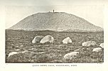
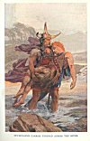

  
[Intangible Textual Heritage](../../../index) 
[Legends/Sagas](../../index)  [Celtic](../index)  [Index](index) 
[Previous](cml15)  [Next](cml17) 

------------------------------------------------------------------------

[Buy this Book at
Amazon.com](https://www.amazon.com/exec/obidos/ASIN/0809531534/internetsacredte)

------------------------------------------------------------------------

p. 153 

### CHAPTER XII

### THE IRISH ILIAD

With Eber and Eremon, sons of Milé, and conquerors of the gods, begins a
fresh series of characters in Gaelic tradition--the early "Milesian"
kings of Ireland. Though monkish chroniclers have striven to find
history in the legends handed down concerning them, they are none the
less almost as mythical as the Tuatha Dé Danann. The first of them who
has the least appearance of reality is Tigernmas, who is recorded to
have reigned a hundred years after the coming of the Milesians. He seems
to have been what is sometimes called a "Culture-king", bearing much the
same kind of relation to Ireland as Theseus bore to Athens or Minos to
Crete. During his reign, nine new lakes and three new rivers broke forth
from beneath the earth to give their waters to Erin. Under his auspices,
gold was first smelted, ornaments of gold and silver were first made,
and clothes first dyed. He is said to have perished mysteriously [1](#fn_185) with

p. 154

three-fourths of the men of Erin while worshipping Cromm Cruaich on the
field of Mag Slecht. In him Mr. Nutt sees, no doubt rightly, the great
mythical king who, in almost all national histories, closes the strictly
mythological age, and inaugurates a new era of less obviously divine, if
hardly less apocryphal characters. [1](#fn_186)

In spite, however, of the worship of the Tuatha Dé Danann instituted by
Eremon, we find the early kings and heroes of Ireland walking very
familiarly with their gods. Eochaid Airem, high king of Ireland, was
apparently reckoned a perfectly fit suitor for the goddess Etain, and
proved a far from unsuccessful rival of Mider, the Gaelic Pluto. [2](#fn_187) And adventures of love or war were
carried quite as cheerfully among the *sídh* dwellers by Eochaid's
contemporaries--Conchobar son of Nessa, King of Ulster, Curoi son of
Daire, King of Munster, Mesgegra, King of Leinster, and Ailell and
Medb [3](#fn_188), King and Queen of Connaught.

All these figures of the second Gaelic cycle (that of the heroes of
Ulster, and especially of their great champion, Cuchulainn) lived,
according to Irish tradition, at about the beginning of the

p. 155

\[paragraph continues\] Christian era.
Conchobar, indeed, is said to have expired in a fit of rage on hearing
of the death of Christ. [1](#fn_189)

But this is a very transparent monkish interpolation into the original
story. A quite different view is taken by most modern scholars, who
would see gods and not men in all the legendary characters of the Celtic
heroic cycles. Upon such a subject, however, one may legitimately take
sides. Were King Conchobar and his Ultonian champions, Finn and his
Fenians, Arthur and his Knights once living men round whom the
attributes of gods have gathered, or were they ancient deities renamed
and stripped of some of their divinity to make them more akin to their
human worshippers? History or mythology? A mingling, perhaps, of both.
Cuchulainn [2](#fn_190) may have been the name
of a real Gaelic warrior, however suspiciously he may now resemble the
sun-god, who is said to have been his father. King Conchobar may have
been the real chief of a tribe of Irish Celts before he became an
adumbration of the Gaelic sky-god. It is the same problem that confronts
us in dealing with the heroic legends of Greece and Rome. Were Achilles,
Agamemnon, Odysseus, Paris, Æneas gods, demi-gods, or men? Let us call
them all alike--whether they be Greek or Trojan heroes, Red Branch
Champions, or followers of the Gaelic Finn or the British
Arthur--demi-gods. Even so, they stand

p. 156

definitely apart from the older gods who were greater than they were.

We are stretching no point in calling them demi-gods, for they were
god-descended. [1](#fn_191) Cuchulainn, the
greatest hero of the Ulster cycle, was doubly so; for on his mother's
side he was the grandson of the Dagda, while Lugh of the Long Hand is
said to have been his father. His mother, Dechtiré, daughter of Maga,
the daughter of Angus "Son of the Young", was half-sister to King
Conchobar, and all the other principal heroes were of hardly less lofty
descent. It is small wonder that they are described in ancient
manuscripts [2](#fn_192) as terrestrial gods
and goddesses.

"Terrestrial" they may have been in form, but their acts were
superhuman. Indeed, compared with the more modest exploits of the heroes
of the "Iliad", they were those of giants. Where Greek warriors slew
their tens, these Ultonians despatched their hundreds. They came home
after such exploits so heated that their cold baths boiled over. When
they sat down to meat, they devoured whole oxen, and drank their mead
from vats. With one stroke of their favourite swords they beheaded hills
for sport. The gods themselves hardly did more, and it is easy to
understand that in those old days not only might the sons of gods look
upon the daughters of men and find them fair, but immortal

p. 157

women also need not be too proud to form passing alliances with mortal
men.

Some of the older deities seem to have already passed out of memory at
the time of the compilation of the Ulster cycle. At any rate, they make
no appearance in it. Dead Nuada rests in the *grianan* of Aileach; Ogma
lies low in *sídh* Airceltrai; while the Dagda, thrust into the
background by his son Angus, mixes himself very little in the affairs of
Erin. [1](#fn_193) But the Morrígú is no less
eager in encouraging human or semi-divine heroes to war than she was
when she revived the fainting spirits of the folk of the goddess Danu at
the Battle of Moytura. The gods who appear most often in the cycle of
the Red Branch of Ulster are the same that have lived on throughout with
the most persistent vitality. Lugh the Long-handed, Angus of the Brugh,
Mider, Bodb the Red, and Manannán son of Lêr, are the principal deities
that move in the background of the stage where the chief parts are now
played by mortals. But, to make up for the loss of some of the greater
divine figures, the ranks of the gods are being recruited from below.
All manner of inferior divinities claim to be members of the tribe of
the goddess Danu. The goblins and sprites and demons of the air who
shrieked around battles are described collectively as Tuatha Dé
Danann. [2](#fn_194)

As for the Fomors, they have lost their distinctive names, though they
are still recognized as dwellers beneath the deep, who at times raid
upon

p. 158

the coast, and do battle with the heroes over whom Conchobar ruled at
Emain Macha.

This seat of his government, the traditionary site of which is still
marked by an extensive prehistoric entrenchment called Navan Fort [1](#fn_195), near Armagh, was the centre of an
Ulster that stretched southwards as far as the Boyne, and round its
ruler gathered such a galaxy of warriors as Ireland had never seen
before, or will again. They called themselves the "Champions of the Red
Branch"; there was not one of them who was not a hero; but they are all
dwarfed by one splendid figure--Cuchulainn, whose name means "Culann's
Hound". Mr. Alfred Nutt calls him "the Irish Achilles" [2](#fn_196), while Professor Rhys would rather see
in him a Heracles of the Gaels. [3](#fn_197)
Like Achilles, he was the chosen hero of his people, invincible in
battle, and yet "at once to early death and sorrows doomed beyond the
lot of man", while, like Heracles, his life was a series of wonderful
exploits and labours. It matters little enough; for the lives of all
such mythical heroes must be of necessity somewhat alike.

If Achilles and Heracles were, as some think, personifications of the
sun, Cuchulainn is not less so. Most of his attributes, as the old
stories record them, are obviously solar symbols. He seemed generally
small and insignificant, yet, when he was

p. 159

at his full strength, no one could look him in the face without
blinking, while the heat of his constitution melted snow for thirty feet
all round him. He turned red and hissed as he dipped his body into its
bath--the sea. Terrible was his transformation when sorely oppressed by
his enemies, as the sun is by mist, storm, or eclipse. At such times
"among the aërial clouds over his head were visible the virulent pouring
showers and sparks of ruddy fire which the seething of his savage wrath
caused to mount up above him. His hair became tangled about his head, as
it had been branches of a red thorn-bush stuffed into a strongly-fenced
gap. . . . Taller, thicker, more rigid, longer than mast of a great ship
was the perpendicular jet of dusky blood which out of his scalp's very
central point shot upwards and then was scattered to the four cardinal
points; whereby was formed a magic mist of gloom resembling the smoky
pall that drapes a regal dwelling, what time a king at nightfall of a
winter's day draws near to it." [1](#fn_198)

So marvellous a being [2](#fn_199) was, of
course, of marvellous birth. His mother, Dechtiré, was on the point of
being married to an Ulster chieftain called Sualtam, and was sitting at
the wedding-feast, when a may-fly flew into her cup of wine and was
unwittingly swallowed by her. That same afternoon

p. 160

she fell into a deep sleep, and in her dream the sun-god Lugh appeared
to her, and told her that it was he whom she had swallowed, and bore
within her. He ordered her and her fifty attendant maidens to come with
him at once, and he put upon them the shapes of birds, so that they were
not seen to go. Nothing was heard of them again. But one day, months
later, a flock of beautiful birds appeared before Emain Macha, and drew
out its warriors in their chariots to hunt them.

They followed the birds till nightfall, when they found themselves at
the Brugh on the Boyne, where the great gods had their homes. As they
looked everywhere for shelter, they suddenly saw a splendid palace. A
tall and handsome man, richly dressed, came out and welcomed them and
led them in. Within the hall were a beautiful and noble-faced woman and
fifty maidens, and on the tables were the richest meats and wines, and
everything fit for the needs of warriors. So they rested there the
night, and, during the night, they heard the cry of a new-born child.
The next morning, the man told them who he was, and that the woman was
Conchobar's half-sister Dechtiré, and he ordered them to take the child,
and bring it up among the warriors of Ulster. So they brought him back,
together with his mother and the maidens, and Dechtiré married Sualtam,
and all the chiefs, champions, druids, poets, and lawgivers of Ulster
vied with one another in bringing up the mysterious infant.

At first they called him Setanta; and this is how he came to change his
name. While still a child,

p. 161

he was the strongest of the boys of Emain Macha, and the champion in
their sports. One day he was playing hurley single-handed against all
the others, and beating them, when Conchobar the King rode by with his
nobles on the way to a banquet given by Culann, the chief smith of the
Ultonians. Conchobar called to the boy, inviting him to go with them,
and he replied that, when the game was finished, he would follow. As
soon as the Ulster champions were in Culann's hall, the smith asked the
king's leave to unloose his terrible watch-dog, which was as strong and
fierce as a hundred hounds; and Conchobar, forgetting that the boy was
to follow them, gave his permission. Immediately the hound saw Setanta
coming, it rushed at him, open-mouthed. But the boy flung his
playing-ball into its mouth, and then, seizing it by the hind-legs,
dashed it against a rock till he had killed it.

The smith Culann was very angry at the death of his dog; for there was
no other hound in the world like him for guarding a house and flocks. So
Setanta promised to find and train up another one, not less good, for
Culann, and, until it was trained, to guard the smith's house as though
he were a dog himself. This is why he was called Cuchulainn, that is,
"Culann's Hound"; and Cathbad the Druid prophesied that the time would
come when the name would be in every man's mouth.

Not long after this, Cuchulainn overheard Cathbad giving druidical
instruction, and one of his pupils asking him what that day would be
propitious

p. 162

for. Cathbad replied that, if any young man first took arms on that day,
his name would be greater than that of any other hero's, but his life
would be short. At once, the boy went to King Conchobar, and demanded
arms and a chariot. Conchobar asked him who had put such a thought into
his head; and he answered that it was Cathbad the Druid. So Conchobar
gave him arms and armour, and sent him out with a charioteer. That
evening, Cuchulainn brought back the heads of three champions who had
killed many of the warriors of Ulster. He was then only seven years old.

The women of Ulster so loved Cuchulainn after this that the warriors
grew jealous, and insisted that a wife should be found for him. But
Cuchulainn was very hard to please. He would have only one, Emer [1](#fn_200), the daughter of Forgall the Wily, the
best maiden in Ireland for the six gifts--the gift of beauty, the gift
of voice, the gift of sweet speech, the gift of needlework, the gift of
wisdom, and the gift of chastity. So he went to woo her, but she laughed
at him for a boy. Then Cuchulainn swore by the gods of his people that
he would make his name known wherever the deeds of heroes were spoken
of, and Emer promised to marry him if he could take her from her warlike
kindred.

When Forgall, her father, came to know of this betrothal, he devised a
plan to put an end to it. He went to visit King Conchobar at Emain
Macha. There he pretended to have heard of Cuchulainn for the first
time, and he saw him do all his feats.

p. 163

\[paragraph continues\] He said, loud
enough to be overheard by all, that if so promising a youth dared to go
to the Island of Scathach the Amazon, in the east of Alba, [1](#fn_201) and learn all her warrior-craft, no
living man would be able to stand before him. It was hard to reach
Scathach's Isle, and still harder to return from it, and Forgall felt
certain that, if Cuchulainn went, he would get his death there.

Of course, nothing would now satisfy Cuchulainn but going. His two
friends, Laegaire the Battle-winner and Conall the Victorious, said that
they would go with him. But, before they had gone far, they lost heart
and turned back. Cuchulainn went on alone, crossing the Plain of
Ill-Luck, where men's feet stuck fast, while sharp grasses sprang up and
cut them, and through the Perilous Glens, full of devouring wild beasts,
until he came to the Bridge of the Cliff, which rose on end, till it
stood straight up like a ship's mast, as soon as anyone put foot on it.
Three times Cuchulainn tried to cross it, and thrice he failed. Then
anger came into his heart, and a magic halo shone round his head, and he
did his famous feat of the "hero's salmon leap", and landed, in one
jump, on the middle of the bridge, and then slid down it as it rose up
on end.

Scathach was in the *dún*, with her two sons. Cuchulainn went to her,
and put his sword to her breast, and threatened to kill her if she would
not teach him all her own skill in arms. So he became her pupil, and she
taught him all her war-craft. In return, Cuchulainn helped her against a
rival queen

p. 164

of the Amazons, called Aoife [1](#fn_202). He
conquered Aoife, and compelled her to make peace with Scathach.

Then he returned to Ireland, and went in a scythed chariot to Forgall's
palace. He leaped over its triple walls, and slew everyone who came near
him. Forgall met his death in trying to escape Cuchulainn's rage. He
found Emer, and placed her in his chariot, and drove away; and, every
time that Forgall's warriors came up to them, he turned, and slew a
hundred, and put the rest to flight. He reached Emain Macha in safety,
and he and Emer were married there.

And so great, after this, were the fame of Cuchulainn's prowess and
Emer's beauty that the men and women of Ulster yielded them
precedence--him among the warriors and her among the women--in every
feast and banquet at Emain Macha.

But all that Cuchulainn had done up to this time was as nothing to the
deeds he did in the great war which all the rest of Ireland, headed by
Ailill and Medb, King and Queen of Connaught, made upon Ulster, to get
the Brown Bull of Cualgne. [2](#fn_203) This
Bull was one of two, of fairy descent. They had originally been the
swineherds of two of the gods, Bodb, King of the Sídhe of Munster, and
Ochall Ochne, King of the Sídhe of Connaught. As swineherds they were in
perpetual rivalry; then, the better to carry on their quarrel, they
changed themselves into two ravens, and fought for a year;

 

[  
Click to enlarge](img/16400.jpg)  
QUEEN MEDB'S CAIRN, KNOCKNAREA, Sligo--R. Welch  

 

p. 165

next they turned into water-monsters, which tore one another for a year
in the Suir and a year in the Shannon; then they became human again and
fought as champions; and ended by changing into eels. One of these eels
went into the River Cruind, in Cualgne [1](#fn_204), in Ulster, where it was swallowed by a
cow belonging to Daire of Cualgne, and the other into the spring of
Uaran Garad, in Connaught, where it passed into the belly of a cow of
Queen Medb's. Thus were born those two famous beasts, the Brown Bull of
Ulster and the White-horned Bull of Connaught.

Now the White-horned was of such proud mind that he scorned to belong to
a woman, and he went out of Medb's herds into those of her husband
Ailill. So that when Ailill and Medb one day, in their idleness, counted
up their possessions, to set them off one against the other, although
they were equal in every other thing, in jewels and clothes and
household vessels, in sheep and horses and swine and cattle, Medb had no
one bull that was worthy to be set beside Ailill's White-horned.
Refusing to be less in anything than her husband, the proud queen sent
heralds, with gifts and compliments, to Daire, asking him to lend her
the Brown Bull for a year. Daire would have done so gladly had not one
of Medb's messengers been heard boasting in his cups that, if Daire had
not lent the Brown Bull of his own free-will, Medb would have taken it.
This was reported to Daire, who at once swore that she should never have
it. Medb's messenger

p. 166

returned; and the Queen of Connaught, furious at his refusal, vowed that
she would take it by force.

She assembled the armies of all the rest of Ireland to go against
Ulster, and made Fergus son of Roy, an Ulster champion who had
quarrelled with King Conchobar, its leader. They expected to have an
easy victory, for the warriors of Ulster were at that time lying under a
magic weakness which fell upon them for many days in each year, as the
result of a curse laid upon them, long before, by a goddess who had been
insulted by one of Conchobar's ancestors. Medb called up a prophetess of
her people to foretell victory. "How do you see our hosts?" asked the
queen of the seeress. "I see crimson on them; I see red," she replied.
"But the warriors of Ulster are lying in their sickness. Nay, how do you
see our men?" "I see them all crimson; I see them all red," she
repeated. And then she added to the astonished queen, who had expected a
quite different foretelling: "For I see a small man doing deeds of arms,
though there are many wounds on his smooth skin; the hero-light shines
round his head, and there is victory on his forehead; he is richly
clothed, and young and beautiful and modest, but he is a dragon in
battle. His appearance and his valour are those of Cuchulainn of
Muirthemne; who that 'Culann's hound' from Muirthemne may be, I do not
know; but I know this, that all our army will be reddened by him. He is
setting out for battle; he will hew down your hosts; the slaughter he
shall make will be long remembered; there will be many women crying over
the bodies mangled by the Hound of

p. 167

the Forge whom I see before me now." [1](#fn_205) For Cuchulainn was, for some reason
unknown to us, the only man in Ulster who was not subject to the magic
weakness, and therefore it fell upon him to defend Ulster single-handed
against the whole of Medb's army.

In spite of the injury done him by King Conchobar, Fergus still kept a
love for his own country. He had not the heart to march upon the
Ultonians without first secretly sending a messenger to warn them. So
that, though all the other champions of the Red Branch were helpless,
Cuchulainn was watching the marches when the army came.

Now begins the story of the *aristeia* of the Gaelic hero. It is, after
the manner of epics, the record of a series of single combats, in each
of which Cuchulainn slays his adversary. Man after man comes against
him, and not one goes back. In the intervals between these duels,
Cuchulainn harasses the army with his sling, slaying a hundred men a
day. He kills Medb's pet dog, bird, and squirrel, and creates such
terror that no one dares to stir out of the camp. Medb herself has a
narrow escape; for one of her serving-women, who puts on her mistress's
golden head-dress, is killed by a stone flung from Cuchulainn's sling.

The great queen determines to see with her own eyes this marvellous hero
who is holding all her warriors at bay. She sends an envoy, asking him
to come and parley with her. Cuchulainn agrees, and, at the meeting,
Medb is amazed at his boyish

p. 168

look. She finds it hard to believe that it is this beardless stripling
of seventeen who is killing her champions, until the whole army seems as
though it were melting away. She offers him her own friendship and great
honours and possessions in Connaught if he will forsake Conchobar. He
refuses; but she offers it again and again. At last Cuchulainn
indignantly declares that the next man who comes with such a message
will do so at his peril. One bargain, however, he will make. He is
willing to fight one of the men of Ireland every day, and, while the
duel lasts, the main army may march on; but, as soon as Cuchulainn has
killed his man, it must halt until the next day. Medb agrees to this,
thinking it better to lose one man a day than a hundred.

Medb makes the same offer to every famous warrior, to induce him to go
against Cuchulainn. The reward for the head of the champion will be the
hand of her daughter, Findabair [1](#fn_206).
In spite of this, not one of the aspirants to the princess can stand
before Cuchulainn. All perish; and Findabair, when she finds out how she
is being promised to a fresh suitor every day, dies of shame. But, while
Cuchulainn is engaged in these combats, Medb sends men who scour Ulster
for the brown bull, and find him, and drive him, with fifty heifers,
into her camp.

Meanwhile the Æs Sídhe, the fairy god-clan, are watching the
half-divine, half-mortal hero, amazed at his achievements. His exploits
kindle love in the fierce heart of the Morrígú, the great war-goddess.

p. 169

\[paragraph continues\] Cuchulainn is
awakened from sleep by a terrible shout from the north. He orders his
driver, Laeg, to yoke the horses to his chariot, so that he may find out
who raised it. They go in the direction from which the sound had come,
and meet with a woman in a chariot drawn by a red horse. She has red
eyebrows, and a red dress, and a long, red cloak, and she carries a
great, gray spear. He asks her who she is, and she tells him that she is
a king's daughter, and that she has fallen in love with him through
hearing of his exploits. Cuchulainn says that he has other things to
think of than love. She replies that she has been giving him her help in
his battles, and will still do so; and Cuchulainn answers that he does
not need any woman's help. "Then," says she, "if you will not have my
love and help, you shall have my hatred and enmity. When you are
fighting with a warrior as good as yourself, I will come against you in
various shapes and hinder you, so that he shall have the advantage."
Cuchulainn draws his sword, but all he sees is a hoodie crow sitting on
a branch. He knows from this that the red woman in the chariot was the
great queen of the gods.

The next day, a warrior named Loch went to meet Cuchulainn. At first he
refused to fight one who was beardless; so Cuchulainn smeared his chin
with blackberry juice, until it looked as though he had a beard. While
Cuchulainn was fighting Loch, the Morrígú came against him three
times--first as a heifer which tried to overthrow him, and next as an
eel which got beneath his feet as he stood in

p. 170

running water, and then as a wolf which seized hold of his right arm.
But Cuchulainn broke the heifer's leg, and trampled upon the eel, and
put out one of the wolf's eyes, though, every one of these three times,
Loch wounded him. In the end, Cuchulainn slew Loch with his invincible
spear, the *gae bolg* [1](#fn_207), made of a
sea-monster's bones. The Morrígú came back to Cuchulainn, disguised as
an old woman, to have her wounds healed by him, for no one could cure
them but he who had made them. She became his friend after this, and
helped him.

But the fighting was so continuous that Cuchulainn got no sleep, except
just for a while, from time to time, when he might rest a little, with
his head on his hand and his hand on his spear and his spear on his
knee. So that his father, Lugh the Long-handed, took pity on him and
came to him in the semblance of a tall, handsome man in a green cloak
and a gold-embroidered silk shirt, and carrying a black shield and a
five-pronged spear. He put him into a sleep of three days and three
nights, and, while he rested, he laid druidical herbs on to all his
wounds, so that, in the end, he rose up again completely healed and as
strong as at the very beginning of the war. While he was asleep, the
boy-troop of Emain Macha, Cuchulainn's old companions, came and fought
instead of him, and slew three times their own number, but were all
killed.

It was at this time that Medb asked Fergus to go and fight with
Cuchulainn. Fergus answered that he would never fight against his own
foster-

p. 171

son Medb asked him again and again, and at last he went, but without his
famous sword. "Fergus, my guardian," said Cuchulainn, "it is not safe
for you to come out against me without your sword." "If I had the
sword," replied Fergus, "I would not use it on you." Then Fergus asked
Cuchulainn, for the sake of all he had done for him in his boyhood, to
pretend to fight with him, and then give way before him and run away.
Cuchulainn answered that he was very loth to be seen running from any
man. But Fergus promised Cuchulainn that, if Cuchulainn would run away
from Fergus then, Fergus would run away from Cuchulainn at some future
time, whenever Cuchulainn wished. Cuchulainn agreed to this, for he knew
that it would be for the profit of Ulster. So they fought a little, and
then Cuchulainn turned and fled in the sight of all Medb's army. Fergus
went back; and Medb could not reproach him any more.

But she cast about to find some other way of vanquishing Cuchulainn. The
agreement made had been that only one man a day should be sent against
him. But now Medb sent the wizard Calatin with his twenty-seven sons and
his grandson all at once, for she said "they are really only one, for
they are all from Calatin's body". They never missed a throw with their
poisoned spears, and every man they hit died, either on the spot or
within the week. When Fergus heard of this, he was in great grief, and
he sent a man called Fiacha, an exile, like himself, from Ulster, to
watch the fight and report how it went. Now Fiacha did not mean to join
in it,

p. 172

but when he saw Cuchulainn assailed by twenty-nine at a time, and
overpowered, he could not restrain himself. So he drew his sword and
helped Cuchulainn, and, between them, they killed Calatin and his whole
family.

As a last resource, now, Medb sent for Ferdiad, who was the great
champion of the Iberian "Men of Domnu", who had thrown in their lot with
Medb in the war for the Brown Bull. Ferdiad had been a companion and
fellow-pupil of Cuchulainn with Scathach, and he did not wish to fight
with him. But Medb told him that, if he refused, her satirists should
make such lampoons on him that he would die of shame, and his name would
be a reproach for ever. She also offered him great rewards and honours,
and bound herself in six sureties to keep her promises. At last,
reluctantly, he went.

Cuchulainn saw him coming, and went out to welcome him; but Ferdiad said
that he had not come as a friend, but to fight. Now Cuchulainn had been
Ferdiad's junior and serving-boy in Scathach's Island, and he begged him
by the memory of those old times to go back; but Ferdiad said he could
not. They fought all day, and neither had gained any advantage by
sunset. So they kissed one another, and each went back to his camp.
Ferdiad sent half his food and drink to Cuchulainn, and Cuchulainn sent
half his healing herbs and medicines to Ferdiad, and their horses were
put in the same stable, and their charioteers slept by the same fire.
And so it happened on the second day. But at the end of the third day
they parted

 

[  
Click to enlarge](img/17200.jpg)  
CUCHULAINN CARRIES FERDIAD ACROSS THE RIVER  

 

p. 173

gloomily, knowing that on the morrow one of them must fall; and their
horses were not put in the same stall that night, neither did their
charioteers sleep at the same fire. On the fourth day, Cuchulainn
succeeded in killing Ferdiad, by casting the gae bolg at him from
underneath. But when he saw that he was dying, the battle-fury passed
away, and he took his old companion up in his arms, and carried him
across the river on whose banks they had fought, so that he might be
with the men of Ulster in his death, and not with the men of Ireland.
And he wept over him, and said: "It was all a game and a sport until
Ferdiad came; Oh, Ferdiad! your death will hang over me like a cloud for
ever. Yesterday he was greater than a mountain; to-day he is less than a
shadow."

By this time, Cuchulainn was so covered with wounds that he could not
bear his clothes to touch his skin, but had to hold them off with
hazel-sticks, and fill the spaces in between with grass. There was not a
place on him the size of a needle-point that had not a wound on it,
except his left hand, which held the shield.

But Sualtam, Cuchulainn's reputed father, had learned what a sore plight
his son was in. "Do I hear the heaven bursting, or the sea running away,
or the earth breaking open," he cried, "or is it my son's groaning that
I hear?" He came to look for him, and found him covered with wounds and
blood. But Cuchulainn would not let his father either weep for him or
try to avenge him. "Go, rather," he said to him, "to Emain Macha, and
tell Conchobar

p. 174

that I can no longer defend Ulster against all the four provinces of
Erin without help. Tell him that there is no part of my body on which
there is not a wound, and that, if he wishes to save his kingdom, he
must make no delay."

Sualtam mounted Cuchulainn's war-horse, the "Gray of Battle", and
galloped to Emain Macha. Three times he shouted: "Men are being killed,
women carried off, and cattle lifted in Ulster". Twice he met with no
response. The third time, Cathbad the Druid roused himself from his
lethargy to denounce the man who was disturbing the king's sleep. In his
indignation Sualtam turned away so sharply that the gray steed reared,
and struck its rider's shield against his neck with such force that he
was decapitated. The startled horse then turned back into Conchobar's
stronghold, and dashed through it, Sualtam's severed head continuing to
cry out: "Men are being killed, women carried off, and cattle lifted in
Ulster." Such a portent was enough to rouse the most drowsy. Conchobar,
himself again, swore a great oath. "The heavens are over us, the earth
is beneath us, and the sea circles us round, and, unless the heavens
fall, with all their stars, or the earth gives way beneath us, or the
sea bursts over the land, I will restore every cow to her stable, and
every woman to her home."

He sent messengers to rally Ulster, and they gathered, and marched on
the men of Erin. And then was fought such a battle as had never been
before in Ireland. First one side, then the other, gave way and rallied
again, until Cuchulainn heard

p. 175

the noise of the fight, and rose up, in spite of all his wounds, and
came to it.

He called out to Fergus, reminding him how he had bound himself with an
oath to run from him when called upon to do so. So Fergus ran before
Cuchulainn, and when Medb's army saw their leader running they broke and
fled like one man.

But the Brown Bull of Cualgne went with the army into Connaught, and
there he met Ailill's bull, the White-horned. And he fought the
White-horned, and tore him limb from limb, and carried off pieces of him
on his horns, dropping the loins at Athlone and the liver at Trim. Then
he went back to Cualgne, and turned mad, killing all who crossed his
path, until his heart burst with bellowing, and he fell dead.

This was the end of the great war called *Táin Bó Chuailgné*, the
"Driving of the Cattle of Cooley".

Yet, wondrous as it was, it was not the most marvellous of Cuchulainn's
exploits. Like all the solar gods and heroes of Celtic myth, he carried
his conquests into the dark region of Hades. On this occasion the
mysterious realm is an island called *Dún Scaith*, that is, the "Shadowy
Town", and though its king is not mentioned by name, it seems likely
that he was Mider, and that Dun Scaith is another name for the Isle of
Falga, or Man. The story, as a poem [1](#fn_208) relates it, is curiously suggestive of a
raid which the powers of light, and especially the sun-gods, are
represented as having made upon

p. 176

\[paragraph continues\] Hades in kindred
British myth. [1](#fn_209). The same loathsome
combatants issue out of the underworld to repel its assailants. There
was a pit in the centre of Din Scaith, out of which swarmed a vast
throng of serpents. No sooner had Cuchulainn and the heroes of Ulster
disposed of these than "a house full of toads" was loosed upon
them--"sharp, beaked monsters" (says the poem), which caught them by the
noses, and these were in turn replaced by fierce dragons. Yet the heroes
prevailed and carried off the spoil--three cows of magic qualities and a
marvellous cauldron in which was always found an inexhaustible supply of
meat, with treasure of silver and gold to boot. They started back for
Ireland in a coracle, the three cows being towed behind, with the
treasure in bags around their necks. But the gods of Hades raised a
storm which wrecked their ship, and they had to swim home. Here
Cuchulainn's more than mortal prowess came in useful. We are told that
he floated nine men to shore on each of his hands, and thirty on his
head, while eight more, clinging to his sides, used him as a kind of
life-belt.

After this, came the tragedy of Cuchulainn's career, the unhappy duel in
which he killed his only son, not knowing who he was. The story is one
common, apparently, to the Aryan nations, for it is found not only in
the Gaelic, but in the Teutonic and Persian mythic traditions. It will
be remembered that Cuchulainn defeated a rival of Scathach the Amazon,
named Aoife, and compelled her to render submission. The hero had also a
son by

p. 177

\[paragraph continues\] Aoife, and he
asked that the boy should be called Conlaoch [1](#fn_210), and that, when he was of age to travel,
he should be sent to Ireland to find his father. Aoife promised this,
but, a little later, news came to her that Cuchulainn had married Emer.
Mad with jealousy, she determined to make the son avenge her slight upon
the father. She taught him the craft of arms until there was no more
that he could learn, and sent him to Ireland. Before he started, she
laid three *geasa* [2](#fn_211) upon him. The
first was that he was not to turn back, the second that he was never to
refuse a challenge, and the third that he was never to tell his name.

He arrived at Dundealgan [3](#fn_212),
Cuchulainn's home, and the warrior Conall came down to meet him, and
asked him his name and lineage. He refused to tell them, and this led to
a duel, in which Conall was disarmed and humiliated. Cuchulainn next
approached him, asked the same question, and received the same answer.
"Yet if I was not under a command," said Conlaoch, who did not know he
was speaking to his father, "there is no man in the world to whom I
would sooner tell it than to yourself, for I love your face." Even this
compliment could not stave off the fight, for Cuchulainn felt it his
duty to punish the insolence of this stripling who refused to declare
who he was. The fight was a fierce one, and the invincible Cuchulainn
found himself so pressed that the "hero-light" shone round

p. 178

him and transfigured his face. When Conlaoch saw this, he knew who his
antagonist must be, and purposely flung his spear slantways that it
might not hit his father. But before Cuchulainn understood, he had
thrown the terrible *gae bolg*. Conlaoch, dying, declared his name; and
so passionate was Cuchulainn's grief that the men of Ulster were afraid
that in his madness he might wreak his wrath upon them. They, therefore,
called upon Cathbad the Druid to put him under a glamour. Cathbad turned
the waves of the sea into the appearance of armed men, and Cuchulainn
smote them with his sword until he fell prone from weariness.

It would take too long to relate all the other adventures and exploits
of Cuchulainn. Enough has been done if any reader of this chapter should
be persuaded by it to study the wonderful saga of ancient Ireland for
himself. We must pass on quickly to its tragical close--the hero's
death.

Medb, Queen of Connaught, had never forgiven him for keeping back her
army from raiding Ulster, and for slaying so many of her friends and
allies. So she went secretly to all those whose relations Cuchulainn had
killed (and they were many), and stirred them up to revenge.

Besides this, she had sent the three daughters of Calatin the Wizard,
born after their father's death at the hands of Cuchulainn, to Alba and
to Babylon to learn witchcraft. When they came back they were mistresses
of every kind of sorcery, and could make the illusion of battle with an
incantation.

And, lest she might fail even then, she waited

p. 179

with patience until the Ultonians were again in their magic weakness,
and there was no one to help Cuchulainn but himself.

Lugaid [1](#fn_213), son of the Curoi, King of
Munster whom Cuchulainn had killed for the sake of Blathnat, Mider's
daughter, gathered the Munster men; Erc, whose father had also fallen at
Cuchulainn's hands, called the men of Meath; the King of Leinster
brought out his army; and, with Ailill and Medb and all Connaught, they
marched into Ulster again, and began to ravage it.

Conchobar called his warriors and druids into council, to see if they
could find some means of putting off war until they were ready to meet
it. He did not wish Cuchulainn to go out single-handed a second time
against all the rest of Ireland, for he knew that, if the champion
perished, the prosperity of Ulster would fall with him for ever. So,
when Cuchulainn came to Emain Macha, the king set all the ladies,
singers, and poets of the court to keep his thoughts from war until the
men of Ulster had recovered from their weakness.

But while they sat feasting and talking in the "sunny house", the three
daughters of Calatin came fluttering down on to the lawn before it, and
began gathering grass and thistles and puff-balls and withered leaves,
and turning them into the semblance of armies. And, by the same magic,
they caused shouts and shrieks and trumpet-blasts and the clattering of
arms to be heard all round the house, as though a battle were being
fought.

p. 180

Cuchulainn leaped up, red with shame to think that fighting should be
going on without his help, and seized his sword. But Cathbad's son
caught him by the arms. All the druids explained to him that what he saw
was only an enchantment raised by the children of Calatin to draw him
out to his death. But it was as much as all of them could do to keep him
quiet while he saw the phantom armies and heard the magic sounds.

So they decided that it would be well to remove Cuchulainn from Emain
Macha to *Glean-na-Bodhar* [1](#fn_214), the
"Deaf Valley", until all the enchantments of the daughters of Calatin
were spent. It was the quality of this valley that, if all the men of
Ireland were to shout round it at once, no one within it would hear a
sound.

But the daughters of Calatin went there too, and again they took
thistles and puff-balls and withered leaves, and put on them the
appearance of armed men; so that there seemed to be no place outside the
whole valley that was not filled with shouting battalions. And they made
the illusion of fires all around and the sound of women shrieking.
Everyone who heard that outcry was frightened at it, not only the men
and women, but even the dogs.

Though the women and the druids shouted back with all the strength of
their voices, to drown it they could not keep Cuchulainn from hearing.
"Alas!" he cried, "I hear the men of Ireland shouting as they ravage the
province. My triumph is at an end; my fame is gone; Ulster lies low for
ever."

p. 181

"Let it pass," said Cathbad; "it is only the idle magic noises made by
the children of Calatin, who want to draw you out, to put an end to you.
Stay here with us, and take no heed of them."

Cuchulainn obeyed; and the daughters of Calatin went on for a long time
filling the air with noises of battle. But they grew tired of it at
last; for they saw that the druids and women had outwitted them.

They did not succeed until one of them took the form of a leman of
Cuchulainn's, and came to him, crying out that Dundealgan was burnt, and
Muirthemne ruined, and the whole province of Ulster ravaged. Then, at
last, he was deceived, and took his arms and armour, and, in spite of
all that was said to him, he ordered Laeg to yoke his chariot.

Signs and portents now began to gather as thickly round the doomed hero
as they did round the wooers in the hall of Odysseus. His famous
war-horse, the Gray of Macha, refused to be bridled, and shed large
tears of blood. His mother, Dechtiré, brought him a goblet full of wine,
and thrice the wine turned into blood as he put it to his lips. At the
first ford he crossed, he saw a maiden of the *sídhe* washing clothes
and armour, and she told him that it was the clothes and arms of
Cuchulainn, who was soon to be dead. He met three ancient hags cooking a
hound on spits of rowan, and they invited him to partake of it. He
refused, for it was taboo to him to eat the flesh of his namesake; but
they shamed him into doing so by telling him that he ate at rich men's
tables and refused the hospitality of

p. 182

the poor. The forbidden meat paralysed half his body. Then he saw his
enemies coming up against him in their chariots.

Cuchulainn had three spears, of which it was prophesied that each should
kill a king. Three druids were charged in turn to ask for these spears;
for it was not thought lucky to refuse anything to a druid. The first
one came up to where Cuchulainn was making the plain red with slaughter.
"Give me one of those spears," he said, "or I will lampoon you." "Take
it," replied Cuchulainn, "I have never yet been lampooned for refusing
anyone a gift." And he threw the spear at the druid, and killed him. But
Lugaid, son of Curoi, got the spear, and killed Laeg with it. Laeg was
the king of all chariot-drivers.

"Give me one of your spears, Cuchulainn," said the second druid. "I need
it myself," he replied. "I will lampoon the province of Ulster because
of you, if you refuse." "I am not obliged to give more than one gift in
a day," said Cuchulainn, "but Ulster shall never be lampooned because of
me." He threw the spear at the druid, and it went through his head. But
Erc, King of Leinster, got it, and mortally wounded the Gray of Macha,
the king of all horses.

"Give me your spear," said the third druid. "I have paid all that is due
from myself and Ulster," replied Cuchulainn. "I will satirize your
kindred if you do not," said the druid. "I shall never go home, but I
will be the cause of no lampoons there," answered Cuchulainn, and he
threw the spear at the

p. 183

asker, and killed him. But Lugaid threw it back, and it went through
Cuchulainn's body, and wounded him to the death.

Then, in his agony, he greatly desired to drink. He asked his enemies to
let him go to a lake that lay close by, and quench his thirst, and then
come back again. "If I cannot come back to you, come to fetch me," he
said; and they let him go.

Cuchulainn drank, and bathed, and came out of the water. But he found
that he could not walk; so he called to his enemies to come to him.
There was a pillar-stone near; and he bound himself to it with his belt,
so that he might die standing up, and not lying down. His dying horse,
the Gray of Macha, came back to fight for him, and killed fifty men with
his teeth and thirty with each of his hoofs. But the "hero-light" had
died out of Cuchulainn's face, leaving it as pale as "a one-night's
snow", and a crow came and perched upon his shoulder.

"Truly it was not upon that pillar that birds used to sit," said Erc.

Now that they were certain that Cuchulainn was dead, they all gathered
round him, and Lugaid cut off his head to take it to Medb. But vengeance
came quickly, for Conall the Victorious was in pursuit, and he made a
terrible slaughter of Cuchulainn's enemies.

Thus perished the great hero of the Gaels in the twenty-seventh year of
his age. And with him fell the prosperity of Emain Macha and of the Red
Branch of Ulster.

------------------------------------------------------------------------

### Footnotes

[153:1](cml16.htm#fr_185)

"There came  
Tigernmas, the prince of Tara yonder,  
On Hallowe’en with many hosts,  
A cause of grief to them was the deed.

"Dead were the men  
Of Banba's host, without happy strength,  
Around Tigernmas, the destructive man in the North,  
From the worship of Cromm Cruaich--’t was no luck for them.  
"For I have learnt,  
Except one-fourth of the keen Gaels  
Not a man alive--lasting the snare!  
Escaped without death in his mouth."  
--Dr. Kuno Meyer's translation of the *Dinnsenchus of Mag Slecht*.

[154:1](cml16.htm#fr_186) Nutt: *Voyage of
Bran*, p. 164.

[154:2](cml16.htm#fr_187) See [chap.
XI](cml15.htm#ch-11)--"The Gods in Exile".

[154:3](cml16.htm#fr_188) Pronounced *Maive*.

[155:1](cml16.htm#fr_189) The story of the
*Tragical Death of King Conchobar*, translated by Eugene O’Curry from
the Book of Leinster, will be found in the appendix to his *MS.
Materials of Irish History*, and (more accessible) in Miss Hull's
*Cuchullin Saga*.

[155:2](cml16.htm#fr_190) The name is best
pronounced *C\\ŭhoolin* or *Cuchullin* (*ch* as in German).

[156:1](cml16.htm#fr_191) The descent of the
principal Red Branch Heroes from the Tuatha Dé Danann is given in a
table in Miss Hull's Introduction to her *Cuchullin Saga*.

[156:2](cml16.htm#fr_192) Conchobar is called a
terrestrial god of the Ultonians in the Book of the Dun Cow, and
Dechtiré is termed a goddess in the Book of Leinster.

[157:1](cml16.htm#fr_193) He is last heard of
as chief cook to Conairé the Great, a mythical king of Ireland.

[157:2](cml16.htm#fr_194) In the Book of
Leinster.

[158:1](cml16.htm#fr_195) For a description of
Navan Fort see a paper by M. de Jubainville in the *Revue Celtique*,
Vol. XVI.

[158:2](cml16.htm#fr_196) *Cuchulainn, the
Irish Achilles*. By Alfred Nutt. Popular Studies in Mythology, Romance,
and Folklore, No. 8.

[158:3](cml16.htm#fr_197) See a series of
interesting parallels between Cuchulainn and Heracles in *Studies in the
Arthurian Legend*, chap. IX and X.

[159:1](cml16.htm#fr_198) The *Táin Bó
Chuailgné*. Translated by Standish Hayes O’Grady.

[159:2](cml16.htm#fr_199) The Irish romances
relating to Cuchulainn and his cycle, nearly a hundred in number, need
hardly be referred to severally in this chapter. Of many of the tales,
too, there exist several slightly-varying versions. Many of them have
been translated by different scholars. The reader desiring a more
complete survey of the Cuchulainn legend is referred to Miss Hull's
*Cuchullin Saga* or to Lady Gregory's *Cuchulain of Muirthemne*.

[162:1](cml16.htm#fr_200) Pronounced *Avair*.

[163:1](cml16.htm#fr_201) Usually identified,
however, with the Isle of Skye.

[164:1](cml16.htm#fr_202) Pronounced *Eefa*.

[164:2](cml16.htm#fr_203) A literal translation
by Miss Winifred Faraday of the *Táin Bo Chuailgné* from the Book of the
Dun Cow and the Yellow Book of Lecan has been published by Mr.
Nutt--Grimm Library, No. 16.

[165:1](cml16.htm#fr_204) Pronounced *Cooley*.

[167:1](cml16.htm#fr_205) This prophecy (here
much abridged) is, in the original, in verse.

[168:1](cml16.htm#fr_206) Finnavár.

[170:1](cml16.htm#fr_207) "Bellows-dart",
apparently a kind of harpoon. It had thirty barbs.

[175:1](cml16.htm#fr_208) It is contained in
the Book of the Dun Cow story called the "Phantom Chariot".

[176:1](cml16.htm#fr_209) See [chap.
XX](cml24.htm#ch-20)--"The Victories of Light over Darkness".

[177:1](cml16.htm#fr_210) Pronounced *Conla*.

[177:2](cml16.htm#fr_211) A kind of mystic
prohibition or taboo; singular, *geis*.

[177:3](cml16.htm#fr_212) Now called Dundalk.

[179:1](cml16.htm#fr_213) Pronounced *Lewy*.

[180:1](cml16.htm#fr_214) Pronounced *Glen na
Mower*.

------------------------------------------------------------------------

[Next: Chapter XIII. Some Gaelic Love-Stories](cml17)
