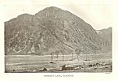

  
[Intangible Textual Heritage](../../../index) 
[Legends/Sagas](../../index)  [Celtic](../index)  [Index](index) 
[Previous](cml17)  [Next](cml19) 

------------------------------------------------------------------------

[Buy this Book at
Amazon.com](https://www.amazon.com/exec/obidos/ASIN/0809531534/internetsacredte)

------------------------------------------------------------------------

p. 201 

### CHAPTER XIV

### FINN AND THE FENIANS [1](#fn_222)

The epoch of Emain Macha is followed in the annals of ancient Ireland by
a succession of monarchs who, though doubtless as mythical as King
Conchobar and his court, seem to grow gradually more human. Their line
lasts for about two centuries, culminating in a dynasty with which
legend has occupied itself more than with its immediate predecessors.
This is the one which began, according to the annalists, in A.D. 177,
with the famous Conn "the Hundred-Fighter", and, passing down to the
reign of his even more famous grandson, Cormac "the Magnificent", is
connected with the third Gaelic cycle--that which relates the exploits
of Finn and the Fenians. All these kings had their dealings with the
national gods. A story contained in a fifteenth-century Irish
manuscript, and called "The Champion's Prophecy", [2](#fn_223) tells how Lugh appeared to Conn,
enveloped him in a magic mist, led him away to an enchanted palace, and
there prophesied to him the number of his descendants, the length of
their reigns,

p. 202

and the manner of their deaths. Another tradition relates how Conn's
son, Connla, was wooed by a goddess and borne away, like the British
Arthur, in a boat of glass to the Earthly Paradise beyond the sea. [1](#fn_224) Yet another relates Conn's own marriage
with Becuma of the Fair Skin, wife of that same Labraid of the Quick
Hand on Sword who, in another legend, married Liban, the sister of Fand,
Cuchulainn's fairy love. Becuma had been discovered in an intrigue with
Gaiar, a son of Manannán, and, banished from the "Land of Promise",
crossed the sea that sunders mortals and immortals to offer her hand to
Conn. The Irish king wedded her, but evil came of the marriage. She grew
jealous of Conn's other son, Art, and insisted upon his banishment; but
they agreed to play chess to decide which should go, and Art won. Art,
called "the Lonely" because he had lost his brother Connla, was king
after Conn, but he is chiefly known to legend as the father of Cormac.

Many Irish stories occupy themselves with the fame of Cormac, who is
pictured as a great legislator--a Gaelic Solomon. Certain traditions
credit him with having been the first to believe in a purer doctrine
than the Celtic polytheism, and even with having attempted to put down
druidism, in revenge for which a druid called Maelcen sent an evil
spirit who placed a salmon-bone crossways in the king's throat, as he
sat at meat, and so compassed his death. Another class of stories,
however, make him

p. 203

an especial favourite with those same heathen deities. Manannán son of
Lêr, was so anxious for his friendship that he decoyed him into
fairyland, and gave him a magic branch. It was of silver, and bore
golden apples, and, when it was shaken, it made such sweet music that
the wounded, the sick, and the sorrowful forgot their pains, and were
lulled into deep sleep. Cormac kept this treasure all his life; but, at
his death, it returned into the hands of the gods. [1](#fn_225)

King Cormac was a contemporary of Finn mac Coul [2](#fn_226), whom he appointed head of the
*Fianna* [3](#fn_227) *Eirinn*, more generally
known as the "Fenians". Around Finn and his men have gathered a cycle of
legends which were equally popular with the Gaels of both Scotland and
Ireland. We read of their exploits in stories and poems preserved in the
earliest Irish manuscripts, while among the peasantry both of Ireland
and of the West Highlands their names and the stories connected with
them are still current lore. Upon some of these floating traditions, as
preserved in folk ballads, MacPherson founded his factitious *Ossian*,
and the collection of them from the lips of living men still affords
plenty of employment to Gaelic students.

How far Finn and his followers may have been historical personages it is
impossible to say. The Irish people themselves have always held that the
Fenians were a kind of native militia, and that Finn

p. 204

was their general. The early historical writers of Ireland supported
this view. The chronicler Tighernach, who died in 1088, believed in him,
and the "Annals of the Four Masters", compiled between the years 1632
and 1636 from older chronicles, while they ignore King Conchobar and his
Red Branch Champions as unworthy of the serious consideration of
historians, treat Finn as a real person whose death took place in 283
A.D. Even so great a modern scholar as Eugene O’Curry declared in the
clearest language that Finn, so far from being "a merely imaginary or
mythical character", was "an undoubtedly historical personage; and that
he existed about the time at which his appearance is recorded in the
Annals is as certain as that Julius Caesar lived and ruled at the time
stated on the authority of the Roman historians". [1](#fn_228)

The opinion of more recent Celtic scholars, however, is opposed to this
view. Finn's pedigree, preserved in the Book of Leinster, may seem at
first to give some support to the theory of his real existence, but, on
more careful examination of it, his own name and that of his father
equally bewray him. Finn or Fionn, meaning "fair", is the name of one of
the mythical ancestors of the Gaels, while his father's name,
Cumhal [2](#fn_229), signifies the "sky", and
is the same word as *Camulus*, the Gaulish heaven-god identified by the
Romans with Mars. His followers are as doubtfully human as himself. One
may compare them with Cuchulainn and the rest of the heroes of Emain
Macha. Their deeds are not less marvellous.

p. 205

\[paragraph continues\] Like the Ultonian
warriors, they move, too, on equal terms with the gods. "The Fianna of
Erin", says a tract called "The Dialogue of the Elders", [1](#fn_230) contained in thirteenth and fourteenth
century manuscripts, "had not more frequent and free intercourse with
the men of settled habitation than with the Tuatha Dé Danann". [2](#fn_231) Angus, Mider, Lêr, Manannán, and Bodb
the Red, with their countless sons and daughters, loom as large in the
Fenian, or so-called "Ossianic" stories as do the Fenians themselves.
They fight for them, or against them; they marry them, and are given to
them in marriage.

A luminous suggestion of Professor Rhys also hints that the Fenians
inherited the conduct of that ancient war formerly waged between the
Tuatha Dé Danann and the Fomors. The most common antagonists of Finn and
his heroes are tribes of invaders from oversea, called in the stories
the *Lochlannach*. These "Men of Lochlann" are usually identified, by
those who look for history in the stories of the Fenian cycle, with the
invading bands of Norsemen who harried the Irish coasts in the ninth
century. But the nucleus of the Fenian tales antedates these
Scandinavian raids, and mortal foes have probably merely stepped into
the place of those immortal enemies of the gods whose "Lochlann" was a
country, not over the sea--but under it. [3](#fn_232)

The earlier historians of Ireland were as ready with their dates and
facts regarding the Fenian band

p. 206

as an institution as with the personality of Finn. It was said to have
been first organized by a king called Fiachadh, in 300 B.C., and
abolished, or rather, exterminated, by Cairbré, the son of Cormac mac
Art, in 284 A.D. We are told that it consisted of three regiments
modelled on the Roman legion; each of these bodies contained, on a peace
footing, three thousand men, but in time of war could be indefinitely
strengthened. Its object was to defend the coasts of Ireland and the
country generally, throwing its weight upon the side of any prince who
[happened](errata.htm#3) to be assailed by foreign foes. During the six
months of winter, its members were quartered upon the population, but
during the summer they had to forage for themselves, which they did by
hunting and fishing. Thus they lived in the woods and on the open moors,
hardening themselves for battle by their adventurous life. The sites of
their enormous camp-fires were long pointed out under the name of the
"Fenians' cooking-places".

It was not easy to become a member of this famous band. A candidate had
to be not only an expert warrior, but a poet and a man of culture as
well. He had practically to renounce his tribe; at any rate he made oath
that he would neither avenge any of his relatives nor be avenged by
them. He put himself under bonds never to refuse hospitality to anyone
who asked, never to turn his back in battle, never to insult any woman,
and not to accept a dowry with his wife. In addition to all this, he had
to pass successfully through the most stringent physical tests. Indeed,
as these have come down

p. 207

to us, magnified by the perfervid Celtic imagination, they are of an
altogether marvellous and impossible character. An aspirant to the
*Fianna Eirinn*, we are told, had first to stand up to his knees in a
pit dug for him, his only arms being his shield and a hazel wand, while
nine warriors, each with a spear, standing within the distance of nine
ridges of land, all hurled their weapons at him at once; if he failed to
ward them all off, he was rejected. Should he succeed in this first
test, he was given the distance of one tree-length's start, and chased
through a forest by armed men; if any of them came up to him and wounded
him, he could not belong to the Fenians. If he escaped unhurt, but had
unloosed a single lock of his braided hair, or had broken a single
branch in his flight, or if, at the end of the run, his weapons trembled
in his hands, he was refused. As, besides these tests, he was obliged to
jump over a branch as high as his forehead, and stoop under one as low
as his knee, while running at full speed, and to pluck a thorn out of
his heel without hindrance to his flight, it is clear that even the rank
and file of the Fenians must have been quite exceptional athletes. [1](#fn_233)

But it is time to pass on to a more detailed description of these
champions. [2](#fn_234) They are a goodly
company, not less heroic than the mighty men of Ulster. First comes Finn
himself, not the strongest in body of the Fenians, but the truest,
wisest, and kindest, gentle to women, generous to men, and

p. 208

trusted by all. If he could help it, he would never let anyone be in
trouble or poverty. "If the dead leaves of the forest had been gold, and
the white foam of the water silver, Finn would have given it all away."

Finn had two sons, Fergus and his more famous brother Ossian [1](#fn_235). Fergus of the sweet speech was the
Fenian's bard, and, also, because of his honeyed words, their
diplomatist and ambassador. Yet, by the irony of fate, it is to Ossian,
who is not mentioned as a poet in the earliest texts, that the poems
concerning the Fenians which are current in Scotland under the name of
"Ossianic Ballads" are attributed. Ossian's mother was Sadb, a daughter
of Bodb the Red. A rival goddess changed her into a deer--which explains
how Ossian got his name, which means "fawn". With such advantages of
birth, naturally he was speedy enough to run down a red deer hind and
catch her by the ear, though far less swift-footed than his cousin
Caoilte [2](#fn_236), the "Thin Man". Neither
was he so strong as his own son Oscar, the mightiest of all the Fenians,
yet, in his youth, so clumsy that the rest of the band refused to take
him with them on their warlike expeditions. They changed their minds,
however, when, one day, he followed them unawares, found them giving way
before an enemy, and, rushing to their help, armed only with a great log
of wood which lay handy on the ground, turned the fortunes of the fight.
After this, Oscar was hailed the best warrior of all the

 

[  
Click to enlarge](img/20800.jpg)  
OSSIAN'S CAVE, GLENCOE  

 

p. 209

\[paragraph continues\] Fianna; he was
given command of a battalion, and its banner, called the "Terrible
Broom", was regarded as the centre of every battle, for it was never
known to retreat a foot. Other prominent Fenians were Goll [1](#fn_237), son of Morna, at first Finn's enemy but
afterwards his follower, a man skilled alike in war and learning. Even
though he was one-eyed, we are told that he was much loved by women, but
not so much as Finn's cousin, Diarmait O’Duibhne [2](#fn_238), whose fatal beauty ensnared even Finn's
betrothed bride, Grainne [3](#fn_239). Their
comic character was Conan, who is represented as an old, bald, vain,
irritable man, as great a braggart as ancient Pistol and as foul-mouthed
as Thersites, and yet, after he had once been shamed into activity, a
true man of his hands. These are the prime Fenian heroes, the chief
actors in its stories.

The Fenian epic begins, before the birth of its hero, with the struggle
of two rival clans, each of whom claimed to be the real and only Fianna
Eirinn. They were called the Clann Morna, of which Goll mac Morna was
head, and the Clann Baoisgne [4](#fn_240),
commanded by Finn's father, Cumhal. A battle was fought at Cnucha [5](#fn_241), in which Goll killed Cumhal, and the
Clann Baoisgne was scattered. Cumhal's wife, however, bore a posthumous
son, who was brought up among the Slieve Bloom Mountains secretly, for
fear his father's enemies should find and kill him. The boy, who was at
first

p. 210

called Deimne [1](#fn_242), grew up to be an
expert hurler, swimmer, runner, and hunter. Later, like Cuchulainn, and
indeed many modern savages, he took a second, more personal name. Those
who saw him asked who was the "fair" youth. He accepted the omen, and
called himself Deimne Finn.

At length, he wandered to the banks of the Boyne, where he found a
soothsayer called Finn the Seer living beside a deep pool near Slane,
named "Fec's Pool", in hope of catching one of the "salmons of
knowledge", and, by eating it, obtaining universal wisdom. He had been
there seven years without result, though success had been prophesied to
one named "Finn". When the wandering son of Cumhal appeared, Finn the
Seer engaged him as his servant. Shortly afterwards, he caught the
coveted fish, and handed it over to our Finn to cook, warning him to eat
no portion of it. "Have you eaten any of it?" he asked the boy, as he
brought it up ready boiled. "No indeed," replied Finn; "but, while I was
cooking it, a blister rose upon the skin, and, laying my thumb down upon
the blister, I scalded it, and so I put it into my mouth to ease the
pain." The man was perplexed. "You told me your name was Deimne," he
said; "but have you any other name?" "Yes, I am also called Finn." "It
is enough," replied his disappointed master." Eat the salmon yourself,
for you must be the one of whom the prophecy told." Finn ate the "salmon
of knowledge", and thereafter he had only to put his thumb under his
tooth, as he had done when he

 

[  
Click to enlarge](img/21000.jpg)  
FINN FINDS THE SALMON OF KNOWLEDGE  
*From the Drawing by H. R. Millar*.  

 

p. 211

scalded it, to receive fore-knowledge and magic counsel. [1](#fn_243)

Thus armed, Finn was more than a match for the Clann Morna. Curious
legends tell how he discovered himself to his father's old followers,
confounded his enemies with his magic, and turned them into faithful
servants. [2](#fn_244) Even Goll of the Blows
had to submit to his sway. Gradually he welded the two opposing clans
into one Fianna, over which he ruled, taking tribute from the kings of
Ireland, warring against the Fomorian "Lochlannach", destroying every
kind of giant, serpent, or monster that infested the land, and at last
carrying his mythical conquests over all Europe.

Out of the numberless stories of the Fenian exploits it is hard to
choose examples. All are heroic, romantic, wild, fantastic. In many of
them the Tuatha Dé Danann play prominent parts. One such story connects
itself with an earlier mythological episode already related. The reader
will remember [3](#fn_245) how, when the Dagda
gave up the kingship of the immortals, five aspirants appeared to claim
it; how of these five--Angus, Mider, Lêr, Ilbhreach son of
[Manannán](errata.htm#4), and Bodb the Red--the latter was chosen; how
Lêr refused to acknowledge him, but was reconciled later; how Mider,
equally rebellious, fled to "desert country round Mount Leinster" in
County Carlow; and how a yearly war was waged upon him and his people by
the rest of the gods to

p. 212

bring them to subjection. This war was still raging in the time of Finn,
and Mider was not too proud to seek his help. One day that Finn was
hunting in Donegal, with Ossian, Oscar, Caoilte, and Diarmait, their
hounds roused a beautiful fawn, which, although at every moment
apparently nearly overtaken, led them in full chase as far as Mount
Leinster. Here it suddenly disappeared into a cleft in the hillside.
Heavy snow, "making the forest's branches as it were a withe-twist", now
fell, forcing the Fenians to seek for some shelter, and they therefore
explored the place into which the fawn had vanished. It led to a
splendid *sídhe* in the hollow of the hill. Entering it, they were
greeted by a beautiful goddess-maiden, who told them that it was she,
Mider's daughter, who had been the fawn, and that she had taken that
shape purposely to lead them there, in the hope of getting their help
against the army that was coming to attack the *sídh*. Finn asked who
the assailants would be, and was told that they were Bodb the Red with
his seven sons, Angus "Son of the Young" with his seven sons, Lêr of
Sídh Fionnechaidh with his twenty-seven sons, and Fionnbharr of Sídh
Meadha with his seventeen sons, as well as numberless gods of lesser
fame drawn from *sídhe* not only over all Ireland, but from Scotland and
the islands as well. Finn promised his aid, and, with the twilight of
that same day, the attacking forces appeared, and made their annual
assault. They were beaten off, after a battle that lasted all night,
with the loss of "ten men, ten score, and ten hundred". Finn, Oscar, and
Diarmait,

p. 213

as well as most of Mider's many sons, were sorely wounded, but the leech
Labhra healed all their wounds. [1](#fn_246)

Sooth to say, the Fenians did not always require the excuse of fairy
alliance to start them making war on the race of the hills. One of the
so-called "Ossianic ballads" is entitled "The Chase of the Enchanted
Pigs of Angus of the Brugh [2](#fn_247)". This
Angus is, of course, the "Son of the Young", and the Brugh that famous
*sídh* beside the Boyne out of which he cheated his father, the Dagda.
After the friendly manner of gods towards heroes, he invited Finn and a
picked thousand of his followers to a banquet at the Brugh. They came to
it in their finest clothes, "goblets went from hand to hand, and waiters
were kept in motion". At last conversation fell upon the comparative
merits of the pleasures of the table and of the chase, Angus stoutly
contending that "the gods' life of perpetual feasting" was better than
all the Fenian huntings, and Finn as stoutly denying it. Finn boasted of
his hounds, and Angus said that the best of them could not kill one of
his pigs. Finn angrily replied that his two hounds, Bran [3](#fn_248) and Sgeolan [4](#fn_249), would kill any pig that trod on dry
land. Angus answered that he could show Finn a pig that none of his
hounds or huntsmen could catch or kill. Here were the makings of a
pretty quarrel among such inflammable creatures as gods and heroes, but
the steward of

p. 214

the feast interposed and sent everyone to bed. The next morning, Finn
left the Brugh, for he did not want to fight all Angus's fairies with
his handful of a thousand men. A year passed before he heard more of it;
then came a messenger from Angus, reminding Finn of his promise to pit
his men and hounds against Angus's pigs. The Fenians seated themselves
on the tops of the hills, each with his favourite hound in leash, and
they had not been there long before there appeared on the eastern plain
a hundred and one such pigs as no Fenian had ever seen before. Each was
as tall as a deer, and blacker than a smith's coals, having hair like a
thicket and bristles like ships' masts. Yet such was the prowess of the
Fenians that they killed them all, though each of the pigs slew ten men
and many hounds. Then Angus complained that the Fenians had murdered his
son and many others of the Tuatha Dé Danann, who, indeed, were none
other than the pigs whose forms they had taken. There were mighty
recriminations on both sides, and, in the end, the enraged Fenians
prepared to attack the Brugh on the Boyne. Then only did Angus begin to
yield, and, by the advice of Ossian, Finn made peace with him and his
fairy folk.

Such are specimens of the tales which go to make up the Fenian cycle of
sagas. Hunting is the most prominent feature of them, for the Fenians
were essentially a race of mighty hunters. But the creatures of their
chase were not always flesh and blood. Enchanters who wished the Fenians
ill could always lure them into danger by taking the

p. 215

shape of boar or deer, and many a story begins with an innocent chase
and ends with a murderous battle. But out of such struggles the Fenians
always emerge successfully, as Ossian is represented proudly boasting,
"through truthfulness and the might of their hands".

The most famous chase of all is, however, not that of deer or boar, but
of a woman and a man, Finn's betrothed wife and his nephew
Diarmait. [1](#fn_250) Ever fortunate in war,
the Fenian leader found disaster in his love. Wishing for a wife in his
old age, he sent to seek Grainne, the daughter of Cormac, the High-King
of Ireland. Both King Cormac and his daughter consented, and Finn's
ambassadors returned with an invitation to the suitor to come in a
fortnight's time to claim his bride. He arrived with his picked band,
and was received in state in the great banqueting-hall of Tara. There
they feasted, and there Grainne, the king's daughter, casting her eyes
over the assembled Fenian heroes, saw Diarmait O’Duibhne.

This Fenian Adonis had a beauty-spot upon his cheek which no woman could
see without falling instantly in love with him. Grainne, for all her
royal birth, was no exception to this rule. She asked a druid to point
her out the principal guests. The druid told her all their names and
exploits. Then she called for a jewelled drinking-horn, and, filling it
with a drugged wine, sent it round to each in turn, except to Diarmait.
None could be so

p. 216

discourteous as to refuse wine from the hand of a princess. All drank,
and fell into deep sleep.

Then, rising, she came to Diarmait, told him her passion for him, and
asked for its return. "I will not love the betrothed of my chief," he
replied, "and, even if I wished, I dare not." And he praised Finn's
virtues, and decried his own fame. But Grainne merely answered that she
put him under *geasa* (bonds which no hero could refuse to redeem) to
flee with her; and at once went back to her chair before the rest of the
company awoke from their slumber.

After the feast, Diarmait went round to his comrades, one by one, and
told them of Grainne's love for him, and of the *geasa* she had placed
upon him to take her from Tara. He asked each of them what he ought to
do. All answered that no hero could break a *geis* put upon him by a
woman. He even asked Finn, concealing Grainne's name, and Finn gave him
the same counsel as the others. That night, the lovers fled from Tara to
the ford of the Shannon at Athlone, crossed it, and came to a place
called the "Wood of the Two Tents", where Diarmait wove a hut of
branches for Grainne to shelter in.

Meanwhile Finn had discovered their flight, and his rage knew no bounds.
He sent his trackers, the Clann Neamhuain [1](#fn_251), to follow them. They tracked them to
the wood, and one of them climbed a tree, and, looking down, saw the
hut, with a strong seven-doored fence built round it, and Diarmait and

p. 217

\[paragraph continues\] Grainne inside.
When the news came to the Fenians, they were sorry, for their sympathies
were with Diarmait and not with Finn. They tried to warn him, but he
took no heed; for he had determined to fight and not to flee. Indeed,
when Finn himself came to the fence, and called over it to Diarmait,
asking if he and Grainne were within, he replied that they were, but
that none should enter unless he gave permission.

So Diarmait, like Cuchulainn in the war of Ulster against Ireland, found
himself matched single-handed against a host. But, also like Cuchulainn,
he had a divine helper. The favourite of the Tuatha Dé Danann, he had
been the pupil of Manannán son of Lêr in the "Land of Promise", and had
been fostered by Angus of the Brugh. Manannán had given him his two
spears, the "Red Javelin" and the "Yellow Javelin", and his two swords,
the "Great Fury" and the "Little Fury". And now Angus came to look for
his foster-son, and brought with him the magic mantle of invisibility
used by the gods. He advised Diarmait and Grainne to come out wrapped in
the cloak, and thus rendered invisible. Diarmait still refused to flee,
but asked Angus to protect Grainne. Wrapping the magic mantle round her,
the god led the princess away unseen by any of the Fenians.

By this time, Finn had posted men outside all the seven doors in the
fence. Diarmait went to each of them in turn. At the first, were Ossian
and Oscar with the Clann Baoisgne. They offered him their protection. At
the second, were Caoilte and the

p. 218

\[paragraph continues\] Clann Ronan, who
said they would fight to the death for him. At the third, were Conan and
the Clann Morna, also his friends. At the fourth, stood Cuan with the
Fenians of Munster, Diarmait's native province. At the fifth, were the
Ulster Fenians, who also promised him protection against Finn. But at
the sixth, were the Clann Neamhuain, who hated him; and at the seventh,
was Finn himself.

"It is by your door that I will pass out, O Finn," cried Diarmait. Finn
charged his men to surround Diarmait as he came out, and kill him. But
he leaped the fence, passing clean over their heads, and fled away so
swiftly that they could not follow him. He never halted till he reached
the place to which he knew Angus had taken Grainne. The friendly god
left them with a little sage advice: never to hide in a tree with only
one trunk; never to rest in a cave with only one entrance; never to land
on an island with only one channel of approach; not to eat their supper
where they had cooked it, nor to sleep where they had supped, and, where
they had slept once, never to sleep again. With these Red-Indian-like
tactics, it was some time before Finn discovered them.

However, he found out at last where they were, and sent champions with
venomous hounds to take or kill them. But Diarmait conquered all who
were sent against him.

Yet still Finn pursued, until Diarmait, as a last hope of escape, took
refuge under a magic quicken-tree [1](#fn_252),
which bore scarlet fruit, the ambrosia of the

p. 219

gods. It had grown from a single berry dropped by one of the Tuatha Dé
Danann, who, when they found that they had carelessly endowed mortals
with celestial and immortal food, had sent a huge, one-eyed Fomor called
Sharvan the Surly to guard it, so that no man might eat of its fruit.
All day, this Fomor sat at the foot of the tree, and, all night, he
slept among its branches, and so terrible was his appearance that
neither the Fenians nor any other people dared to come within several
miles of him.

But Diarmait was willing to brave the Fomor in the hope of getting a
safe hiding-place for Grainne. He came boldly up to him, and asked leave
to camp and hunt in his neighbourhood. The Fomor told him surlily that
he might camp and hunt where he pleased, so long as he refrained from
taking any of the scarlet berries. So Diarmait built a hut near a
spring; and he and Grainne lived there, killing the wild animals for
food.

But, unhappily, Grainne conceived so strong a desire to eat the quicken
berries that she felt that she must die unless her wish could be
gratified. At first she tried to hide this longing, but in the end she
was forced to tell her companion. Diarmait had no desire to quarrel with
the Fomor; so he went to him and told the plight that Grainne was in,
and asked for a handful of the berries as a gift.

But the Fomor merely answered: "I swear to you that if nothing would
save the princess and her unborn child except my berries, and if she
were the last woman upon the earth, she should not have any

p. 220

of them." Whereupon Diarmait fought the Fomor, and, after much trouble,
killed him.

It was reported to Finn that the guardian of the magic quicken-tree
lived no longer, and he guessed that Diarmait must have killed him; so
he came down to the place with seven battalions of the Fenians to look
for him. By this time, Diarmait had abandoned his own hut and taken
possession of that built by the Fomor among the branches of the magic
quicken. He was sitting in it with Grainne when Finn and his men came
and camped at the foot of the tree, to wait till the heat of noon had
passed before beginning their search.

To beguile the time, Finn called for his chess-board and challenged his
son Ossian to a game. They played until Ossian had only one more move.

"One move would make you a winner," said Finn to him, "but I challenge
you and all the Fenians to guess it."

Only Diarmait, who had been looking down through the branches upon the
players, knew the move. He could not resist dropping a berry on to the
board, so deftly that it hit the very chessman which Ossian ought to
move in order to win. Ossian took the hint, moved it, and won. A second
and a third game were played; and in each case the same thing happened.
Then Finn felt sure that the berries that had prompted Ossian must have
been thrown by Diarmait.

He called out, asking Diarmait if he were there, and the Fenian hero,
who never spoke an untruth,

p. 221

answered that he was. So the quicken-tree was surrounded by armed men,
just as the fenced hut in the woods had been. But, again, things
happened in the same way; for Angus of the Brugh took away Grainne
wrapped in the invisible magic cloak, while Diarmait, walking to the end
of a thick branch, cleared the circle of Fenians at a bound, and escaped
untouched.

This was the end of the famous "Pursuit"; for Angus came as ambassador
to Finn, urging him to become reconciled to the fugitives, and all the
best of the Fenians begged Finn to consent. So Diarmait and Grainne were
allowed to return in peace.

But Finn never really forgave, and, soon after, he urged Diarmait to go
out to the chase of the wild boar of Benn Gulban [1](#fn_253). Diarmait killed the boar without
getting any hurt; for, like the Greek Achilles, he was invulnerable,
save in his heel alone. Finn, who knew this, told him to measure out the
length of the skin with his bare feet. Diarmait did so. Then Finn,
declaring that he had measured it wrongly, ordered him to tread it again
in the opposite direction. This was against the lie of the bristles; and
one of them pierced Diarmait's heel, and inflicted a poisoned and mortal
wound.

This "Pursuit of Diarmait and Grainne", which has been told at such
length, marks in some degree the climax of the Fenian power, after which
it began to decline towards its end. The friends of Diarmait never
forgave the treachery with which Finn had

p. 222

compassed his death. The ever-slumbering rivalry between Goll and his
Clann Morna and Finn and his Clann Baoisgne began to show itself as open
enmity. Quarrels arose, too, between the Fenians and the High-Kings of
Ireland, which culminated at last in the annihilation of the Fianna at
the battle of Gabhra [1](#fn_254).

This is said to have been fought in A.D. 284. Finn himself had perished
a year before it, in a skirmish with rebellious Fenians at the Ford of
Brea on the Boyne. King Cormac the Magnificent, Grainne's father, was
also dead. It was between Finn's grandson Oscar and Cormac's son Cairbré
that war broke out. This mythical battle was as fiercely waged as that
of Arthur's last fight at Camlan. Oscar slew Cairbré, and was slain by
him. Almost all the Fenians fell, as well as all Cairbré's forces.

Only two of the greater Fenian figures survived. One was Caoilte, whose
swiftness of foot saved him at the end when all was lost. The famous
story, called the "Dialogue of the Elders", represents him discoursing
to St. Patrick, centuries after, of the Fenians' wonderful deeds. Having
lost his friends of the heroic age, he is said to have cast in his lot
with the Tuatha Dé Danann. He fought in a battle, with Ilbhreach son of
Manannán, against Lêr himself, and killed the ancient sea-god with his
own hand. [2](#fn_255) The tale represents him
taking possession of Lêr's fairy palace of Sídh Fionnechaidh, after
which we know no more of him, except that

p. 223

he has taken rank in the minds of the Irish peasantry as one of, and a
ruler among, the Sídhe.

The other was Ossian, who did not fight at Gabhra, for, long before, he
had taken the great journey which most heroes of mythology take, to that
bourne from which no ordinary mortal ever returns. Like Cuchulainn, it
was upon the invitation of a goddess that he went. The Fenians were
hunting near Lake Killarney when a lady of more than human beauty came
to them, and told them that her name was Niamh [1](#fn_256), daughter of the Son of the Sea. The
Gaelic poet, Michael Comyn, who, in the eighteenth century, rewove the
ancient story into his own words, [2](#fn_257)
describes her in just the same way as one of the old bards would have
done:

"A royal crown was on her head;  
And a brown mantle of precious silk,  
Spangled with stars of red gold,  
Covering her shoes down to the grass.

"A gold ring was hanging down  
From each yellow curl of her golden hair;  
Her eyes, blue, clear, and cloudless,  
Like a dew-drop on the top of the grass.

"Redder were her cheeks than the rose,  
Fairer was her visage than the swan upon the wave,  
And more sweet was the taste of her balsam lips  
Than honey mingled thro' red wine. p. 224

"A garment, wide, long, and smooth  
Covered the white steed,  
There was a comely saddle of red gold,  
And her right hand held a bridle with a golden bit.

"Four shoes well-shaped were under him,  
Of the yellow gold of the purest quality;  
A silver wreath was on the back of his head,  
And there was not in the world a steed better."

Such was Niamh of the Golden Hair, Manannán's daughter; and it is small
wonder that, when she chose Ossian from among the sons of men to be her
lover, all Finn's supplications could not keep him. He mounted behind
her on her fairy horse, and they rode across the land to the sea-shore,
and then over the tops of the waves. As they went, she described the
country of the gods to him in just the same terms as Manannán himself
had pictured it to Bran, son of Febal, as Mider had painted it to Etain,
and as everyone that went there limned it to those that stayed at home
on earth.

"It is the most delightful country to be found  
Of greatest repute under the sun;  
Trees drooping with fruit and blossom,  
And foliage growing on the tops of boughs.

"Abundant, there, are honey and wine,  
And everything that eye has beheld,  
There will not come decline on thee with lapse of time.  
Death or decay thou wilt not see."

As they went they saw wonders. Fairy palaces with

p. 225

bright sun-bowers and lime-white walls appeared on the surface of the
sea. At one of these they halted, and Ossian, at Niamh's request,
attacked a fierce Fomor who lived there, and set free a damsel of the
Tuatha Dé Danann whom he kept imprisoned. He saw a hornless fawn leap
from wave to wave, chased by one of those strange hounds of Celtic myth
which are pure white, with red ears. At last they reached the "Land of
the Young", and there Ossian dwelt with Niamh for three hundred years
before he remembered Erin and the Fenians. Then a great wish came upon
him to see his own country and his own people again, and Niamh gave him
leave to go, and mounted him upon a fairy steed for the journey. One
thing alone she made him swear--not to let his feet touch earthly soil.
Ossian promised, and reached Ireland on the wings of the wind. But, like
the children of Lêr at the end of their penance, he found all changed.
He asked for Finn and the Fenians, and was told that they were the names
of people who had lived long ago, and whose deeds were written of in old
books. The Battle of Gabhra had been fought, and St. Patrick had come to
Ireland, and made all things new. The very forms of men had altered;
they seemed dwarfs compared with the giants of his day. Seeing three
hundred of them trying in vain to raise a marble slab, he rode up to
them in contemptuous kindness, and lifted it with one hand. But, as he
did so, the golden saddle-girth broke with the strain, and he touched
the earth with his feet. The fairy horse vanished, and Ossian rose from
the ground, no

p. 226

longer divinely young and fair and strong, but a blind, gray-haired,
withered old man.

A number of spirited ballads [1](#fn_258) tell
how Ossian, stranded in his old age upon earthly soil, unable to help
himself or find his own food, is taken by St. Patrick into his house to
be converted. The saint paints to him in the brightest colours the
heaven which may be his own if he will but repent, and in the darkest
the hell in which he tells him his old comrades now lie in anguish.
Ossian replies to the saint's arguments, entreaties, and threats in
language which is extraordinarily frank. He will not believe that heaven
could be closed to the Fenians if they wished to enter it, or that God
himself would not be proud to claim friendship with Finn. And if it be
not so, what is the use to him of eternal life where there is no
hunting, or wooing fair women, or listening to the songs and tales of
bards? No, he will go to the Fenians, whether they sit at the feast or
in the fire; and so he dies as he had lived.

------------------------------------------------------------------------

### Footnotes

[201:1](cml18.htm#fr_222) The translations of
Fenian stories are numerous. The reader will find many of them popularly
retold in Lady Gregory's *Gods and Fighting Men*. Thence he may pass on
to Mr. Standish Hayes O’Grady's *Silva Gadelica*; the *Waifs and .Strays
of Celtic Tradition*, especially Vol. IV; Mr. J. G. Campbell's *The
Fians*; as well as the volumes of the *Revue Celtique* and the
*Transactions of the Ossianic Society*.

[201:2](cml18.htm#fr_223) See O’Curry's
translation in Appendix CXXVIII to his MS. Materials.

[202:1](cml18.htm#fr_224) The story, found in
the Book of the Dun Cow, appears in French in De Jubainville's *Épopée
Celtique*.

[203:1](cml18.htm#fr_225) This famous story is
told in several MSS. of the fourteenth and fifteenth centuries. For
translations see Dr. Whitley Stokes, *Irische Texte*, and Standish Hayes
O’Grady, *Transactions of the Ossianic Society*, Vol. III.

[203:2](cml18.htm#fr_226) In Gaelic spelling,
Fionn mac Cumhail.

[203:3](cml18.htm#fr_227) Pronounced *Fēna*.

[204:1](cml18.htm#fr_228) O’Curry: *MS.
Materials*, Lecture XIV, p. 303.

[204:2](cml18.htm#fr_229) Pronounced *Coul* or
*Cooal*.

[205:1](cml18.htm#fr_230) *Agalamh na
Senórach*. Under the title *The Colloquy of the Ancients*, there is an
excellent translation of it, from the Book of Lismore, in Standish Hayes
O’Grady 's *Silva Gadelica*.

[205:2](cml18.htm#fr_231) O’Grady: *Silva
Gadelica*.

[205:3](cml18.htm#fr_232) *Hibbert Lectures*,
p. 355.

[207:1](cml18.htm#fr_233) See *The Enumeration
of Finn's Household*, translated by O’Grady in *Silva Gadelica*.

[207:2](cml18.htm#fr_234) For a good account,
see J. G. Campbell's *The Finns*, pp. 10-80.

[208:1](cml18.htm#fr_235) In more correct
spelling, *Oisin*, and pronounced *Usheen* or *Isheen*.

[208:2](cml18.htm#fr_236) Pronounced *Kylta* or
*Cweeltia*.

[209:1](cml18.htm#fr_237) Pronounced *Gaul*.

[209:2](cml18.htm#fr_238) Pronounced *Dermat
O’Dyna*.

[209:3](cml18.htm#fr_239) Pronounced *Grania*.

[209:4](cml18.htm#fr_240) Pronounced *Baskin*.

[209:5](cml18.htm#fr_241) Now Castleknock, near
Dublin.

[210:1](cml18.htm#fr_242) Pronounced *Demna*.

[211:1](cml18.htm#fr_243) This and other
"boy-exploits" of Finn mac Cumhail are contained in a little tract
written upon a fragment of the ninth century *Psalter of Cashel*. It is
translated in Vol. IV of the *Transactions of the Ossianic Society*.

[211:2](cml18.htm#fr_244) Campbell's *Fians*,
p. 22.

[211:3](cml18.htm#fr_245) See [chap.
XI](cml15.htm#ch-11)--"The Gods in Exile".

[213:1](cml18.htm#fr_246) From the *Colloquy of
the Ancients* in O’Grady's *Silva Gadelica*.

[213:2](cml18.htm#fr_247) It is translated in
Vol. VI of the *Transactions of the Ossianic Society*.

[213:3](cml18.htm#fr_248) Pronounced *Brăn*,
not *Brān*.

[213:4](cml18.htm#fr_249) Pronounced *Skōlaun*
or *Scolaing*.

[215:1](cml18.htm#fr_250) A fine translation of
the *Pursuit of Diarmait and Grainne* has been published by S. H.
O’Grady in Vol. III of the *Transactions of the Ossianic Society*.

[216:1](cml18.htm#fr_251) Pronounced *Navin* or
*Nowin*.

[218:1](cml18.htm#fr_252) The mountain-ash, or
rowan.

[221:1](cml18.htm#fr_253) Now called Benbulben.
It is near Sligo.

[222:1](cml18.htm#fr_254) Pronounced *Gavra*.

[222:2](cml18.htm#fr_255) See O’Grady's *Silva
Gadelica*.

[223:1](cml18.htm#fr_256) Pronounced *Nee-av*.

[223:2](cml18.htm#fr_257) *The Lay of Oisin in
the Land of Youth*, translated by Brian O’Looney for the Ossianic
Society--*Transactions*, Vol. IV. A fine modem poem on the same subject
is W. B. Yeats' *Wanderings of Oisin*.

[226:1](cml18.htm#fr_258) See the *Transactions
of the Ossianic Society*. They are generally called the *Dialogues of
Oisin and Patrick*.

------------------------------------------------------------------------

[Next: Chapter XV. The Decline and Fall of the Gods](cml19)
