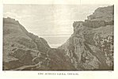

  
[Intangible Textual Heritage](../../../index.md) 
[Legends/Sagas](../../index)  [Celtic](../index)  [Index](index.md) 
[Previous](cml24)  [Next](cml26.md) 

------------------------------------------------------------------------

[Buy this Book at
Amazon.com](https://www.amazon.com/exec/obidos/ASIN/0809531534/internetsacredte.md)

------------------------------------------------------------------------

p. 312 

### CHAPTER XXI

### THE MYTHOLOGICAL "COMING OF ARTHUR"

The "Coming of Arthur", his sudden rise into prominence, is one of the
many problems of the Celtic mythology. He is not mentioned in any of the
Four Branches of the Mabinogi, which deal with the races of British gods
equivalent to the Gaelic Tuatha Dé Danann. The earliest references to
him in Welsh literature seem to treat him as merely a warrior-chieftain,
no better, if no worse, than several others, such as "Geraint, a
tributary prince of Devon", immortalized both by the bards [1](#fn_357.md) and by Tennyson. Then, following upon
this, we find him lifted to the extraordinary position of a king of
gods, to whom the old divine families of Dôn, of Llyr, and of Pwyll pay
unquestioned homage. Triads tell us that Lludd--the Zeus of the older
Pantheon--was one of Arthur's "Three Chief War-Knights", and Arawn, King
of Hades, one of his "Three Chief Counselling Knights". In the story
called the "Dream of Rhonabwy", in the Red Book of Hergest, he is shown
as a leader to whom are subject those we know to have been of

p. 313

divine race--sons of Nudd, of Llyr, of Brân, of Govannan, and of
Arianrod. In another "Red Book" tale, that of "Kulhwch and Olwen", even
greater gods are his vassals. Amaethon son of Dôn, ploughs for him, and
Govannan son of Dôn, rids the iron, while two other sons of Beli,
Nynniaw and Peibaw, "turned into oxen on account of their sins", toil at
the yoke, that a mountain may be cleared and tilled and the harvest
reaped in one day. He assembles his champions to seek the "treasures of
Britain"; and Manawyddan son of Llyr, Gwyn son of Nudd, and Pryderi son
of Pwyll rally round him at his call.

The most probable, and only adequate explanation, is given by Professor
Rhys, who considers that the fames of two separate Arthurs have been
accidentally confused, to the exceeding renown of a composite,
half-real, half-mythical personage into whom the two blended. [1](#fn_358.md) One of these was a divine Arthur, a god
more or less widely worshipped in the Celtic world--the same, no doubt,
whom an *ex voto* inscription found in south-eastern France calls
*Mercurius Artaius*. [2](#fn_359.md) The other was
a human Arthur, who held among the Britons the post which, under Roman
domination, had been called *Comes Britanniæ*. This "Count of Britain"
was the supreme military authority; he had a roving commission to defend
the country against foreign invasion; and under his orders were two
slightly subordinate officers, the *Dux Britanniarum* (Duke of the
Britains), who had charge of the northern

p. 314

wall, and the *Comes Littoris Saxonici* (Count of the Saxon Shore), who
guarded the south-eastern coasts. The Britons, after the departure of
the Romans, long kept intact the organization their conquerors had built
up; and it seems reasonable to believe that this post of leader in war
was the same which early Welsh literature describes as that of
"emperor", a title given to Arthur alone among the British heroes. [1](#fn_360.md) The fame of Arthur the Emperor blended
with that of Arthur the God, so that it became conterminous with the
area over which we have traced Brythonic settlement in Great
Britain. [2](#fn_361.md) Hence the many disputes,
ably, if unprofitably, conducted, over "Arthurian localities" and the
sites of such cities as Camelot, and of Arthur's twelve great battles.
Historical elements doubtless coloured the tales of Arthur and his
companions, but they are none the less as essentially mythic as those
told of their Gaelic analogues--the Red Branch Heroes of Ulster and the
Fenians.

Of those two cycles, it is with the latter that the Arthurian legend
shows most affinity. [3](#fn_362.md) Arthur's
position as supreme war-leader of Britain curiously parallels that of
Finn's as general of a "native Irish militia". His "Round Table" of
warriors also reminds one of Finn's Fenians sworn to adventure. Both
alike battle with human and superhuman foes.

p. 315

\[paragraph continues\] Both alike harry
Europe, even to the walls of Rome. The love-story of Arthur, his wife
Gwynhwyvar (Guinevere), and his nephew Medrawt (Mordred), resembles in
several ways that of Finn, his wife Grainne, and his nephew Diarmait. In
the stories of the last battles of Arthur and of the Fenians, the
essence of the kindred myth still subsists, though the actual exponents
of it slightly differ. At the fight of Camlan, it was Arthur and Medrawt
themselves who fought the final duel. But in the last stand of the
Fenians at Gabhra, the original protagonists have given place to their
descendants and representatives. Both Finn and Cormac were already dead.
It is Oscar, Finn's grandson, and Cairbré, Cormac's son, who fight and
slay each other. And again, just as Arthur was thought by many not to
have really died, but to have passed to "the island valley of Avilion",
so a Scottish legend tells us how, ages after the Fenians, a man,
landing by chance upon a mysterious western island, met and spoke with
Finn mac Coul. Even the alternative legend, which makes Arthur and his
warriors wait under the earth in a magic sleep for the return of their
triumph, is also told of the Fenians.

But these parallels, though they illustrate Arthur's pre-eminence, do
not show his real place among the gods. To determine this, we must
examine the ranks of the older dynasties carefully, to see if any are
missing whose attributes this new-corner may have inherited. We find
Lludd and Gwyn, Arawn, Pryderi, and Manawyddan side by side with him

p. 316

under their own names. Among the children of Dôn are Amaethon and
Govannan. But here the list stops, with a notable omission. There is no
mention, in later myth, of Gwydion. That greatest of the sons of Dôn has
fallen out, and vanished without a sign.

Singularly enough, too, the same stories that were once told of Gwydion
are now attached to the name of Arthur. So that we may assume, with
Professor Rhys, that Arthur, the prominent god of a new Pantheon, has
taken the place of Gwydion in the old. [1](#fn_363.md) A comparison of Gwydion-myths and
Arthur-myths shows an almost exact correspondence in everything but
name.

Like Gwydion, Arthur is the exponent of culture and of arts. Therefore
we see him carrying on the same war against the underworld for wealth
and wisdom that Gwydion and the sons of Dôn waged against the sons of
Llyr, the Sea, and of Pwyll, the Head of Hades.

Like Gwydion, too, Arthur suffered early reverses. He failed, indeed,
even where his prototype had succeeded. Gwydion, we know from the
Mabinogi of Mâth, successfully stole Pryderi's pigs, but Arthur was
utterly baffled in his attempt to capture the swine of a similar prince
of the underworld, called March son of Meirchion. [2](#fn_364.md) Also as with Gwydion, his earliest
reconnaissance of Hades was disastrous,

p. 317

and led to his capture and imprisonment. Manawyddan son of Llyr,
confined him in the mysterious and gruesome bone-fortress of Oeth and
Anoeth, and there he languished for three days and three nights before a
rescuer came in the person of Goreu, his cousin. [1](#fn_365.md) But, in the end, he triumphed. A Welsh
poem, ascribed to the bard Taliesin, relates, under the title "The
Spoiling of Annwn", [2](#fn_366.md) an expedition
of Arthur and his followers into the very heart of that country, from
which he appears to have returned (for the verses are somewhat obscure)
with the loss of almost all his men, but in possession of the object of
his quest--the magic cauldron of inspiration and poetry.

Taliesin tells the story as an eye-witness. He may well have done so;
for it was his boast that from the creation of the world he had allowed
himself to miss no event of importance. He was in Heaven, he tells
us, [3](#fn_367.md) when Lucifer fell, and in the
Court of Dôn before Gwydion was born; he had been among the
constellations both with Mary Magdalene and with the pagan goddess
Arianrod; he carried a banner before Alexander, and was chief director
of the building of the Tower of Babel; he saw the fall of Troy and the
founding of Rome; he was with Noah in the Ark, and he witnessed the
destruction of Sodom and Gomorrah; and he was present both at the Manger
of Bethlehem and at the Cross of Calvary. But, unfortunately, Taliesin,

p. 318

as a credible personage, rests under exactly the same disabilities as
Arthur himself. It is not denied by scholars that there was a real
Taliesin, a sixth-century bard to whom were attributed, and who may have
actually composed, some of the poems in the Book of Taliesin. [1](#fn_368.md) But there was also another Taliesin,
whom mythical poet of the British Celts, Professor Rhys is inclined to
equate with the Gaelic Ossian. [2](#fn_369.md) The
traditions of the two mingled, endowing the historic Taliesin with the
god-like attributes of his predecessor, and clothing the mythical
Taliesin with some of the actuality of his successor. [3](#fn_370.md)

It is regrettable that our bard did not at times sing a little less
incoherently, for his poem contains the fullest description that has
come down to us of the other world as the Britons conceived it.
Apparently the numerous names, all different and some now
untranslatable, refer to the same place, and they must be collated to
form a right idea of what Annwn was like. With the exception of an
obviously spurious last verse, here omitted, the poem is magnificently
pagan, and quite a storehouse of British mythology [4](#fn_371.md).

p. 319

"I will praise the Sovereign, supreme Lord of the land,  
Who hath extended his dominion over the shore of the world.  
Stout was the prison of Gweir [1](#fn_372.md), in
Caer Sidi,  
Through the spite of Pwyll and Pryderi:  
No one before him went into it.  
The heavy blue chain firmly held the youth,  
And before the spoils of Annwn woefully he sang,  
And thenceforth till doom he shall remain a bard.  
Thrice enough to fill Prydwen [2](#fn_373.md) we
went into it;  
Except seven, none returned from Caer Sidi [3](#fn_374.md).

"Am I not a candidate for fame, to be heard in song  
In Caer Pedryvan [4](#fn_375.md), four times
revolving?  
The first word from the cauldron, when was it spoken?  
By the breath of nine maidens it was gently warmed.  
Is it not the cauldron of the chief of Annwn? What is its fashion?  
A rim of pearls is round its edge.  
It will not cook the food of a coward or one forsworn.  
A sword flashing bright will be raised to him,  
And left in the hand of Lleminawg.  
And before the door of the gate of Uffern [5](#fn_376.md) the lamp was burning.  
When we went with Arthur--a splendid labour!--  
Except seven, none returned from Caer Vedwyd [6](#fn_377.md).

"Am I not a candidate for fame, to be heard in song  
In Caer Pedryvan, in the Isle of the Strong Door,  
Where twilight and pitchy darkness meet together,  
And bright wine is the drink of the host?  
Thrice enough to fill Prydwen we went on the sea.  
Except seven, none returned from Caer Rigor [7](#fn_378.md).

p. 320

"I will not allow much praise to the leaders of literature.  
Beyond Caer Wydyr [1](#fn_379.md) they saw not the
prowess of Arthur;  
Three-score hundreds stood on the walls;  
It was hard to converse with their watchman.  
Thrice enough to fill Prydwen we went with Arthur;  
Except seven, none returned from Caer Golud [2](#fn_380.md).

"I will not allow much praise to the spiritless.  
They know not on what day, or who caused it,  
Or in what hour of the serene day Cwy was born,  
Or who caused that he should not go to the dales of Devwy.  
They know not the brindled ox with the broad head-band,  
Whose yoke is seven-score handbreadths.  
When we went with Arthur, of mournful memory,  
Except seven, none returned from Caer Vandwy [3](#fn_381.md).

"I will not allow much praise to those of drooping courage,  
They know not on what day the chief arose,  
Nor in what hour of the serene day the owner was born,  
Nor what animal they keep, with its head of silver.  
When we went with Arthur, of anxious striving,  
Except seven, none returned from Caer Ochren [4](#fn_382.md)".

Many of the allusions of this poem will perhaps never be explained. We
know no better than the "leaders of literature" whom the vainglorious
Taliesin taunted with their ignorance and lack of spirit in what hour
Cwy was born, or even who he was, much less who prevented him from going
to the dales of Devwy, wherever they may have been. We are in the dark
as much as they were with

 

[  
Click to enlarge](img/32000.jpg.md)  
KING ARTHUR'S CASTLE, TINTAGEL  

 

p. 321

regard to the significance of the brindled ox with the broad head-band,
and of the other animal with the silver head. [1](#fn_383.md) But the, earlier portion of the poem is,
fortunately, clearer, and it gives glimpses of a grandeur of savage
imagination. The strong-doored, foursquare fortress of glass, manned by
its dumb, ghostly sentinels, spun round in never-ceasing revolution, so
that few could find its entrance; it was pitch-dark save for the
twilight made by the lamp burning before its circling gate; feasting
went on there, and revelry, and in its centre, choicest of its many
riches, was the pearl-rimmed cauldron of poetry and inspiration, kept
bubbling by the breaths of nine British pythonesses, so that it might
give forth its oracles. To this scanty information we may add a few
lines, also by Taliesin, and contained in a poem called "A Song
Concerning the Sons of Llyr ab Brochwel Powys":--

"Perfect is my chair in Caer Sidi:  
Plague and age hurt not him who 's in it--  
They know, Manawyddan and Pryderi.  
Three organs round a fire sing before it,  
And about its points are ocean's streams  
And the abundant well above it--,  
Sweeter than white wine the drink in it." [2](#fn_384.md)

\[paragraph continues\] Little is,
however, added by it to our knowledge. It reminds us that Annwn was
surrounded by the sea--"the heavy blue chain" which held Gweir so
firmly;--it informs us that the "bright wine" which

p. 322

was "the drink of the host" was kept in a well; it adds to the revelry
the singing of the three organs; it makes a point that its inhabitants
were freed from age and death; and, last of all, it shows us, as we
might have expected, the ubiquitous Taliesin as a privileged resident of
this delightful region. We have two clues as to where the country may
have been situated. Lundy Island, off the coast of Devonshire, was
anciently called *Ynys Wair*, the "Island of Gweir", or Gwydion. The
Welsh translation of the *Seint Greal*, an Anglo-Norman romance
embodying much of the old mythology, locates its "Turning
Castle"--evidently the same as Caer Sidi--in the district around and
comprising Puffin Island off the coast of Anglesey. [1](#fn_385.md) But these are slender threads by which
to tether to firm ground a realm of the imagination.

With Gwydion, too, have disappeared the whole of the characters
connected with him in that portion of the Mabinogi of Mâth, Son of
Mathonwy, which recounts the myth of the birth of the sun-god. Neither
Mâth himself, nor Lieu Llaw Gyffes, nor Dylan, nor their mother,
Arianrod, play any more part; they have vanished as completely as
Gwydion. But the essence of the myth of which they were the figures
remains intact. Gwydion was the father by his sister Arianrod, wife of a
waning heaven-god called Nwyvre (Space), of twin sons, Lieu, a god of
light, and Dylan, a god of darkness; and we find this same story woven
into the very innermost texture of the legend of Arthur. [2](#fn_386.md) The new Arianrod,

p. 323

though called "Morgawse" by Sir Thomas Malory [1](#fn_387.md), and "Anna" by Geoffrey of
Monmouth [2](#fn_388.md), is known to earlier
Welsh myth as "Gwyar" [3](#fn_389.md). She was the
sister of Arthur and the wife of the sky-god, Lludd, and her name, which
means "shed blood" or "gore", reminds us of the relationship of the
Morrígú, the war-goddess of the Gaels, to the heaven-god Nuada [4](#fn_390.md). The new Lleu Llaw Gyffes is called
Gwalchmei, that is, the "Falcon of May" [5](#fn_391.md), and the new Dylan is Medrawt, at once
Arthur's son and Gwalchmei's brother, and the bitterest enemy of
both [6](#fn_392.md).

Besides these "old friends with new faces", Arthur brings with him into
prominence a fresh Pantheon, most of whom also replace the older gods of
the heavens and earth and the regions under the earth. The Zeus of
Arthur's cycle is called Myrddin, who passed into the Norman-French
romances as "Merlin". All the myths told of him bear witness to his high
estate. The first name of Britain, before it was inhabited, was, we
learn from a triad, *Clas Myrddin*, that is, "Myrddin's
Enclosure". [7](#fn_393.md) He is given a wife
whose attributes recall those of the consorts of Nuada and Lludd. She is
described as the only daughter of Coel--the British name of the Gaulish
*Camulus*, a god of war and the sky--and was called Elen Lwyddawg, that
is, "Elen, Leader of Hosts". Her memory is still preserved in Wales in
connection with ancient roadways; such names

p. 324

as *Ffordd Elen* ("Elen's Road") and Sarn Elen ("Elen's Causeway") seem
to show that the paths on which armies marched were ascribed or
dedicated to her. [1](#fn_394.md) As Myrddin's
wife, she is credited with having founded the town of Carmarthen (*Caer
Myrddin*), as well as the "highest fortress in Arvon", which must have
been the site near Beddgelert still called *Dinas Emrys*, the "Town of
Emrys", one of Myrddin's epithets or names. [2](#fn_395.md)

Professor Rhys is inclined to credit Myrddin, or, rather, the British
Zeus under whatever name, with having been the god especially worshipped
at Stonehenge. [3](#fn_396.md) Certainly this
impressive temple, ever unroofed and open to the sun and wind and rain
of heaven, would seem peculiarly appropriate to a British supreme god of
light and sky. Neither are we quite without documentary evidence which
will allow us to connect it with him. Geoffrey of Monmouth [4](#fn_397.md), whose historical fictions usually
conceal mythological facts, relates that the stones which compose it
were erected by Merlin. Before that, they had stood in Ireland, upon a
hill which Geoffrey calls "Mount Killaraus", and which can be identified
as the same spot known to Irish legend as the "Hill of Uisnech", and,
still earlier, connected with Balor. According to British tradition, the
primeval giants who first colonized Ireland had brought them from their
original home on "the farthest coast of Africa",

p. 325

on account of their miraculous virtues; for any water in which they were
bathed became a sovereign remedy either for sickness or for wounds. By
the order of Aurelius, a half-real, half-mythical king of Britain,
Merlin brought them thence to England, to be set up on Salisbury Plain
as a monument to the British chieftains treacherously slain by Hengist
and his Saxons. With this scrap of native information about Stonehenge
we may compare the only other piece we have--the account of the classic
Diodorus, who called it a temple of Apollo. [1](#fn_398.md) At first, these two statements seem to
conflict. But it is far from unlikely that the earlier Celtic settlers
in Britain made little or no religious distinction between sky and sun.
The sun-god, as a separate personage, seems to have been the conception
of a comparatively late age. Celtic mythology allows us to be present,
as it were, at the births both of the Gaelic Lugh Lamhfada and the
British Lleu Llaw Gyffes.

Even the well-known story of Myrddin's, or Merlin's final imprisonment
in a tomb of airy enchantment--"a tour withouten walles, or withoute eny
closure"--reads marvellously like a myth of the sun "with all his fires
and travelling glories round him". [2](#fn_399.md)
Encircled, shielded, and made splendid by his atmosphere of living
light, the Lord of Heaven moves slowly towards the west, to disappear at
last into the sea (as one local version of the myth puts it), or on to a
far-off island (as another says), or into a dark forest (the choice of a
third). [3](#fn_400.md) When the

p. 326

myth became finally fixed, it was Bardsey Island, off the extreme
westernmost point of Caernarvonshire, that was selected as his last
abode. Into it he went with nine attendant bards, taking with him the
"Thirteen Treasures of Britain", thenceforth lost to men. Bardsey Island
no doubt derives its name from this story; and what is probably an
allusion to it is found in a first-century Greek writer called Plutarch,
who describes a grammarian called Demetrius as having visited Britain,
and brought home an account of his travels. He mentioned several
uninhabited and sacred islands off our coasts which he said were named
after gods and heroes, but there was one especially in which Cronos was
imprisoned with his attendant deities, and Briareus keeping watch over
him as he slept; "for sleep was the bond forged for him". [1](#fn_401.md) Doubtless this disinherited deity, whom
the Greek, after his fashion, called "Cronos", was the British heaven-
and sun-god, after he had descended into the prison of the west.

Among other new-corners is Kai, who, as Sir Kay the Seneschal, fills so
large a part in the later romances. Purged of his worst offences, and
reduced to a surly butler to Arthur, he is but a shadow of the earlier
Kai who murdered Arthur's son Llacheu [2](#fn_402.md), and can only be acquitted, through the
obscurity of the poem that relates the incident, of having also carried
off, or having tried to carry off, Arthur's wife, Gwynhwyvar. [3](#fn_403.md) He is thought

p. 327

to have been a personification of fire, [1](#fn_404.md) upon the strength of a description given
of him in the mythical romance of "Kulhwch and Olwen". "Very subtle", it
says, "was Kai. When it pleased him he could render himself as tall as
the highest tree in the forest. And he had another peculiarity--so great
was the heat of his nature, that, when it rained hardest, whatever he
carried remained dry for a handbreadth above and a handbreadth below his
hand; and when his companions were coldest, it was to them as fuel with
which to light their fire."

Another personage who owes his prominence in the Arthurian story to his
importance in Celtic myth was March son of Meirchion, whose swine Arthur
attempted to steal, as Gwydion had done those of Pryderi. In the
romances, he has become the cowardly and treacherous Mark, king,
according to some stories, of Cornwall, but according to others, of the
whole of Britain, and known to all as the husband of the Fair Isoult,
and the uncle of Sir Tristrem. But as a deformed deity of the
underworld [2](#fn_405.md) he can be found in
Gaelic as well as in British myth. He cannot be considered as originally
different from Morc, a king of the Fomors at the time when from their
Glass Castle they so fatally oppressed the Children of Nemed. [3](#fn_406.md) The Fomors were distinguished by their
animal features, and March had the same peculiarity. [4](#fn_407.md) When Sir

p. 328

\[paragraph continues\] Thomas Malory
relates how, to please Arthur and Sir Launcelot, Sir Dinadan made a song
about Mark, "which was the worst lay that ever harper sang with harp or
any other instruments", [1](#fn_408.md) he does
not tell us wherein the sting of the lampoon lay. It no doubt reminded
King Mark of the unpleasant fact that he had--not like his Phrygian
counterpart, ass's but--horse's ears. He was, in fact, a Celtic Midas, a
distinction which he shared with one of the mythical kings of early
Ireland. [2](#fn_409.md)

Neither can we pass over Urien, a deity of the underworld akin to, or
perhaps the same as, Brân. [3](#fn_410.md) Like
that son of Llyr, he was at once a god of battle and of
minstrelsy; [4](#fn_411.md) he was adored by the
bards as their patron; [5](#fn_412.md) his badge
was the raven (*bran*, in Welsh); [6](#fn_413.md)
while, to make his identification complete, there is an extant poem
which tells how Urien, wounded, ordered his own head to be cut off by
his attendants. [7](#fn_414.md) His wife was
Modron, [8](#fn_415.md) known as the mother of
Mabon, the sun-god to whom inscriptions exist as *Maponos*. Another of
the children of Urien and Modron is Owain, which was perhaps only
another name for Mabon. [9](#fn_416.md) Taliesin
calls him "chief of the glittering west", [10](#fn_417.md) and he is as certainly a sun-god as his
father Urien, "lord of the evening", [11](#fn_418.md) was a ruler of the dark underworld.

p. 329

It is by reason of the pre-eminence of Arthur that we find gathered
round him so many gods, all probably various tribal personifications of
the same few mythological ideas. The Celts, both of the Gaelic and the
British branches, were split up into numerous petty tribes, each with
its own local deities embodying the same essential conceptions under
different names. There was the god of the underworld, gigantic in
figure, patron alike of warrior and minstrel, teacher of the arts of
eloquence and literature, and owner of boundless wealth, whom some of
the British tribes worshipped as Brân, others as Urien, others as Pwyll,
or March, or Mâth, or Arawn, or Ogyrvran. There was the lord of an
elysium--Hades in its aspect of a paradise of the departed rather than
of the primeval subterranean realm where all things originated--whom the
Britons of Wales called Gwyn, or Gwynwas; the Britons of Cornwall,
Melwas; and the Britons of Somerset, Avallon, or Avallach. Under this
last title, his realm is called *Ynys Avallon*, "Avallon's Island", or,
as we know the word, Avilion. It was said to be in the "Land of Summer",
which, in the earliest myth, signified Hades; and it was only in later
days that the mystic Isle of Avilion became fixed to earth as
Glastonbury, and the Elysian "Land of Summer" as Somerset. [1](#fn_419.md) There was a mighty ruler of heaven, a
"god of battles", worshipped on high places, in whose hands was "the
stern arbitrament of war"; some knew him as Lludd, others as Myrddin, or
as Emrys.

p. 330

There was a gentler deity, friendly to man, to help whom he fought or
cajoled the powers of the underworld; Gwydion he was called, and Arthur.
Last, perhaps, to be imagined in concrete shape, there was a long-armed,
sharp-speared sun-god who aided the culture-god in his work, and was
known as Lleu, or Gwalchmei, or Mabon, or Owain, or Peredur, and no
doubt by many another name; and with him is usually found a brother
representing not light, but darkness. This expression of a single idea
by different names may be also observed in Gaelic myth, though not quite
so clearly. In the hurtling of clan against clan, many such divinities
perished altogether out of memory, or survived only as names, to make
up, in Ireland, the vast, shadowy population claiming to be Tuatha Dé
Danann, and, in Britain, the long list of Arthur's followers.
Others--gods of stronger communities--would increase their fame as their
worshippers increased their territory, until, as happened in Greece, the
chief deities of many tribes came together to form a national Pantheon.

We have already tried to explain the "Coming of Arthur" historically.
Mythologically, he came, as, according to Celtic ideas, all things came
originally, from the underworld. His father is called Uther
Pendragon. [1](#fn_420.md) But Uther Pendragon is
(for the word "dragon" is not part of the name, but a title signifying
"war-leader") *Uther Ben*, that is, Brân, under his name of the
"Wonderful Head", [2](#fn_421.md) so that, in
spite of the legend which describes

p. 331

\[paragraph continues\] Arthur as having
disinterred Brân's head on Tower Hill, where it watched against
invasion, because he thought it beneath his dignity to keep Britain in
any other way than by valour, [1](#fn_422.md) we
must recognize the King of Hades as his father. This being so, it would
only be natural that he should take a wife from the same eternal
country, and we need not be surprised to find in Gwynhwyvar's father,
Ogyrvran, a personage corresponding in all respects to the Celtic
conception of the ruler of the underworld. He was of gigantic
size; [2](#fn_423.md) he was the owner of a
cauldron out of which three Muses had been born; [3](#fn_424.md) and he was the patron of the
bards, [4](#fn_425.md) who deemed him to have been
the originator of their art. More than this, his very name, analysed
into its original *ocur vran*, means the evil *bran*, or raven, the bird
of death. [5](#fn_426.md)

But Welsh tradition credits Arthur with three wives, each of them called
Gwynhwyvar. This peculiar arrangement is probably due to the Celtic love
of triads; and one may compare them with the three Etains who pass
through the mythico-heroic story of Eochaid Airem, Etain, and Mider. Of
these three Gwynhwyvars, [6](#fn_427.md) besides
the Gwynhwyvar, daughter of Ogyrvran, one was the daughter of Gwyrd
Gwent, of whom we know nothing but the name, and the other of Gwyrthur
ap Greidawl,

p. 332

the same "Victor son of Scorcher" with whom Gwyn son of Nudd, fought, in
earlier myth, perpetual battle for the possession of Creudylad, daughter
of the sky-god Lludd. This same eternal strife between the powers of
light and darkness for the possession of a symbolical damsel is waged
again in the Arthurian cycle; but it is no longer for Creudylad that
Gwyn contends, but for Gwynhwyvar, and no longer with Gwyrthur, but with
Arthur. It would seem to have been a Cornish form of the myth; for the
dark god is called "Melwas", and not "Gwynwas", or "Gwyn", his name in
Welsh. [1](#fn_428.md) Melwas lay in ambush for a
whole year, and finally succeeded in carrying off Gwynhwyvar to his
palace in Avilion. But Arthur pursued, and besieged that stronghold,
just as Eochaid Airem had, in the Gaelic version of the universal story,
mined and sapped at Mider's *sídh* of Bri Leith. [2](#fn_429.md) Mythology, as well as history, repeats
itself; and Melwas was obliged to restore Gwynhwyvar to her rightful
lord.

It is not Melwas, however, that in the best-known versions of the story
contends with Arthur for the love of Gwynhwyvar. The most widespread
early tradition makes Arthur's rival his nephew Medrawt. Here Professor
Rhys traces a striking parallel between the British legend of Arthur,
Gwynhwyvar, and Medrawt, and the Gaelic story of Airem, Etain, and
Mider. [3](#fn_430.md) The two myths are
practically counterparts; for the names of all

p. 333

the three pairs agree in their essential meaning. "Airem", like
"Arthur", signifies the "Ploughman", the divine institutor of
agriculture; "Etain", the "Shining One", is a fit parallel to
"Gwynhwyvar", the "White Apparition"; while "Mider" and "Medrawt" both
come from the same root, a word meaning "to hit", either literally, or
else metaphorically, with the mind, in the sense of coming to a
decision. To attempt to explain this myth is to raise the vexed question
of the meaning of mythology. Is it day and dark that strive for dawn, or
summer and winter for the lovely spring, or does it shadow forth the
rescue of the grain that makes man's life from the devouring underworld
by the farmer's wit? When this can be finally resolved, a multitude of
Celtic myths will be explained. Everywhere arise the same combatants for
the stolen bride; one has the attributes of light, the other is a
champion of darkness.

Even in Sir Thomas Malory's version of the Arthurian story, taken by him
from French romances far removed from the original tradition, we find
the myth subsisting. Medrawt's original place as the lover of Arthur's
queen had been taken in the romances by Sir Launcelot, who, if he was
not some now undiscoverable Celtic god, [1](#fn_431.md) must have been an invention of the
Norman adapters. But the story which makes Medrawt Arthur's rival

p. 334

has been preserved in the account of how Sir Mordred would have wedded
Guinevere by force, as part of the rebellion which he made against his
king and uncle. [1](#fn_432.md) This strife was
Celtic myth long before it became part of the pseudo-history of early
Britain. The triads [2](#fn_433.md) tell us how
Arthur and Medrawt raided each other's courts during the owner's
absence. Medrawt went to Kelli Wic, in Cornwall, ate and drank
everything he could find there, and insulted Queen Gwynhwyvar, in
revenge for which Arthur went to Medrawt's court and killed man and
beast. Their struggle only ended with the Battle of Camlan; and that
mythical combat, which chroniclers have striven to make historical, is
full of legendary detail. Tradition tells how Arthur and his antagonist
shared their forces three times during the fight, which caused it to be
known as one of the "Three Frivolous Battles of Britain", the idea of
doing so being one of "Britain's Three Criminal Resolutions". Four alone
survived the fray: one, because he was so ugly that all shrank from him,
believing him to be a devil; another, whom no one touched because he was
so beautiful that they took him for an angel; a third, whose great
strength no one could resist; and Arthur himself, who, after revenging
the death of Gwalchmei upon Medrawt, went to the island of Avilion to
heal him of his grievous wounds.

And thence--from the Elysium of the Celts

p. 335

popular belief has always been that he will some day return. But just as
the gods of the Gaels are said to dwell sometimes in the "Land of the
Living", beyond the western wave, and sometimes in the palace of a
hollow hill, so Arthur is sometimes thought to be in Avilion, and
sometimes to be sitting with his champions in a charmed sleep in some
secret place, waiting for the trumpet to be blown that shall call him
forth to reconquer Britain. The legend is found in the Eildon Hills; in
the Snowdon district; at Cadbury, in Somerset, the best authenticated
Camelot; in the Vale of Neath, in South Wales; as well as in other
places. He slumbers, but he has not died. The ancient Welsh poem called
"The Verses of the Graves of the Warriors" [1](#fn_434.md) enumerates the last resting-places of
most of the British gods and demi-gods. "The grave of Gwydion is in the
marsh of Dinlleu", the grave of Lieu Llaw Gyffes is "under the
protection of the sea with which he was familiar", and "where the wave
makes a sullen sound is the grave of Dylan"; we know the graves of
Pryderi, of Gwalchmei, of March, of Mabon, even of the great Beli, but

"Not wise the thought--a grave for Arthur". [2](#fn_435.md)

 

------------------------------------------------------------------------

### Footnotes

[312:1](cml25.htm#fr_357.md) A poem in praise of
Geraint, the brave man from the region of Dyvnaint (Devon) . . . the
enemy of tyranny and oppression", is contained in both the Black Book of
Caermarthen and the Red Book of Hergest. "When Geraint was born, open
were the gates of heaven", begins its last verse. It is translated in
Vol. I of Skene, p. 267.

[313:1](cml25.htm#fr_358.md) Rhys: *Arthurian
Legend*, p. 8.

[313:2](cml25.htm#fr_359.md) Rhys: *Hibbert
Lectures*, pp. 40-41.

[314:1](cml25.htm#fr_360.md) Rhys: *Arthurian
Legend*, p. 7.

[314:2](cml25.htm#fr_361.md) "It is worthy of
remark that the fame of Arthur is widely spread; he is claimed alike as
a prince in Brittany, Cornwall, Wales, Cumberland, and the Lowlands of
Scotland; that is to say, his fame is conterminous with the Brythonic
race, and does not extend to the Gaels".--*Chambers's Encyclopædia*.

[314:3](cml25.htm#fr_362.md) For Arthurian and
Fenian parallels see Campbell's *Popular Tales of the West Highlands*.

[316:1](cml25.htm#fr_363.md) See chap. I of Rhys's
*Arthurian Legend*--"Arthur, Historical and Mythical".

[316:2](cml25.htm#fr_364.md) A triad in the
Hengwrt MS. 536, translated by Skene. It was Trystan who was watching
the swine for his uncle, while the swineherd went with a message to
Essylt (Iseult), "and Arthur desired one pig by deceit or by theft, and
could not get it"

[317:1](cml25.htm#fr_365.md) See note to [chap.
XXII](cml26.htm#ch-22.md)--"The Treasures of Britain".

[317:2](cml25.htm#fr_366.md) *Book of Taliesin*,
poem xxx, Skene, Vol. I, p. 256.

[317:3](cml25.htm#fr_367.md) In a probably very
ancient poem embedded in the sixteenth-century Welsh romance called
*Taliesin*, included by Lady Guest in her *Mabinogion*.

[318:1](cml25.htm#fr_368.md) "The existence of a
sixth-century bard of this name, a contemporary of the heroic stage of
British resistance to the Germanic invaders, is well attested. A number
of poems are found in mediæval Welsh MSS., chief among them the
so-called *Book of Taliesin*, ascribed to this sixth-century poet. Some
of these are almost as old as any remains of Welsh poetry, and may go
back to the early tenth or the ninth century; others are productions of
the eleventh, twelfth, and even thirteenth centuries."--Nutt: Notes to
his (1902) edition of Lady Guest's *Mabinogion*.

[318:2](cml25.htm#fr_369.md) Rhys: *Hibbert
Lectures*, p. 551.

[318:3](cml25.htm#fr_370.md) "There can be little
doubt but that the sixth-century bard succeeded to the form and
attributes of a far older, a prehistoric, a mythic singer."--Nutt: Notes
to Mabinogion.

[318:4](cml25.htm#fr_371.md) I have been obliged
to collate four different translators to obtain an acceptable version of
what Mr. T. Stephens, in his *Literature of the Kymri*, calls "one of
the p. 319 least intelligible of the
mythological poems". My authorities have been Skene, Stephens, Nash, and
Rhys.

[319:1](cml25.htm#fr_372.md) A form of the name
Gwydion.

[319:2](cml25.htm#fr_373.md) The name of Arthur's
ship.

[319:3](cml25.htm#fr_374.md) Revolving Castle.

[319:4](cml25.htm#fr_375.md) Four-cornered Castle.

[319:5](cml25.htm#fr_376.md) The Cold Place.

[319:6](cml25.htm#fr_377.md) Castle of Revelry.

[319:7](cml25.htm#fr_378.md) Kingly Castle.

[320:1](cml25.htm#fr_379.md) Glass Castle.

[320:2](cml25.htm#fr_380.md) Castle of Riches.

[320:3](cml25.htm#fr_381.md) Meaning is unknown.
See [chap. XVI](cml20.htm#ch-16.md)--"The Gods of the Britons".

[320:4](cml25.htm#fr_382.md) Meaning is unknown.
See [chap. XX](cml24.htm#ch-20.md)--"The Victories of Light over Darkness".

[321:1](cml25.htm#fr_383.md) Unless they should be
"the yellow and the brindled bull" mentioned in the story of *Kulhwch
and Olwen*.

[321:2](cml25.htm#fr_384.md) Book of Taliesin,
poem XIV. The translation is by Rhys: *Arthurian Legend*. p. 301.

[322:1](cml25.htm#fr_385.md) Rhys: *Arthurian
Legend*, p. 325.

[322:2](cml25.htm#fr_386.md) Rhys: *ibid*., chap.
I.

[323:1](cml25.htm#fr_387.md) Malory's *Morte
Darthur*, Book II, chap. 11.

[323:2](cml25.htm#fr_388.md) *Historia Britonum*,
Book VIII, chap. xx.

[323:3](cml25.htm#fr_389.md) Rhys: *Arthurian
Legend*, p. 169.

[323:4](cml25.htm#fr_390.md) Rhys: *ibid*., p 169.

[323:5](cml25.htm#fr_391.md) Rhys: *Arthurian
Legend*, p. 13.

[323:6](cml25.htm#fr_392.md) Rhys: *ibid*., pp.
19-23.

[323:7](cml25.htm#fr_393.md) Rhys: *Hibbert
Lectures*, p. 168.

[324:1](cml25.htm#fr_394.md) Rhys: *Hibbert
Lectures*, p. 167.

[324:2](cml25.htm#fr_395.md) See Rhys's exposition
of the mythological meaning of the *Red Book* romance of the *Dream of
Maxen Wledig*, in his *Hibbert Lectures*, pp. 160-175.

[324:3](cml25.htm#fr_396.md) Rhys: *Hibbert
Lectures*, pp. 192-195.

[324:4](cml25.htm#fr_397.md) *Historia Britonum*,
Book VIII, chaps. IX-XII.

[325:1](cml25.htm#fr_398.md) See [chap.
IV](cml08.htm#ch-04.md) and Rhys: *Hibbert Lectures*, p. 194.

[325:2](cml25.htm#fr_399.md) Rhys: *Hibbert
Lectures*, pp. 158, 159.

[325:3](cml25.htm#fr_400.md) *Ibid*., p. 155.

[326:1](cml25.htm#fr_401.md) Plutarch: De Defectu
Oraculorum.

[326:2](cml25.htm#fr_402.md) The *Seint Greal*,
quoted by Rhys: *Arthurian Legend*, pp. 61-62.

[326:3](cml25.htm#fr_403.md) Rhys: *Arthurian
Legend*, p. 59.

[327:1](cml25.htm#fr_404.md) Elton: *Origins of
English History*, p. 269.

[327:2](cml25.htm#fr_405.md) Rhys: *Arthurian
Legend*, p. 12.

[327:3](cml25.htm#fr_406.md) *Ibid*., p.70.

[327:4](cml25.htm#fr_407.md) The name March means
"horse".

[328:1](cml25.htm#fr_408.md) *Morte Darthur*. Book
X, chap. XXVII.

[328:2](cml25.htm#fr_409.md) Called Labraid
Longsech.

[328:3](cml25.htm#fr_410.md) Rhys: *Arthurian
Legend*. See chap. XI--"Urien and his Congeners".

[328:4](cml25.htm#fr_411.md) *Ibid*., p. 260.

[328:5](cml25.htm#fr_412.md) *Ibid.*, p. 261.

[328:6](cml25.htm#fr_413.md) *Ibid*., p. 256.

[328:7](cml25.htm#fr_414.md) Red Book of Hergest,
XII. Rhys: *Arthurian Legend*, pp. 253-256.

[328:8](cml25.htm#fr_415.md) Rhys: *Arthurian
Legend*, p. 247.

[328:9](cml25.htm#fr_416.md) *Ibid*.

[328:10](cml25.htm#fr_417.md) *The Death-song of
Owain*. Taliesin, XLIV, Skene, Vol. I, p. 366.

[328:11](cml25.htm#fr_418.md) Book of Taliesin,
XXXII. Skene, however, translates the word rendered "evening" by Rhys as
"cultivated plain".

[329:1](cml25.htm#fr_419.md) Rhys: *Arthurian
Legend*, p. 345.

[330:1](cml25.htm#fr_420.md) Both by Malory and
Geoffrey of Monmouth.

[330:2](cml25.htm#fr_421.md) Rhys: *Arthurian
Legend*, p. 256.

[331:1](cml25.htm#fr_422.md) See chap. XVIII--"The
Wooing of Branwcn and the Beheading of Bryn".

[331:2](cml25.htm#fr_423.md) He is called Ogyrvran
the Giant.

[331:3](cml25.htm#fr_424.md) Rhys: *Arthurian
Legend*, p. 326.

[331:4](cml25.htm#fr_425.md) Rhys: *Hibbert
Lectures*, pp. 268-269.

[331:5](cml25.htm#fr_426.md) Rhys: *Lectures on
Welsh Philology*, p. 306. But the derivation is only tentative, and an
interesting alternative one is given, which equates him with the Persian
Ahriman.

[331:6](cml25.htm#fr_427.md) The enumeration of
Arthur's three Gwynhwyvars forms one of the Welsh triads.

[332:1](cml25.htm#fr_428.md) Rhys: *Arthurian
Legend*, p. 342.

[332:2](cml25.htm#fr_429.md) See [chap.
XI](cml15.htm#ch-11.md)--"The Gods in Exile".

[332:3](cml25.htm#fr_430.md) Rhys: *Arthurian
Legend*, chap. II--"Arthur and Airem".

[333:1](cml25.htm#fr_431.md) In the mysterious
Lancelot, not found in Arthurian story before the Norman adaptations of
it, Professor Rhys is inclined to see a British sun-god, or solar hero.
A number of interesting comparisons are drawn between him and the
Peredur and Owain of the later "Mabinogion" tales, as well as with the
Gaelic Cuchulainn. See *Studies in the Arthurian Legend*.

[334:1](cml25.htm#fr_432.md) *Morte Darthur*, Book
XXI, chap. I.

[334:2](cml25.htm#fr_433.md) The fullest list of
translated triads is contained in the appendix to Probert's *Ancient
Laws of Cambria*, 1823. Many are also given as an appendix in Skene's
*Four Ancient Books of Wales*.

[335:1](cml25.htm#fr_434.md) *Black Book of
Caermarthen* XIX, Vol. I, pp. 309-318 in Skene.

[335:2](cml25.htm#fr_435.md) This is Professor
Rhys's translation of the Welsh line, no doubt more strictly correct
than the famous rendering: "Unknown is the grave of Arthur".

------------------------------------------------------------------------

[Next: Chapter XXII. The Treasures of Britain](cml26.md)
