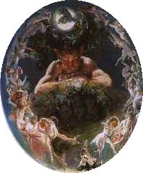

  
[Intangible Textual Heritage](../../../index)  [Sagas and
Legends](../../index)  [Celtic](../index) 

------------------------------------------------------------------------

<table width="75%">
<colgroup>
<col style="width: 50%" />
<col style="width: 50%" />
</colgroup>
<tbody>
<tr class="odd">
<td width="50%" data-valign="TOP"></td>
<td width="50%" data-valign="TOP"><h1 id="the-crock-of-gold">The Crock of Gold</h1>
<h2 id="by-james-stephens">by James Stephens</h2>
<h4 id="section">[1912]</h4></td>
</tr>
</tbody>
</table>

------------------------------------------------------------------------

[Title Page](cog00)  
[Book 1--The Coming of Pan](cog01)  
[Book 2--The Philosophers Journey](cog02)  
[Book 3--The Two Gods](cog03)  
[Book 4--The Philosophers Return](cog04)  
[Book 5--The Policemen](cog05)  
[Book 6--The Thin Woman's Journey](cog06)  
