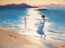

  
[Intangible Textual Heritage](../../../index)  [Legends and
Sagas](../../index)  [Celtic](../index)  [Index](index) 
[Previous](cov06)  [Next](cov08) 

------------------------------------------------------------------------

[Buy this Book on
Kindle](https://www.amazon.com/exec/obidos/ASIN/B002K8Q2IE/internetsacredte)

------------------------------------------------------------------------

  
*The Candle of Vision*, by AE (George William Russell), \[1918\], at
Intangible Textual Heritage

------------------------------------------------------------------------

p. 27

# THE MANY-COLOURED LAND

I HAVE always been curious about the psychology of my own vision as
desirous of imparting it, and I wish in this book to relate the efforts
of an artist and poet to discover what truth lay in his own
imaginations. I have brooded longer over the nature of imagination than
I have lingered over the canvas where I tried to rebuild my vision.
Spiritual moods are difficult to express and cannot be argued over, but
the workings of imagination may well be spoken of, and need precise and
minute investigation. I surmise from my reading of the psychologists who
treat of this that they themselves were without this faculty and spoke
of it as blind men who would fain draw although without vision. We are
overcome when we read *Prometheus Unbound*, but who, as he reads, flings
off the enchantment to ponder in what state was the soul of Shelley in
that ecstasy of swift

p. 28

creation. Who has questioned the artist to whom the forms of his thought
are vivid as the forms of nature? Artist and poet have rarely been
curious about the processes of their own minds. Yet it is reasonable to
assume that the highest ecstasy and vision are conditioned by law and
attainable by all, and this might be argued as of more importance even
than the message of the seers. I attribute to that unwavering meditation
and fiery concentration of will a growing luminousness in my brain as if
I had unsealed in the body a fountain of interior light. Normally we
close our eyes on a cloudy gloom through which vague forms struggle
sometimes into definiteness. But the luminous quality gradually became
normal in me, and at times in meditation there broke in on me an almost
intolerable lustre of light, pure and shining faces, dazzling
processions of figures, most ancient, ancient places and peoples, and
landscapes lovely as the lost Eden. These appeared at first to have no
more relation to myself than images from a street without one sees
reflected in a glass; but at times meditation prolonged itself into
spheres which were radiant with actuality. Once, drawn by some inner
impulse to meditate at an unusual hour, I found quick

p. 29

oblivion of the body. The blood and heat of the brain ebbed from me as
an island fades in the mists behind a swift vessel fleeting into light.
The ways were open within. I rose through myself and suddenly felt as if
I had awakened from dream. Where was I? In what city? Here were hills
crowned with glittering temples, and the ways, so far as I could see,
were thronged with most beautiful people, swaying as if shaken by some
ecstasy running through all as if the Dark Hidden Father was breathing
rapturous life within His children. Did I wear to them an aspect like
their own? Was I visible to them as a new-comer in their land of lovely
light? I could not know, but those nigh me flowed towards me with
outstretched hands. I saw eyes with a beautiful flame of love in them
looking into mine. But I could stay no longer for something below drew
me down and I was again an exile from light.

There came through meditation a more powerful orientation of my being as
if to a hidden sun, and my thoughts turned more and more to the
spiritual life of Earth. All the needles of being pointed to it. I felt
instinctively that all I saw in vision was part of the life of Earth
which is a court where there

p. 30

are many starry palaces. There the Planetary Spirit was King, and that
Spirit manifesting through the substance of Earth, the Mighty Mother,
was, I felt, the being I groped after as God. The love I had for nature
as garment of that deity grew deeper. That which was my own came to me
as it comes to all men. That which claimed me drew me to itself. I had
my days and nights of freedom. How often did I start in the sunshine of
a Sabbath morning, setting my face to the hills, feeling somewhat
uncertain as a lover who draws nigh to a beauty he adores, who sometimes
will yield everything to him and sometimes is silent and will only
endure his presence. I did not know what would happen to me, but I was
always expectant, and walked up to the mountains as to the throne of
God. Step by step there fell from me the passions and fears of the
week-day, until, as I reached the hillside and lay on the grassy slope
with shut eyes, I was bare of all but desire for the Eternal. I was once
more the child close to the Mother. She rewarded me by lifting for me a
little the veil which hides her true face. To those high souls who know
their kinship the veil is lifted, her face is revealed, and her face is
like a bride's. Petty as was my

p. 31

everyday life, with the fears and timidities which abnormal
sensitiveness begets, in those moments of vision I understood
instinctively the high mood they must keep who would walk with the
highest; and who with that divine face glimmering before him could do
aught but adore!

There is an instinct which stills the lips which would speak of
mysteries whose day for revelation has not drawn nigh. The little I know
of these I shall not speak of It is always lawful to speak of that
higher wisdom which relates our spiritual being to that multitudinous
unity which is God and Nature and Man. The only justification for speech
from me, rather than from others whose knowledge is more profound, is
that the matching of words to thoughts is an art I have practised more.
What I say may convey more of truth, as the skilled artist, painting a
scene which he views for the first time, may yet suggest more beauty and
enchantment than the habitual dweller, unskilled in art, who may yet
know the valley he loves so intimately that he could walk blindfold from
end to end.

I do not wish to write a book of wonders, but rather to bring thought
back to that Being

p. 32

whom the ancient seers worshipped as Deity. I believe that most of what
was said of God was in reality said of that Spirit whose body is Earth.
I must in some fashion indicate the nature of the visions which led me
to believe with Plato that the earth is not at all what the geographers
suppose it to be, and that we live like frogs at the bottom of a marsh
knowing nothing of that Many-Coloured Earth which is superior to this we
know, yet related to it as soul to body. On that Many-Coloured Earth, he
tells us, live a divine folk, and there are temples wherein the gods do
truly dwell, and I wish to convey, so far as words may, how some
apparitions of that ancient beauty came to me in wood or on hillside or
by the shores of the western sea.

Sometimes lying on the hillside with the eyes of the body shut as in
sleep I could see valleys and hills, lustrous as a jewel, where all was
self-shining, the colours brighter and purer, yet making a softer
harmony together than the colours of the world I know. The winds
sparkled as they blew hither and thither, yet far distances were clear
through that glowing air. What was far off was precise as what was near,
and the will to see hurried

p. 33

me to what I desired. There, too, in that land I saw fountains as of
luminous mist jetting from some hidden heart of power, and shining folk
who passed into those fountains inhaled them and drew life from the
magical air. They were, I believe, those who in the ancient world gave
birth to legends of nymph and dryad. Their perfectness was like the
perfectness of a flower, a beauty which had never, it seemed, been
broken by act of the individualised will which with us makes possible a
choice between good and evil, and the marring of the mould of natural
beauty. More beautiful than we they yet seemed less than human, and I
surmised I had more thoughts in a moment than they through many of their
days. Sometimes I wondered had they individualised life at all, for they
moved as if in some orchestration of their being. If one looked up, all
looked up. If one moved to breathe the magical airs from the fountains,
many bent in rhythm. I wondered were their thoughts all another's. one
who lived within them, guardian or oversoul to their tribe?

Like these were my first visions of supernature, not spiritual nor of
any high import, not in any way so high as those transcendental

p. 34

moments of awe, when almost without vision the Divine Darkness seemed to
breathe within the spirit. But I was curious about these forms, and
often lured away by them from the highest meditation; for I was dazzled
like a child who escapes from a dark alley in one of our cities of great
sorrow where its life has been spent, and who comes for the first time
upon some rich garden beyond the city where the air is weighted with
scent of lilac or rose, and the eyes are made gay with colour. Such a
beauty begins to glow on us as we journey towards Deity, even as earth
grows brighter as we journey from the gloomy pole to lands of the sun;
and I would cry out to our humanity, sinking deeper into the Iron Age,
that the Golden World is all about us and that beauty is open to all,
and none are shut out from it who will turn to it and seek for it.

As the will grew more intense, the longing for the ancestral self more
passionate, there came glimpses of more rapturous life in the being of
Earth. Once I lay on the sand dunes by the western sea. The air seemed
filled with melody. The motion of the wind made a continuous musical
vibration. Now

p. 35

and then the silvery sound of bells broke on my ear. I saw nothing for a
time. Then there was an intensity of light before my eyes like the
flashing of sunlight through a crystal. It widened like the opening of a
gate and I saw the light was streaming from the heart of a glowing
figure. Its body was pervaded with light as if sunfire rather than blood
ran through its limbs. Light streams flowed from it. It moved over me
along the winds, carrying a harp, and there was a circling of golden
hair that swept across the strings. Birds flew about it, and over the
brows was a fiery plumage as of wings of outspread flame. On the face
was an ecstasy of beauty and immortal youth. There were others, a lordly
folk, and they passed by on the wind as if they knew me not or the earth
I lived on. When I came back to myself my own world seemed grey and
devoid of light though the summer sun was hot upon the sands.

One other vision I will tell because it bears on things the ancients
taught us, and on what I have to write in later pages. Where I saw this
I will not say. There was a hall vaster than any cathedral, with pillars
that seemed built out of living and trembling

p. 36

opal, or from some starry substances which shone with every colour, the
colours of eve and dawn. A golden air glowed in this place, and high
between the pillars were thrones which faded, glow by glow, to the end
of the vast hall. On them sat the Divine Kings. They were fire-crested.
I saw the crest of the dragon on one, and there was another plumed with
brilliant fires that jetted forth like feathers of flame. They sat
shining and starlike, mute as statues, more colossal than Egyptian
images of their gods, and at the end of the hall was a higher throne on
which sat one greater than the rest. A light like the sun glowed behind
him. Below on the floor of the hall lay a dark figure as if in trance,
and two of the Divine Kings made motions with their hands about it over
head and body. I saw where their hands waved how sparkles of fire like
the flashing of jewels broke out. There rose out of that dark body a
figure as tall, as glorious, as shining as those seated on the thrones.
As he woke to the hall he became aware of his divine kin, and he lifted
up his hands in greeting. He had returned from his pilgrimage through
darkness, but now an initiate, a master in the heavenly guild. While he
gazed on

p. 37

them the tall golden figures from their thrones leaped up, they too with
hands uplifted in greeting, and they passed from me and faded swiftly in
the great glory behind the throne.

------------------------------------------------------------------------

[Next: Analytic](cov08)
