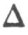
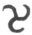
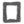
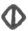

  
[Intangible Textual Heritage](../../../index.md)  [Legends and
Sagas](../../index)  [Celtic](../index)  [Index](index.md) 
[Previous](cov15)  [Next](cov17.md) 

------------------------------------------------------------------------

[Buy this Book on
Kindle](https://www.amazon.com/exec/obidos/ASIN/B002K8Q2IE/internetsacredte.md)

------------------------------------------------------------------------

  
*The Candle of Vision*, by AE (George William Russell), \[1918\], at
Intangible Textual Heritage

------------------------------------------------------------------------

p. 120

# THE LANGUAGE OF THE GODS

IF I interpreted rightly that dweller in the mind, the true roots of
human speech are vowels and consonants, each with affinity to idea.
force, colour and form, the veriest abstractions of these. but by their
union into words expressing more complex notions, as atoms and molecules
by their union form the compounds of the chemist. It is difficult to
discover single words of abstract significance to represent adequately
the ideas associated with these rudiments of speech. Every root is
charged with significance, being the symbol of a force which is itself
the fountain of many energies, even as primordial being when manifested
rolls itself out into numberless forms, states of energy and
consciousness. The roots of human speech are the sound correspondences
of powers which in their combination and interaction make up the
universe. The mind of man is made in

p. 121

the image of Deity, and the elements of speech are related to the powers
in his mind and through it to the being of the Oversoul.

These true roots of language are few, alphabet and roots being
identical. The first root is A, the sound symbol for the self in man and
Deity in the cosmos. Its form equivalent is the circle  . The second root is R,
representing motion. Its colour correspondence is red, and its form
symbol is the line  .

Motion engenders heat, and the third root following the order from
throat sounds to labials is H, the sound correspondence of Heat. Its
symbol is the triangle  ,
and it has affinity with the colour orange.

Motion and heat are the begetters of Fire, the sound equivalent of which
is the root L, which in form is symbolised by lines radiating from a
point as in this figure  .
L is fire, light or radiation., and it is followed in the series of
roots by Y which symbolises the reaction in nature against that
radiation of energy. It is the sound equivalent of binding,
concentration or condensation. Matter in the cosmos is obeying the law
of gravitation and gathering into fire-mists preliminary to its knotting
into suns and planets. The

p. 122

colour affinity is yellow. In man it is will which focuses energy and
concentrates it to a burning-point for the accomplishing of desire. Its
form symbol is  
representing a vortex or spiral movement inward, opposing in this the
expansion or radiation implied in the root L.

The root which follows Y is W. the sound symbol of liquidity or water.
Its form is semilunar,  ,
and I think its colour is green.

We have now descended to earth and with this descent comes dualism, and
henceforth all the roots have companion roots. Primordial substance has
lost its ethereal character and has settled into a solid or static
condition. The two roots which express this are G and K; G is the symbol
of earth, as K is of mineral, rock, crystal or hardness of any kind. I
could discover with no certainty any colour affinities for either of
these roots, and about the forms I am also uncertain though I was moved
to relate G with the square 
 and K with the square crossed by a diagonal  .

The twin roots next in the series are S and Z, and I can find no better
words to indicate the significance of the first than

p. 123

impregnation, inbreathing or insouling. We have reached in evolution the
stage when the one life breaks into myriads of lives, which on earth
finds its correspondence in the genesis of the cell. Z represents the
multiplication, division or begetting of organism from organism. It is
the outbreathing or bringing to birth of the seed which is sown. The
form symbol of S is, I think, 
, and of Z 
. I discovered no colour affinities for either.

The duality of roots succeeding this is TH and SH. The first is the
sound equivalent of growth, expansion or swelling, and its twin root
represents that state where the limit of growth in a particular form is
reached and a scattering or dissolution of its elements takes place. In
the vegetable world we might find an illustration in the growth and
decay of a plant.

After these twain come the duality of T and D. I found great difficulty
in discovering words to express the abstractions related to these. Yet
in meditating on them with reference to the T. I was continually haunted
by the idea of individual action, movement or initiative, and I believe
it refers to that state when life divorced from its old interior

p. 124

unity with the source of life, and, confined in a form. begins in its
imagination of itself to be an ego, is in a state of outgoing, acts and
looks outward, touches and tastes; while D represents the reverse side
of that, its reaction or absorption inward to silence, sleep,
immobility, abeyance. The form symbol T is 
 and  
vaguely suggested itself to me as the symbol of D.

There is a parallelism between T and TH as there is between D and SH, T
representing movement of the thing by itself while TH represents growth
or expansion merely, while D represents the more subjective sinking of a
thing into abeyance of its powers as SH represents the external
resolving of an organism into its elements.

For the dualism of roots J and TCH my intuition failed utterly to
discover correlations, and when I had placed the roots in their correct
sequence and endeavoured by intellect and reason to arrive at the
logical significance these two might have in the series of sounds, I
could never satisfy myself that I had come nigh to any true affinity, so
I pass these by.

The roots which follow are V and F, of which the first refers to life in
water, to all

p. 125

that swims, while F is related to what lives in air and flies. I am
doubtful about the form symbols, but colour affinities began here again,
and blue suggested itself to me as the correspondence, while the twin
roots which come after them, P and B, are related to indigo, the dark
blue.

Life has now reached the human stage, is divided into sexes, and P is
the sound symbol for life masculine or paternity, while B represents
feminine life or maternity.

The series closes with N and M. The first of these represents
continuance of being, immortality if you will, while the last root, in
the utterance of which the lips are closed, has the sense of finality,
it is the close, limit, measure, end or death of things. Their colour
affinities are with violet. In all there are twenty-one consonants which
with the vowels make up the divine roots of speech.

The vowels are the sound symbols of consciousness in seven moods or
states, while the consonants represent states of matter and modes of
energy.

I despair of any attempt to differentiate from each other the seven
states of consciousness represented by the vowels. How

p. 126

shall I make clear the difference between A where consciousness in man
or cosmos begins manifestation, utterance or limitation of itself, and
  where consciousness is
returning into itself, breaking from the limitation of form and becoming
limitless once more; or E when it has become passional, or I where it
has become egoistic, actively intellectual or reasoning, or   where it has become
intuitional. Our psychology gives me no names for these states, but the
vowel root always represents consciousness, and, in its union with the
consonant root., modifies or defines its significance, doing that again
as it precedes or follows it. I once held more completely than I do now
an interior apprehension of the significance of all, and I might
perhaps, if I had concentrated more intently, have completed more fully
the correspondences with idea, colour and form. But life attracts us in
too many Ways, and when I was young and most sensitive and intuitional I
did not realise the importance of what I was attempting to do.

This so far as I know is the only considered effort made by any one to
ascertain the value of intuition as a faculty by using

p. 127

it in reference to matters where the intellect was useless but where the
results attained by intuition could be judged by the reason. Intuition
is a faculty of which many speak with veneration, but it seems rarely to
be evoked consciously, and, if it is witness to a knower in man, it
surely needs testing and use like any other faculty. I have exercised
intuition with respect to many other matters and with inward conviction
of the certainty of truth arrived at in this way, but they were matters
relating to consciousness and were not by their nature easily subject to
ratification by the reason. These intuitions in respect of language are
to some extent capable of being reasoned or argued over, and I submit
them for consideration by others whose study of the literature, learning
and language of the ancients may give them special authority.

------------------------------------------------------------------------

[Next: Ancient Intuitions](cov17.md)
