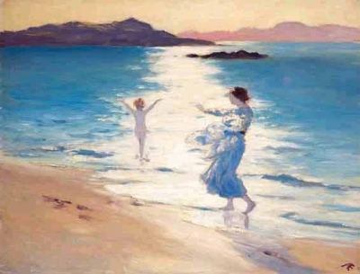

  
[Intangible Textual Heritage](../../../index)  [Legends and
Sagas](../../index)  [Celtic](../index) 

------------------------------------------------------------------------

[Buy this Book on
Kindle](https://www.amazon.com/exec/obidos/ASIN/B002K8Q2IE/internetsacredte)

------------------------------------------------------------------------

<table width="75%">
<colgroup>
<col style="width: 50%" />
<col style="width: 50%" />
</colgroup>
<tbody>
<tr class="odd">
<td width="50%" data-valign="TOP"> 
The Bathers, by AE (public domain image)</td>
<td width="50%" data-valign="CENTER"><h1 id="the-candle-of-vision" data-align="CENTER">The Candle of Vision</h1>
<h2 id="by-ae-george-william-russell" data-align="CENTER">by AE (George William Russell)</h2>
<h4 id="section" data-align="CENTER">[1918]</h4></td>
</tr>
</tbody>
</table>

------------------------------------------------------------------------

[Contents](#contents)    [Start Reading](cov00)    [Page
Index](pageidx)    [Text \[Zipped\]](cov.txt.gz)

------------------------------------------------------------------------

|                                                                                                                           |
|---------------------------------------------------------------------------------------------------------------------------|
|  |

This book by Irish author, poet, painter and mystic George William
Russell, is a set of transcendent essays on Celtic mysticism. Known by
his pen name AE (which is short for Aeon), Russell was friends with many
other figures of the Celtic renaissance of the early 20th century,
including [Y.B. Yeats](../../yeats/index), and [James
Stephens](../cog/index).

The Candle of Vision describes Russells' luminous excursions into the
otherworld, including clairvoyant and prophetic visions, precognition of
Gnostic concepts, past-life and astral journeys, and, always, heightened
awareness of the beauty that pervades mundane reality. Russell describes
encounters with what today we would call UFOs, and attempts to construct
a private Kabala based on an intuitive reconstuction of a primal
language and alphabet. Lastly, he attempts to put a mystical gloss on
the primeval Celtic pagan deities. Lovers of Celtic lore and ecstatic
mystic literature will both find much to enjoy in this short book.

------------------------------------------------------------------------

 [Title Page](cov00)  
[Preface](cov01)  
[Contents](cov02)  
[Retrospect](cov03)  
[The Earth Breath](cov04)  
[The Slave of the Lamp](cov05)  
[Meditation](cov06)  
[The Many-Coloured Land](cov07)  
[Analytic](cov08)  
[The Mingling of Natures](cov09)  
[The Memory of Earth](cov10)  
[Imagination](cov11)  
[Dreams](cov12)  
[The Architecture of Dream](cov13)  
[Have Imaginations Body?](cov14)  
[Intuition](cov15)  
[The Language of the Gods](cov16)  
[Ancient Intuitions](cov17)  
[Power](cov18)  
[The Memory of the Spirit](cov19)  
[Celtic Cosmogony](cov20)  
[The Celtic Imagination](cov21)  
[Earth](cov22)  
