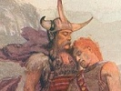

  
[Intangible Textual Heritage](../../../index.md)  [Legends and
Sagas](../../index)  [Celtic](../index)  [Index](index.md) 
[Previous](crc07)  [Next](crc09.md) 

------------------------------------------------------------------------

[Buy this Book on
Kindle](https://www.amazon.com/exec/obidos/ASIN/B0037Z6ILA/internetsacredte.md)

------------------------------------------------------------------------

  
*The Cattle Raid of Cualnge*, by L. Winifred Faraday, \[1904\], at
Intangible Textual Heritage

------------------------------------------------------------------------

p. 39

### The Death of the Squirrel

Cuchulainn threatened in Methe, that wherever he should see Ailill or
Medb afterwards he would throw a stone from his sling at them. He did
this then: he threw a stone from his sling, so that he killed the
squirrel that was on Medb's shoulder south of the ford: hence is Methe
Togmaill. And he killed the bird that was on Ailill's shoulder north of
the ford: hence is Methe n-Eoin. (Or it is on Medb's shoulder that both
squirrel and bird were together, and it is their heads that were struck
from them by the casts.)

 

Reoin was drowned in his lake. Hence is Loch Reoin.

 

'That other is not far from you,' said Ailill to the Manes.

They arose and looked round. When they sat down again, Cuchulainn struck
one of them, so that his head broke.

'It was well that you went for that: your boasting was not fitting,'
said Maenen the fool. 'I would have taken his head off.'

Cuchulainn threw a stone at him, so that his head broke. It is thus then
that these were killed: Orlam in the first place on his hill; the Meic
Garach on their ford; Fertedil in his ———; Maenan in his hill.

'I swear by the god by whom my people swear,' said Ailill, 'that man who
shall make a mock of Cuchulainn here, I will make two halves of him.'

'Go forth for us both day and night,' said Ailill, 'till we reach
Cualnge. That man will kill two-thirds of the host in this way.'

p. 40

It is there that the harpers of the *Cainbili* [1](#fn_39.md) from Ossory came to them to amuse them.
They thought it was from the Ulstermen to spy on them. They set to
hunting them, till they went before them in the forms of deer into the
stones at Liac Mor on the north. For they were wizards with great
cunning.

------------------------------------------------------------------------

### Footnotes

[40:1](crc08.htm#fr_39.md) Reference obscure. They
were wizards of some sort.

------------------------------------------------------------------------

[Next: The Death of Lethan](crc09.md)

