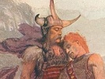

  
[Intangible Textual Heritage](../../../index.md)  [Legends and
Sagas](../../index)  [Celtic](../index)  [Index](index.md) 
[Previous](crc27)  [Next](crc29.md) 

------------------------------------------------------------------------

[Buy this Book on
Kindle](https://www.amazon.com/exec/obidos/ASIN/B0037Z6ILA/internetsacredte.md)

------------------------------------------------------------------------

  
*The Cattle Raid of Cualnge*, by L. Winifred Faraday, \[1904\], at
Intangible Textual Heritage

------------------------------------------------------------------------

### The Death of the Boys (second version)

'How long have I been in this sleep now, O warrior?' said Cuchulainn.

'Three days and three nights,' said the warrior.

'Alas for that!' said Cuchulainn.

'What is the matter?' said the warrior.

'The hosts without attack for this space,' said Cuchulainn.

'They are not that at all indeed,' said the warrior.

'Who has come upon them?' said Cuchulainn.

'The boys came from the north from Emain Macha; Folloman Mac Conchobair
with three fifties of boys of the kings’ sons of Ulster; and they gave
three battles to the hosts for the space of the three days and the three
nights in which you have been in your sleep now. And three times their
own number fell, and the boys fell, except Folloman Mac Conchobair.
Folloman boasted that he would take Ailill's head, and that was not easy
to him, for he was killed.'

'Pity for that, that I was not in my strength! For if I had been in my
strength, the boys would not have fallen as they have fallen, and
Folloman Mac Conch°. bair would not have fallen.'

'Strive further, O Little Hound, it is no reproach to thy honour and no
disgrace to thy valour.'

'Stay here for us to-night, O warrior,' said Cuchulainn, 'that we may
together avenge the boys on the hosts.'

'I will not stay indeed,' said the warrior, 'for however great the
contests of valour and deeds of arms any one does near thee, it is not
on him there will be the renown of it or the fame or the reputation, but
it is on thee; therefore I will not stay. But ply thy

p. 87

deed of arms thyself alone on the hosts, for not with them is there
power over thy life this time.'

------------------------------------------------------------------------

[Next: The Arming of Cuchulainn](crc29.md)

