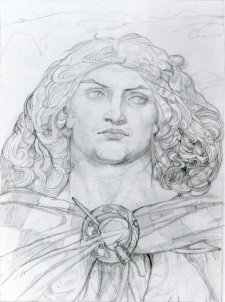

  
[Intangible Textual Heritage](../../../index)  [Legends and
Sagas](../../index)  [Celtic](../index) 

------------------------------------------------------------------------

[Buy this Book at
Amazon.com](https://www.amazon.com/exec/obidos/ASIN/B00267T84E/internetsacredte)

------------------------------------------------------------------------

<table width="75%">
<colgroup>
<col style="width: 50%" />
<col style="width: 50%" />
</colgroup>
<tbody>
<tr class="odd">
<td width="50%" data-valign="TOP"> 
Cuchulain by John Duncan</td>
<td width="50%" data-valign="CENTER"><h1 id="cuchulain-of-muirthemne" data-align="CENTER">Cuchulain of Muirthemne</h1>
<h4 id="by-lady-augusta-gregory" data-align="CENTER">By Lady Augusta Gregory</h4>
<h4 id="section" data-align="CENTER">[1902]</h4></td>
</tr>
</tbody>
</table>

------------------------------------------------------------------------

[Contents](#contents)    [Start Reading](lgc00)    [Page
Index](pageidx)    [Text \[Zipped\]](lgc.txt.gz)

------------------------------------------------------------------------

|                                                                                                                           |
|---------------------------------------------------------------------------------------------------------------------------|
|  |

This is Lady Gregory's collation of the Cuchulain cycle. Cuchulain was a
mighty warrior, 'the Hound of Ulster', the hero of 'the Red Branch', a
band of elite fighters of ancient Ireland. Cuchulain is the subject of
numerous tales set in pre-Christian Ireland, including the pivotal '[War
for the Bull of Cuailgne](lgc14)'. The mythological and supernatural
elements are tightly interwoven in this saga, including the ever-present
Sidhe (fairies); and Celtic gods and goddesses, particularly Morrigu,
the goddess of war. As for the battles, they are principally composed of
single combats as hair-raising as any in the
[Iliad](../../../cla/homer/ili/index) or the
[Mahabharata](../../../hin/index.htm#maha). The female characters are
vivid and self-motivated. The saga is overlaid with episodes which could
be echoes of ancient myths, for instance the story of the two
[shapeshifting swineherds](lgc16). There are sections of great poetry
embedded in the text, particularly the [lament of Emer on Cuchulain's
death](lgc23.htm#page_345).

Lady Gregory's prose, which resembles that of William Morris and her
collaborator [Yeats](../../yeats/index), is gorgeous and moves the story
along vigorously. This rendition of the Cuchulain saga is required
reading for anyone interested in Celtic mythology.

*Production notes*: This text was originally produced by Phillip Brown
from an unknown edition. In March, 2004, I did an proof pass on it using
a 1902 first edition. This was primarily to add page numbers and correct
a number of transcription errors in the original etext. However, there
are a half-dozen places where the Phillip's etext diverged significantly
from the text of the first edition. In these cases, I have retained the
text from Phillip's edition, printed in green type. I have placed these
passages in a two-column table with Phillip's version in the left hand
column and replaced text (if any) from the 1902 version in the right
hand column. Perhaps some reader can identify the other edition.

--John Bruno Hare, March 10th, 2004.

------------------------------------------------------------------------

[Title Page](lgc00)  
[Dedication](lgc01)  
[Preface by W.B. Yeats](lgc02)  
[Contents](lgc03)  
[I. Birth of Cuchulain](lgc04)  
[II. Boy Deeds of Cuchulain](lgc05)  
[III. Courting of Emer](lgc06)  
[IV. Bricriu's Feast, and the War of Words of the Women of
Ulster](lgc07)  
[V. The Championship of Ulster](lgc08)  
[VI. The High King of Ireland](lgc09)  
[VII. Fate of the Sons of Usnach](lgc10)  
[VIII. Dream of Angus](lgc11)  
[IX. Cruachan](lgc12)  
[X. The Wedding of Maine Morgor](lgc13)  
[XI. The War for the Bull of Cuailgne](lgc14)  
[XII. The Awakening of Ulster](lgc15)  
[XIII. The Two Bulls](lgc16)  
[XIV. The Only Jealously of Emer](lgc17)  
[XV. Advice to a Prince](lgc18)  
[XVI. Sons of Doel Dermait](lgc19)  
[XVII. Battle of Rosnaree](lgc20)  
[XVIII. The Only Son of Aoife](lgc21)  
[XIX. The Great Gathering at Muirthemne](lgc22)  
[XX. Death of Cuchulain](lgc23)  
[Note by W.B. Yeats](lgc24)  
[Notes by Lady Gregory](lgc25)  
