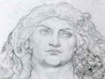

  
[Intangible Textual Heritage](../../../index)  [Legends and
Sagas](../../index)  [Celtic](../index)  [Index](index) 
[Previous](lgc17)  [Next](lgc19) 

------------------------------------------------------------------------

[Buy this Book at
Amazon.com](https://www.amazon.com/exec/obidos/ASIN/B00267T84E/internetsacredte)

------------------------------------------------------------------------

  
*Cuchulain of Muirthemne*, by Lady Augusta Gregory, \[1902\], at
Intangible Textual Heritage

------------------------------------------------------------------------

p. 294

# XV.

### ADVICE TO A PRINCE

THERE was a meeting of the three provinces of Ireland held about this
time in Teamhair, to try could they find some person to give the High
Kingship of Ireland to; for they thought it a pity the Hill of the
Lordship of Ireland, that is Teamhair, to be without the rule of a king
on it, and the tribes to be without a king's government to judge their
houses. For the men of Ireland had been without the government of a High
King over them since the death of Conaire at Da Derga's Inn.

And the kings that met now at the court of Cairbre Niafer were Ailell
and Maeve of Connaught, and Curoi, and Tigernach, son of Luchta, king of
Tuathmumain, and Finn, son of Ross, king of Leinster. But they would not
ask the men of Ulster to help them in choosing a king, for they were all
of them against the men of Ulster.

There was a bull-feast made ready then, the same way as the time Conaire
was chosen, to find out who was the best man to get the kingship.

After a while the dreamer screamed out in his sleep, and told what he
saw to the kings. And what he saw this time, was a young strong man,
with high looks, and with two red stripes on his body, and he sitting
over the pillow of a man that was wasting away in Emain Macha.

p. 295

A message was sent then with this account to Emain Macha. The men of
Ulster were gathered at that time about Cuchulain, that was on his
sick-bed. The messenger told his story to Conchubar and to the chief men
of Ulster.

"There is a young man of good race and good birth with us now that
answers to that account," said Conchubar; "that is Lugaid of the Red
Stripes, son of Clothru, daughter of Eochaid Feidlech, the pupil of
Cuchulain; and he is sitting by his pillow within, caring him, for he is
on his sick-bed."

And when it was told Cuchulain that messengers were come for Lugaid, to
make him King in Teamhair, he rose up and began to advise him, and it is
what he said:

"Do not be a frightened man in a battle; do not be light-minded, hard to
reach, or proud. Do not be ungentle, or hasty, or passionate; do not be
overcome with the drunkenness of great riches, like a flea that is
drowned in the ale of a king's house. Do not scatter many feasts to
strangers; do not visit mean people that cannot receive you as a king.
Do not let wrongful possession stand because it has lasted long; but let
witnesses be searched to know who is the right owner of land. Let the
tellers of history tell truth before you; let the lands of brothers and
their increase be set down in their lifetime; if a family has increased
in its branches, is it not from the one stem they are come? Let them be
called up, let the old claims be established by oaths; let the heir be
left in lawful possession of the place his fathers lived in; let
strangers be driven off it by force.

"Do not use too many words. Do not speak noisily; do not mock, do not
give insults, do not make little of old people. Do not think ill of any
one; do not ask what is hard to give. Let you have a law of lending, a
law of oppression, a law of pledging. Be obedient

p. 296

to the advice of the wise; keep in mind the advice of the old. Be a
follower of the rules of your fathers. Do not be cold-hearted to
friends; be strong towards your enemies; do not give evil for evil in
your battles. Do not be given to too much talking. Do not speak any harm
of others. Do not waste, do not scatter, do not do away with what is
your own. When you do wrong, rake the blame of it; do not give up the
truth for any man. Do not be trying to be first, the way you will not be
jealous; do not be an idler, that you may not be weak; do not ask too
much, that you may not be thought little of. Are you willing to follow
this advice, my son?"

Then Lugaid answered Cuchulain, and it is what he said: "As long as all
goes well, I will keep to your words, and every one will know that there
is nothing wanting in me; all will be done that can be done."

Then Lugaid went away with the messengers to Teamhair, and he was made
king, and he slept in Teamhair that night. And after that all the people
that had gathered there went to their own homes.

------------------------------------------------------------------------

[Next: XVI. Sons of Doel Dermait](lgc19)
