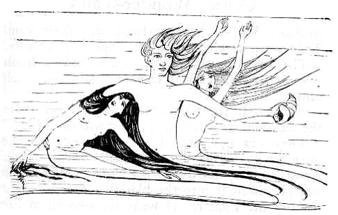
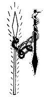
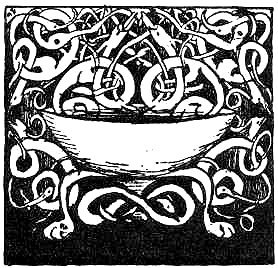

  
[Intangible Textual Heritage](../../../index)  [Sagas and
Legends](../../index)  [Celtic](../index)  [Index](index) 
[Previous](cwt01)  [Next](cwt03) 

------------------------------------------------------------------------

The Spear of Victory

 

  
 UADA, Wielder of the White
Light, set up the Spear of Victory in the centre of Ireland. It was like
a great fiery fountain. It was like a singing flame. It burned
continually, and from it every fire in Ireland was kindled. The glow of
it reached up to the mountain tops. The glow of it reached under the
forest trees. The glow of it shot into the darkness and made a halo of
light far beyond the three waves of Mananaun. The mis-shapen things of
the darkness came to the edge of the halo. They sunned themselves in it
They got strength from it. They began to build a habitation for
themselves in the dark waters. They took shapes to themselves, and dark
cunning wisdom. Balor the One-Eyed was their king. They were minded to
get the Spear of Victory.

They compassed Ireland. They made a harsh screeching. The De Danaans
said to each other:

"It is only the Fomor, the people from under the sea, who are
screeching; they will tire of it!"

They did not tire of it: they kept up the screeching. The De Danaans
tired of it. Nuada took up the Spear of Victory. He whirled it. He threw
it into the blackness that it might destroy the Fomor. It went through
them like lightning through storm-clouds. It made a great destruction.
Balor grasped it. He had the grip The Spear stayed with him. It was like
a fiery serpent twisting every way. He brought it into his own country.
There was a lake in the middle of his own country full of black water.
Whoever tasted that water would forget anything he knew. Balor put the
fiery head of the Spear in that lake. It became a column of red-hot
iron. He could not draw it out of the lake.

The Spear was in the lake then. Great clouds of steam rose about it from
the black water. Out of the hissing steam Demons of the Air were born.
The Demons were great and terrible. There was an icy wind about them.
They found their way into Ireland. They took prey there in spite of the
De Danaans. They made broad tracks for themselves. The Fomor followed in
their tracks. It was then that misfortune came to the De Danaans. The
people of the Fomor got the better of the De Danaans. They took the
Cauldron of Plenty and the Magic Harp from the Dagda. They made
themselves lords and hard rulers over the De Danaans, and they laid
Ireland under tribute. They were taking tribute out of it ever and again
till Lugh Lauve Fauda came. 'Twas he that broke the power of the Fomor
and sent the three sons of Dana for the Spear. They had power to draw it
out of the lake. They gave it to Lugh, and it is with him it is now, and
'tis he will set it up again in the middle of Ireland before the end of
the world.  
 

 

 

------------------------------------------------------------------------

[Next: A Good Action](cwt03)
