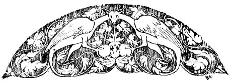
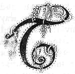

  
[Intangible Textual Heritage](../../../index.md)  [Sagas and
Legends](../../index)  [Celtic](../index)  [Index](index.md) 
[Previous](cwt03)  [Next](cwt05.md) 

------------------------------------------------------------------------

 

How the Son of The Gobhaun Saor Sold the Sheepskin

 

 HE GOBHAUN SAOR was a great
person in the old days, and he looked to his son to be a credit to him.
He had only one son, and thought the world and all of him, but that was
nothing to what the son thought of himself. He was growing up every day,
and the more he grew up the more he thought of himself, till at last the
Gobhaun Saor's house was too small to hold him, and the Gobhaun said it
was time for him to go out and seek his fortune. He gave him a sheepskin
and his blessing, and said:

"Take this sheepskin and go into the fair and let me see what cleverness
you have in selling it."

"I'll do that," said the son, "and bring you the best price to be got in
the fair."

"That's little," said the Gobhaun Saor, "but if you were to bring me the
skin and the price of it, I'd say you had cleverness."

"Then that's what I'll bring you!" said the son, and he set off on his
travels.

"What do you want for that sheepskin you have?" said the first man he
met in the fair. He named his price.

"'Tis a good price," said the man, "but the skin is good, and I have no
time for bargaining; here is the money; give me the skin."

"I can't agree to that," said the son of the Gobhaun Saor. "I must have
the skin and the price of it too."

"I hope you may get it!" said the man, and he went away laughing. That
was the way with all the men that tried to buy the skin, and at last the
son of the Gobhaun Saor was tired of trying to sell it, and when he saw
a crowd of people standing around a beggar man he went and stood with
the rest. The beggar man was doing tricks and every one was watching
him. After a while he called out:

"Lend me that sheepskin of yours and I'll show you a trick with it! "

"You needn't ask for the loan of that skin," said one of the men
standing by, "for the owner of it wants to keep it and sell it at the
same time, there's so much cleverness in him!"

The son of the Gobhaun Saor was angry when that was said, and he flung
down the skin to the juggler-man.

"Do a trick with it if you can," said he.

The beggar man spread out the skin and blew between the wool of it, and
a great wood sprang up--miles and miles of a dark wood--and there were
trees in it with golden apples. The people were frightened when they saw
it, but the beggar man walked into the wood till the trees hid him.
There was sorrow on the son of the Gobhaun Saor at that.

"Now I'll never give my father either the skin or the price of it," he
said to himself, "but the least I may do is to take him an apple off the
trees." He put out his hand to an apple, and when he touched it he had
only a bit of wool in his hand. The sheepskin was before him. He took it
up and went out of the fair.

He was walking along the roads then and it was growing dark and he was
feeling sorry for himself, when he saw the light of a house. He went
toward it, and when he came to it the door was open, and in the little
room inside he saw the beggar man of the fair and another man stirring a
big pot.

"Come in," said the beggar man; "this is the house of the Dagda Mor, the
World Builder. It isn't much, as you see, but you may rest here and
welcome, and maybe the Dagda will give us supper."

"Son Angus," said the Dagda to the beggar man, "you talk as if I had the
Cauldron of Plenty, and you know well that it is gone from me. The
Fomorians have it now and I have only this pot. Hard enough it is to
fill it, and when it is filled I never get a good meal out of it, for a
great, hulking, splay-footed churl of a Fomorian comes in when he smells
the meat and takes all the best of it from me, and I have only what
remains when he has gorged himself; so I am always hungry, son Angus."

"Your case is hard," said Angus, "but I know how you can help yourself."

"Tell me how," said the Dagda.

"Well," said Angus, "get a piece of gold and put it into the best part
of the meat, and when the Fomorian has eaten it up tell him he has
swallowed the gold; his heart will burst when he hears that, and you'll
be rid of him."

"Your plan is good," said the Dagda, "but where am I to get the gold?
The Fomorians keep me building all day for them, but they give me
nothing."

"I wish I had a piece of gold to give you myself," said Angus. " 'Tis a
bad thing to be a beggar man! The next time I disguise myself I'll be a
prince." He laughed at that, but the Dagda stirred the pot and looked
gloomy. The son of the Gobhaun Saor felt sorry for him and remembered
that he had a gold ring his father had given him. He pulled it off his
finger and gave it to the Dagda.

"Here," said he, "is a piece of gold and you can be rid of the
Fomorian."

The Dagda thanked him and gave him his blessing and they spent the night
in peace and happiness till morning reddened the sky.

When the son of the Gobhaun Saor started to go, Angus set him a bit on
the way.

"You are free-handed," he said to him, "and a credit to your father, and
now I'll give you a bit of advice--Say 'Good morrow kindly' to the first
woman you can meet on the road, and good luck be with you."

It wasn't long till the son of the Gobhaun Saor saw a woman at a little
stream washing clothes. "Good luck to the work," he said, "and good
morrow kindly."

"Good morrow to yourself," said she, "and may your load be light."

"It would need to be light," said he, "for I'll have far enough to carry
it."

"Why so? " said she.

"I must carry it till I meet some one to give me the price of it and the
skin as well."

"You need travel no further for that," said she; "give me the
sheepskin."

"With a heart and a half," said he, and he gave her the skin. She paid
the price, and she plucked the wool from the skin and threw him the
skin.

"Now you can go home to your father," she said.

He wasn't long going, and he was proud when he gave the Gobhaun the skin
and the price of it.

"What man showed you the wise way out of it?" said the Gobhaun Saor.

"No man at all," said the son, "but a woman."

"And you met a woman like that, and hadn't the wit to bring her with
you!" said the Gobhaun Saor. "Away with you now, and don't let the wind
that is behind you come up with you. till you ask her to marry you!"

The son didn't need the second word, and the wind didn't overtake him
till he asked the woman to marry him. They came back together, and the
Gobhaun made a wedding feast for them that was remembered year in and
year out for a hundred years.

 

 

------------------------------------------------------------------------

[Next: How the Son of Gobhaun Saor Shortened the Road](cwt05.md)
