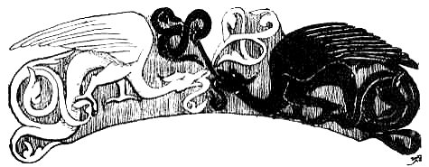
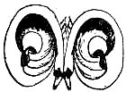
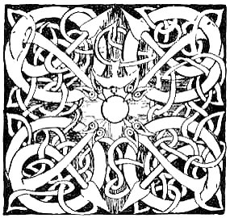
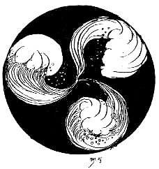

  
[Intangible Textual Heritage](../../../index.md)  [Sagas and
Legends](../../index)  [Celtic](../index)  [Index](index.md) 
[Previous](cwt06)  [Next](cwt08.md) 

------------------------------------------------------------------------

The Coming of Lugh

 

 \[M\]ANANAUN MAC LIR who rules
the ocean took the little SunGod, Lugh, in his arms and held him up so
that he could see the whole of Ireland with the waves whispering about
it everywhere.

"Say farewell to the mountains and rivers, and the big trees and the
flowers in the grass,

O Lugh, for you are coming away with me."

The child stretched out his hands and cried:

"Good-bye, mountains and flowers and rivers: some day I will come back
to you."

Then Mananaun wrapped Lugh in his cloak and stepped into his boat, the
Ocean-Sweeper, and without oar or sail they journeyed over the sea till
they crossed the waters at the edge of the world and came to the country
of Mananaun--a beautiful country shining with the colours of the dawn.

Lugh stayed in that country with Mananaun. He raced the waves along the
strand; he gathered apples sweeter than honey from trees with crimson
blossoms: and wonderful birds came to play with him. Mananaun's
daughter, Niav, took him, through woods where there were milk-white deer
with horns of gold, and blackmaned lions and spotted panthers, and
unicorns that shone like silver, and strange beasts that no one ever
heard of; and all the animals were glad to see him, and he played with
them and called them by their names. Every day he grew taller and
stronger and more beautiful, but he did not any day ask Mananaun to take
him, back to Ireland.

Every night when darkness had come into the sky, Mananaun wrapped
himself in his mantle of power and crossed the sea and walked all round
Ireland, stepping from rock to rock. No one saw him, because his mantle
made him invisible, but he saw everything and knew that trouble had
found the De Danaans. The ugly, mis-shapen folk of the Fomor had come
into Ireland and spread themselves over the country like a pestilence.
They had stolen the Cauldron of Plenty and carried it away to their own
land, where Balor of the Evil Eye reigned. They had taken the Spear of
Victory also, and the only one of the four great Jewels of Sovereignity
remaining to the De Danaans was the Stone of Destiny. It was hidden deep
in the earth of Ireland, and because of it the Fomorians could not
altogether conquer the country, nor could they destroy the De Danaans,
though they drove them from their pleasant palaces and hunted them
through the glens and valleys like outlaws.

Mananaun himself had the fourth Jewel, the Sword of Light: he kept it
and waited.

When Lugh was full grown, Mananaun said to him: "It is three times seven
years, as mortals count time, since I brought you to Tir-nan-Oge, and in
all that time I have never given you a gift. To-day I will give you a
gift."

He brought out the Sword of Light and gave it to Lugh, and when Lugh
took it in his hand he remembered how he had cried to the hills and
rivers of Ireland -" Some day I will come back to you!" And he said to
Mananaun:

"I want to go back to Ireland."

"You will not find joyousness there, O Lugh, or the music of harp
strings, or feasting. The De Danaans are shorn of their strength. Ogma,
their Champion, carries logs to warm Fomorian hearths; Angus wanders
like an outcast; and Nuada, the King, has but one dun, where those who
had once the lordship of the world meet in secret like hunted folk."

"I have a good sword," said Lugh. "I will go to my kinsfolk."

"O Lugh," said Mananaun, "they have never known you. Will you leave me,
and Niav, and this land where sorrow has never touched you, for the sake
of stranger kinsfolk?"

Lugh answered:

"I remember the hills and the woods and the rivers of Ireland, and
though all my kinsfolk were gone from it and the sea covered everything
but the tops of the mountains, I would go back."

"You have the hardiness that wins victory," said Mananaun. "I will set
you on my own white horse and give you companions as high-hearted as
yourself. I will put my helmet on your head and my breast-plate over
your heart: you shall drive the Fomorians out of Ireland as chaff is
driven by the wind."

When Lugh put on the helmet of Mananaun, brightness shot into the sky as
if a new sun had risen; when he put on the breast-plate, a great wave of
music swelled and sounded through Tir-nan-Oge; when he mounted the white
horse, a mighty wind swept past him, and lo! the companions Mananaun had
promised rode beside him. Their horses were white like his, and gladness
that age cannot wither shone in their faces. When they came to the sea
that is about Tir-nan-Oge, the little crystal waves lifted themselves up
to look at Lugh, and when he and his comrades sped over the sea as
lightly as blown foam, the little waves followed them till they came to
Ireland, and the Three Great Waves of Ireland thundered a welcome--the
Wave of Thoth; the Wave of Rury; and the long, slow, white, foaming Wave
of Cleena.

No one saw the Faery Host coming into Ireland. At the place where their
horses leaped from sea to land there was a great wood of pine trees.

"Let us go into the wood," said Lugh, and they rode between the tall
straight tree-trunks into the silent heart of the wood.

"Rest here," said Lugh, "till morning. I will go to the dun of Nuada and
get news of my kinsfolk."

He put his shining armour from him and wrapped himself in a dark cloak
and went on foot to the dun of Nuada. He struck the brazen door, and the
Guardian of the Door spoke to him from within.

"What do you seek?"

"My way into the dun."

"No one enters here who has not his craft. What can you do?"

"I have the craft of a Carpenter."

"We have a carpenter within; he is Luchtae, son of Luchaid."

"I have the craft of a Smith."

"We have a smith within, Colum of the three new ways of working."

"I have the craft of a Champion."

"We have a champion within; he is Ogma himself."

"I have the craft of a Harper."

"We have a harper within, even Abhcan, son of Bicelmos; the Men of the
Three Gods chose him in the faery hills."

"I have the craft of a Poet and Historian."

"We have a poet and historian within, even En, son of Ethaman."

"I have the craft of a Wizard."

"We have many wizards and magicians within."

"I have the craft of a Physician."

"We have a physician within, even Dian Cecht."

"I have the craft of a Cupbearer."

"We have nine cupbearers within."

"I have the craft of a Brazier."

"We have a brazier within, even Credne Cerd."

"Go hence and ask your king if he has within any one man who can do all
these things. If he has, I will not seek to enter."

The Guardian of the Door hurried in to Nuada.

"O King," he said, "the most wonderful youth in the world is waiting
outside your door to-night! He seeks admittance as the Ildana, the
Master of Every Craft."

"Let him come in," said King Nuada. Lugh came into the dun. Ogma, the
Champion, took a good look at him. He thought him young and slender, and
was minded to test him. He stooped and lifted the Great Stone that was
before the seat of the King. It was flat and round, and four score yoke
of oxen could not move it. Ogma cast it through the open door so that it
crossed the fosse which was round the dun. That was his challenge to the
Ildana.

"It is a good champion-cast," said Lugh. "I will better it."

He went outside. He lifted the Stone and cast it back--not through the
door, but through the strong wall of the dun--so that it fell in the
place where it had lain before Ogma lifted it.

"Your cast is better than mine! " said Ogma. "Sit in the seat of the
champion with your face to the King."

Lugh drew his hand over the wall; it became whole as before. He sat in
the champion-seat.

"Let chess be brought," said the King.

They played, and Lugh won all the games, so that thereafter it passed
into a proverb "to make the Cro of Lugh."

"Truly you are the Ildana," said Nuada. "I would fain hear music of your
making, but I have no harp to offer you."

"I see a kingly harp within reach of your hand," said Lugh.

"That is the harp of the Dagda. No one can bring music from that harp
but himself. When he plays on it, the four Seasons--Spring, Summer,
Autumn, and Winter- pass over the earth."

"I will play on it," said Lugh.

The harp was given to him.

Lugh played the music of joy, and outside the dun the birds began to
sing as though it were morning and wonderful crimson flowers sprang
through the grass--flowers that trembled with delight and swayed and
touched each other with a delicate faery ringing as of silver bells.
Inside the dun a subtle sweetness of laughter filled the hearts of every
one: it seemed to them that they had never known gladness till that
night.

Lugh played the music of sorrow. The wind moaned outside, and where the
grass and flowers had been there was a dark sea of moving waters. The De
Danaans within the dun bowed their heads on their hands and wept, and
they had never wept for any grief.

Lugh played the music of peace, and outside there fell silently a
strange snow. Flake by flake it settled on the earth and changed to
starry dew. Flake by flake the quiet of the Land of the Silver Fleece
settled in the hearts and minds of Nuada and his people: they closed
their eyes and slept, each in his seat.

Lugh put the harp from him and stole out of the dun. The snow was still
falling outside. It settled on his dark cloak and shone like silver
scales; it settled on the thick curls of his hair and shone like
jewelled fire; it filled the night about him with white radiance. He
went back to his companions.

The sun had risen in the sky when the De Danaans awoke in Nuada's dun.
They were light-hearted and joyous and it seemed to them that they had
dreamed overnight a strange, beautiful dream.

"The Fomorians have not taken the sun out of the sky," said Nuada. "Let
us go to the Hill of Usna and send to our scattered comrades that we may
make a stand against our enemies."

They took their weapons and went to the Hill of Usna, and they were not
long on it when a band of Fomorian devastators came upon them. The
Fomorians scoffed among themselves when they saw how few the De Danaans
were, and how ill-prepared for fighting.

"Behold," they cried, "what mighty kings are to-day upon Usna, the Hill
of Sovereignity! Come down, O Kings, and bow yourselves before your
masters! "

"We will not bow ourselves before you," said Nuada, "for ye are ugly and
vile: and lords neither of us nor of Ireland."

With hoarse cries the Fomorians fell on the De Danaans, but Nuada and
his folk held together and withstood them as well as they were able.
Scarcely had the weapons clashed when a light appeared in the horizon
and a sound of mighty battle trumpets shook the air. The light was so
white that no one could look at it, and great rose-red streamers shot
from it into the sky.

"It is a second sunrise!" said the Fomorians.

"It is The Deliverer! " said the De Danaans.

Out of the light came the glorious company of warriors from Tir-nan-Oge.
Lugh was leading them. He had the helmet of Mananaun on his head, the
breast-plate of Mananaun over his heart, and the great white horse of
Mananaun beneath him.

The Sword of Light was bare in his hand. He fell on the Fomorians as a
sea-eagle falls on her prey, as lightning flashes out of a clear sky.
Before him and his companions they were destroyed as stubble is
destroyed by fire. He held his hand when only nine of them remained
alive.

"Bow yourselves," he said, "before King Nuada, and before the De
Danaans, 'for they are your Lords and the Lords of Ireland, and go hence
to Balor of the Evil Eye and tell him and his mis-shapen brood that the
De Danaans have taken their own again and they will wage war against the
Fomorians till there is not one left to darken the earth with his
shadow."

The nine Fomorians bowed themselves before King Nuada, and before the De
Danaans; and before Lugh Lauve Fauda, the Ildana; and they arose and
carried his message to Balor of the Evil Eye, King of the Fomorians.  
 

 

 

 

------------------------------------------------------------------------

[Next: The Eric-Fine of Lugh](cwt08.md)
