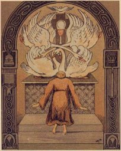

  
[Intangible Textual Heritage](../../../index)  [Sagas and
Legends](../../index)  [Celtic](../index) 

------------------------------------------------------------------------

<table width="75%">
<colgroup>
<col style="width: 50%" />
<col style="width: 50%" />
</colgroup>
<tbody>
<tr class="odd">
<td width="50%" data-valign="TOP"></td>
<td width="50%" data-valign="TOP"><h1 id="celtic-wonder-tales" data-align="CENTER">Celtic Wonder Tales</h1>
<h2 id="by-ella-young" data-align="CENTER">by Ella Young</h2>
<h5 id="illustrations-by-maud-gonne" data-align="CENTER">Illustrations by Maud Gonne</h5>
<h5 id="section" data-align="CENTER">[1910]</h5></td>
</tr>
</tbody>
</table>

------------------------------------------------------------------------

[Title Page](cwt00)  
[The Earth Shapers](cwt01)  
[The Spear of Victory](cwt02)  
[A Good Action](cwt03)  
[How the Son of Gobhaun Saor Sold the Sheepskin](cwt04)  
[How the Son of Gobhaun Saor Shortened the Road](cwt05)  
[The Cow of Plenty](cwt06)  
[The Coming of Lugh](cwt07)  
[The Eric-Fine of Lugh](cwt08)  
[The Great Battle](cwt09)  
[Inisfail](cwt10)  
[The Golden Fly](cwt11)  
[The Children of Lir](cwt12)  
[The Luck-Child](cwt13)  
[Conary Mor](cwt14)  
