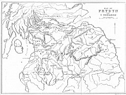
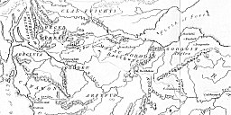
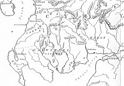

  
[Intangible Textual Heritage](../../../index.md)  [Legends &
Sagas](../../index)  [Celtic](../index)  [Index](index.md) 
[Previous](fab001)  [Next](fab003.md) 

------------------------------------------------------------------------

 

[  
Click to enlarge](img/map.jpg.md)  
Map of Prydyn or Y Gogled  

[  
Click to enlarge](img/mapdet01.jpg.md)  
Map Detail 1  

[  
Click to enlarge](img/mapdet02.jpg.md)  
Map Detail 2  

------------------------------------------------------------------------

[Next: Chapter I. The Poems Contained in the Four Ancient Books of
Wales](fab003.md)
