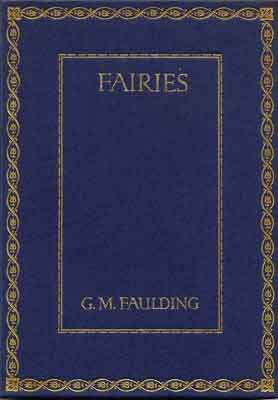

  
[Intangible Textual Heritage](../../../index.md)  [Sagas and
Legends](../../index)  [Celtic](../index.md) 

------------------------------------------------------------------------

<table width="75%">
<colgroup>
<col style="width: 50%" />
<col style="width: 50%" />
</colgroup>
<tbody>
<tr class="odd">
<td width="50%" data-valign="TOP"></td>
<td width="50%" data-valign="TOP"><h1 id="fairies" data-align="CENTER">Fairies</h1>
<h2 id="by-gertrude-m.-faulding" data-align="CENTER">by Gertrude M. Faulding</h2>
<h4 id="section" data-align="CENTER">[1913]</h4></td>
</tr>
</tbody>
</table>

------------------------------------------------------------------------

[Title Page](fau00.md)  
[Fairies, by Gertrude M. Faulding](fau01.md)  
